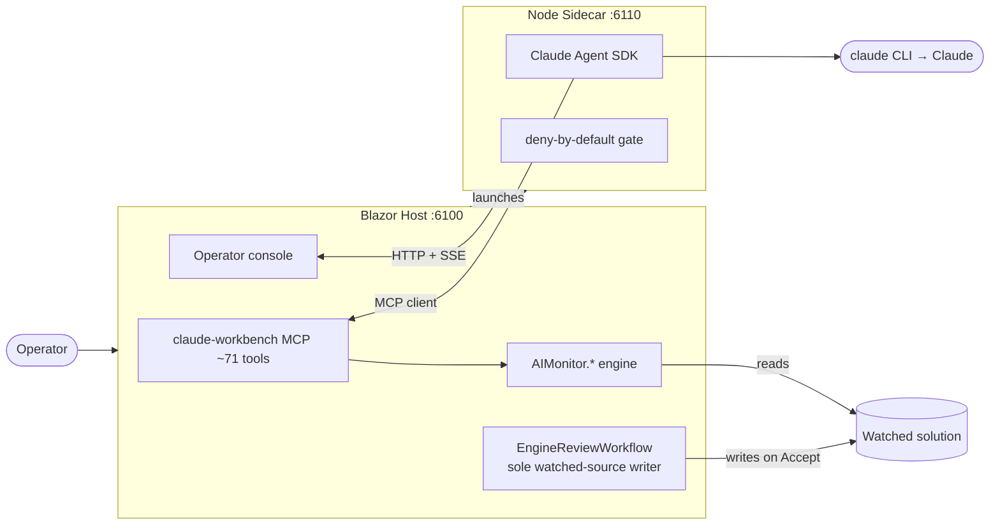

# ClaudeWorkbench — Documentation

> **Start here.** ClaudeWorkbench is a Blazor operator console for **governed,
> human-gated AI edits** to a watched .NET solution, driven by **Claude** through the
> Claude Agent SDK. The agent proposes changes; every change is composed against a local
> *Working* candidate, staged, and held at a human **accept/reject** gate before it ever
> touches real source.

This folder is the project's memory: what each part is, how it works, and why. Docs are
organized by the [C4 model](https://c4model.com/) (Context → Container → Component) and
the [Diátaxis](https://diataxis.fr/) split (Explanation/Reference vs. how-to).

---

## The system in one picture

The whole thing in a sentence: **the agent reasons and stages; the operator accepts;
only the accept writes real source.**

---

## Guided reading path

New to the codebase? Read in this order:

1. **[architecture/Architecture.md](architecture/Architecture.md)** — the big picture:
   the two processes, the governed loop, the two gates, the governance model, the engine
   layering. *Read this first.*
2. **[components/ClaudeWorkbench.Host.md](components/ClaudeWorkbench.Host.md)** — the
   composition root: what the one .NET process hosts (UI + MCP + sidecar supervisor) and
   the only code that writes watched source.
3. **[components/Sidecar.md](components/Sidecar.md)** — how Claude is driven and how the
   deny-by-default operator gate works.
4. **[components/AIMonitor.Workflow.md](components/AIMonitor.Workflow.md)** — the safety
   heart: edit sessions, staging, the hash invariants, `RecordDecision`.
5. Then fan out to the rest of **[components/](components/)** as needed.

Operating the app instead of hacking on it? Jump to the **[user guide](guide/)**.

---

## Map of the docs

### 📐 [architecture/](architecture/) — how the whole system fits together
- [Architecture.md](architecture/Architecture.md) — C4 Context + Container, the governed loop, the two gates, governance, engine layering.

### 🧩 [components/](components/) — one page per module (C4 Component level)
| Module | What it is |
|---|---|
| [AIMonitor.Core](components/AIMonitor.Core.md) | Settings, workspace paths, stable identifiers (the leaf) |
| [AIMonitor.Logging](components/AIMonitor.Logging.md) | JSON-lines log sink + in-proc event source |
| [AIMonitor.MSBuild](components/AIMonitor.MSBuild.md) | MSBuild/Roslyn load → document/project snapshots |
| [AIMonitor.Data](components/AIMonitor.Data.md) | SQLite solution-index store + queries |
| [AIMonitor.Indexing](components/AIMonitor.Indexing.md) | Rebuild/refresh orchestration; post-accept refresh |
| [AIMonitor.Workflow](components/AIMonitor.Workflow.md) | **Edit sessions, staging, the two gates, hash integrity** |
| [AIMonitor.Runtime](components/AIMonitor.Runtime.md) | GATE-1 launch; legacy WinMerge launcher — retired from the app (MCP/CLI only; review is in-app) |
| [AIMonitor.McpServer](components/AIMonitor.McpServer.md) | The governed MCP tool surface (~60 tools) |
| [AIMonitor.Cli](components/AIMonitor.Cli.md) | Engine-side console runner (not in the app runtime path) |
| [ClaudeWorkbench.Host](components/ClaudeWorkbench.Host.md) | **The Blazor host: UI + MCP HTTP + sidecar + the sole source writer** |
| [Sidecar](components/Sidecar.md) | **Node: Claude Agent SDK, MCP client, the operator gate** |
| [ClaudeWorkbench.Launcher](components/ClaudeWorkbench.Launcher.md) | Multi-instance control panel: one host+sidecar+browser per workspace, Job Object lifetime |

### 📖 [guide/](guide/) — operating the workbench (user help)
- [getting-started](guide/getting-started.md) · [the-governed-loop](guide/the-governed-loop.md) · [workspaces](guide/workspaces.md) · [merge-review](guide/merge-review.md) · [git-panel](guide/git-panel.md) · [tasks-board](guide/tasks-board.md) · [settings-and-usage](guide/settings-and-usage.md) · [troubleshooting](guide/troubleshooting.md) · [deploying](guide/deploying.md)

### 🧭 [decisions/](decisions/) — why (ADRs)
- Key architectural decisions, numbered.

---

## Ground truth

- **Requirements & build/test:** the repo [README](../README.md).
- **Run it:** `dotnet run --project src/ClaudeWorkbench.Host` (it launches the sidecar);
  open `http://localhost:6100`. Sidecar must be built once: `cd sidecar && npm install && npm run build`.
  For a published install and the multi-workspace Launcher, see
  [guide/deploying.md](guide/deploying.md). Either way the machine needs the .NET **SDK**,
  not just the runtime — indexing goes through MSBuild.
- **Diagrams** are [Mermaid](https://mermaid.js.org/) — they render on GitHub and stay in
  sync because they live next to the code they describe.
- **How these docs were made:** [GENERATION.md](GENERATION.md) — Claude-generated (parallel
  subagents reading the real source), *not* agent skill cards. The app doesn't consume
  these; the agent's live guidance is `get_staging_guide` + the role card over MCP.

> Docs have no compiler. If a doc and the code disagree, **the code wins** — fix the doc.
> Each component page ends with a "Where to start reading" pointer into the real source.
