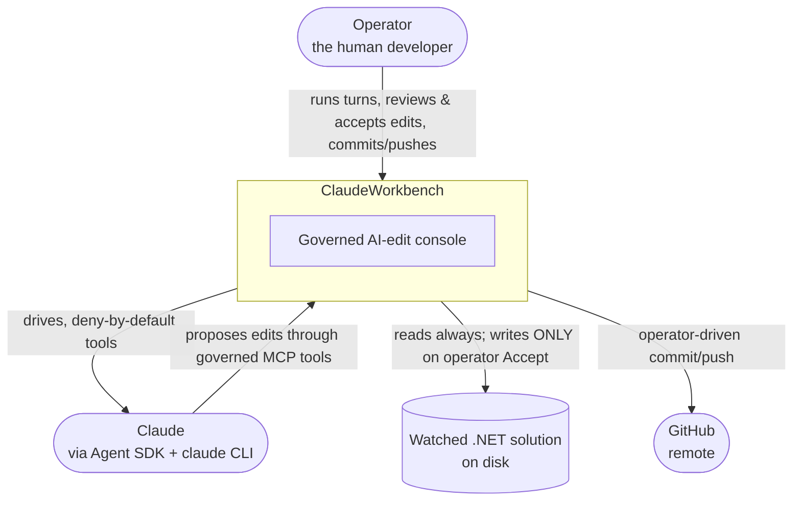
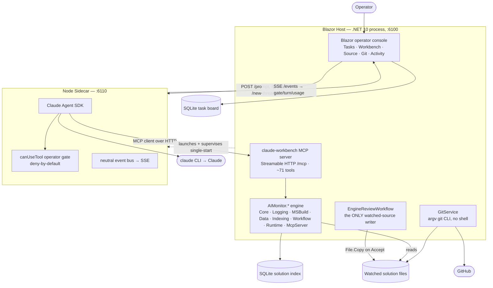
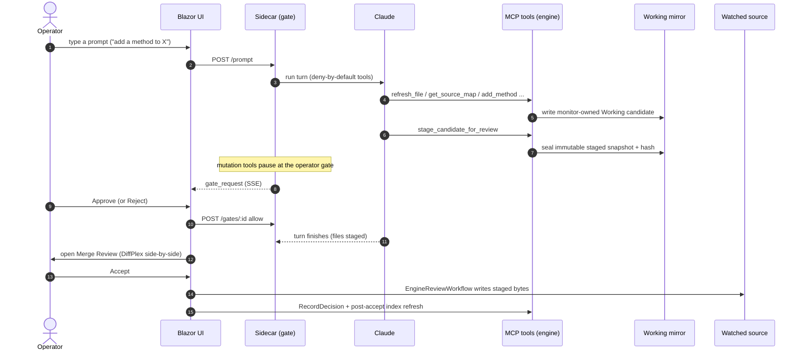
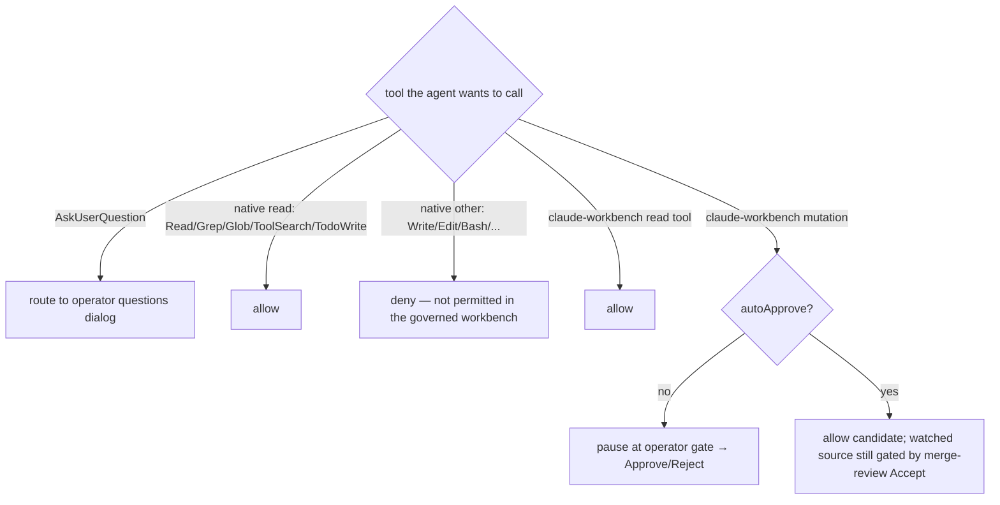
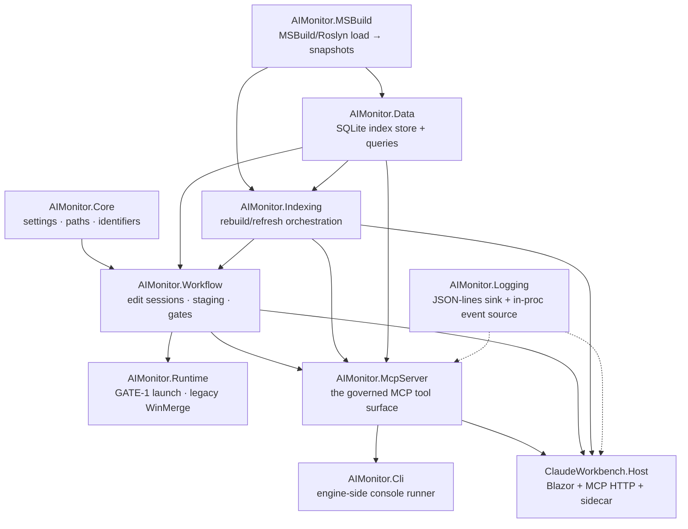

# ClaudeWorkbench — Architecture

> A Blazor operator console for **governed, human-gated AI edits** to a watched .NET
> solution, driven by **Claude** through the Claude Agent SDK. The agent proposes
> changes; every change is composed against a local *Working* candidate, staged, and
> held at a human **accept/reject** gate before it ever touches real source.

This document is the top of the architecture tree. It uses the **C4 model** — zooming
from system **Context** → **Container** → per-module **Component** docs (in
[`../components/`](../components/)). For the operator's view, see the
[user guide](../guide/). For the "why", see the [decisions](../decisions/).

---

## 1. Context (C4 Level 1) — the system in its world



- **Reason in the cloud, edit locally.** Claude reasons from compact context; edits are
  composed against explicit local *Working* candidates and promoted only through review.
- **The gate is code, not a prompt.** Mutations are intercepted and applied only on
  operator approval — see [§5 Governance](#5-governance--the-gate-is-code).
- **Auth is a subscription login.** The Agent SDK spawns the local `claude` CLI, which
  authenticates from the cached `~/.claude` subscription — no `ANTHROPIC_API_KEY` needed
  for personal use.

---

## 2. Containers (C4 Level 2) — the two processes

ClaudeWorkbench is a **two-process** app. A .NET Blazor **Host** and a Node **sidecar**.



**Why two processes.** The Claude Agent SDK is **Node-only** (no .NET SDK). So a thin Node
sidecar runs the SDK and is the MCP *client*; the .NET host owns the engine, the MCP
*server*, and the UI. Everything the human sees and every governed tool the agent calls
lives in the **one** .NET process, so logging and state are in-process — no cross-process
pipe. Details: [`../components/Sidecar.md`](../components/Sidecar.md) and
[`../components/ClaudeWorkbench.Host.md`](../components/ClaudeWorkbench.Host.md).

| Container | Port | Runtime | Responsibility |
|---|---|---|---|
| **Host** | 6100 | .NET 10 (ASP.NET/Blazor Server) | Engine, MCP HTTP surface, operator UI, sidecar supervisor, the sole watched-source writer |
| **Sidecar** | 6110 | Node (Claude Agent SDK, Express) | Drives Claude, MCP client, the `canUseTool` operator gate, neutral SSE events |

---

## 3. The governed edit loop

The heart of the product. An edit never touches real source until the operator accepts it.

```
choose workspace → discover (index) → refresh_file / new_file → governed edit
   → stage session → operator review → accept / reject → post-accept reindex
```



- The agent **stops at the staging line** — it never calls the accept. The operator's
  **Accept** is the only thing that writes real source.
- **Freshness at accept.** The solution index rebuilds after an accepted decision — the
  normal point where downstream truth is refreshed.

Deep dive: [`../components/AIMonitor.Workflow.md`](../components/AIMonitor.Workflow.md).

---

## 4. The two gates

Two independent checks protect watched source. Both must be satisfied to accept.

| Gate | When | What it checks | Where |
|---|---|---|---|
| **GATE 1 — pre-merge validation** | at stage/launch | the staged overlay is readiness-checked (and, on the MCP/CLI path, a full overlay build) | `PreMergeValidationService`, `StagedDiffLaunchWorkflow` |
| **GATE 2 — decision** | at accept | `expectedStagedHash` matches, the staged file is **re-hashed unchanged**, launched, validation completed, and the reviewed (watched) file matches the staged candidate (`dirty-unexpected` guard) | `WorkflowEditService.RecordDecision` |

The core safety invariant: **an accepted edit equals exactly what was reviewed** — the
staged snapshot is copy-once/immutable, accept re-hashes it, and accept independently
requires `watched == staged`. See
[`../components/AIMonitor.Workflow.md`](../components/AIMonitor.Workflow.md#the-safety-invariants-the-crux).

---

## 5. Governance — the gate is code

Governance is **not** policy prose in the model's context. Two mechanisms carry it:

- **Enforcement is code.** Every mutation routes through the sidecar `canUseTool` gate
  (operator accept/reject) and the server-side planned-session gate
  (`EnsurePlannedMutationAllowed`). A denied gate cannot be talked around.
- **The agent is deny-by-default.** Only read-only native tools (`Read`/`Grep`/`Glob`,
  plus `ToolSearch`/`TodoWrite`) and the `claude-workbench` MCP tools are permitted;
  `Write`/`Edit`/`Bash`/`PowerShell`/`Agent`/`WebFetch`/anything unknown are **denied**.
  So the watched workspace is read-only to the agent, and every change must go through the
  governed MCP surface.



Git is governed the same way: the agent's `git_commit` / `git_push` / `git_create_branch`
/ `git_switch_branch` MCP tools **pause at the operator gate**; the agent never runs a
shell. Read: [`../components/Sidecar.md`](../components/Sidecar.md#the-operator-gate-deny-by-default).

---

## 6. The engine layering

The engine was extracted from **AIMonitor** (the WinForms-based origin), one testable
layer at a time, keeping the `AIMonitor.*` namespaces so the port stayed mechanical.
Left behind: the WinForms app, the MCP proxy hub, the stdio bridge, the cross-process log
pipe.



Each box has its own [component doc](../components/). `Core` is the leaf; `Host` is the
composition root.

---

## 7. MCP binding

The sidecar is the MCP **client**; the Agent SDK connects to the engine's MCP **server**
via its `mcpServers` option. Recommended (and implemented) transport: the Host serves MCP
in-proc over **Streamable HTTP** at `http://localhost:6100/mcp`, advertising
`serverInfo.name` = `claude-workbench` (deliberately distinct from the real monitor's
`ai-monitor`). Tools appear to the agent as `mcp__claude-workbench__*`. `strictMcpConfig:
true` exposes only `claude-workbench` — the machine's other MCP connectors don't leak in.

The surface is ~**71 tools**: ~60 `AIMonitorTools` (Editing, Index, Status, RoslynEdits,
Sessions, Review) + 3 `TaskMcpTools` + 8 `GitMcpTools`.

---

## 8. Logging

Engine narration (index rebuilds, staging, gate results, errors) logs via `IMonitorLogger`
to a **JSON-lines file**; in-process, `MonitorLogService` raises `EntryWritten` for a live
UI view. MCP-call telemetry is re-emitted from the sidecar's `tool_use`/`tool_result`
events and hooks — **not** sniffed off a pipe (the old man-in-the-middle proxy is gone).
See [`../components/AIMonitor.Logging.md`](../components/AIMonitor.Logging.md).

---

## 9. Where to read next

- **New to the codebase?** Start at [`../README.md`](../README.md) — the guided path.
- **Operating the app?** [`../guide/`](../guide/).
- **A specific module?** [`../components/`](../components/).
- **Why a decision was made?** [`../decisions/`](../decisions/).
