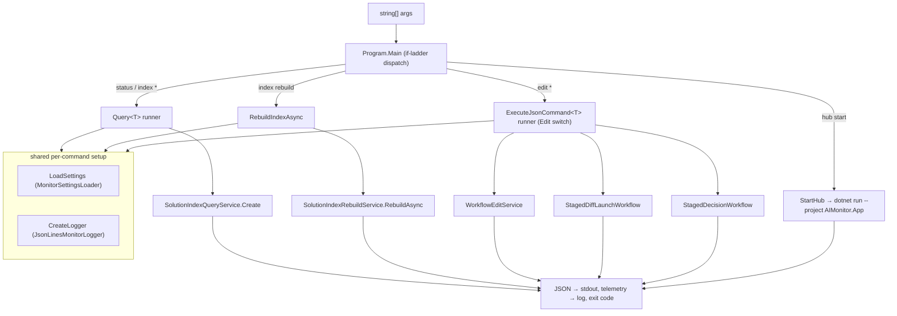

# AIMonitor.Cli

> Engine-side console harness that routes command-line verbs to the AIMonitor engine services — index queries, the staged edit workflow, index rebuilds, and hub launch — emitting JSON to stdout. Not part of the Blazor host runtime path.

**Project:** `src/AIMonitor.Cli/AIMonitor.Cli.csproj` · **Depends on:** `AIMonitor.Core`, `AIMonitor.Data`, `AIMonitor.Workflow`, `AIMonitor.MSBuild`, `AIMonitor.Indexing`, `AIMonitor.Logging`, `AIMonitor.Runtime` (all `ProjectReference`; `net10.0`, `Exe`, implicit usings + nullable, ships an `app.manifest`) · **Depended on by:** `tests/integration/AIMonitor.Integration.Tests` (project-references it, then drives the built `AIMonitor.Cli.dll` out-of-process). Nothing in the Blazor host references it.

## Purpose
AIMonitor.Cli is a single-file console runner (`Program.cs`) that lets a developer or CI job exercise the whole engine from a shell without the Blazor UI. It parses `args`, resolves `MonitorSettings`, constructs the relevant engine service, invokes one method, serializes the result as indented JSON to stdout, and returns a process exit code. It owns no engine logic itself — it is a thin, stateless adapter over services that live in the sibling `AIMonitor.*` modules. Every invocation is also emitted as a structured `adapter.query.started` / `adapter.query.completed` log pair, mimicking the MCP tool-call telemetry (`adapterProtocol = "cli-mcp-like"`), so CLI runs and MCP runs produce comparable logs.

## Command surface
Enumerated from `Program.Main` and the sub-routers (`--help` also prints this list):

| Command | Handler | Backing service |
|---|---|---|
| `hub start [--repo-root <path>]` | `StartHub` | launches `AIMonitor.App` via `dotnet run --project` (child process) |
| `status [--repo-root <path>] [--config <path>]` | `Query` → `GetMonitorStatus()` | `SolutionIndexQueryService` |
| `index rebuild` | `RebuildIndexAsync` | `SolutionIndexRebuildService.RebuildAsync` |
| `index summary` | `Query` → `GetSummary()` | `SolutionIndexQueryService` |
| `index projects` | `Query` → `ListProjects()` | `SolutionIndexQueryService` |
| `index documents [--project 
] [--file 
]` | `Query` → `ListDocuments(...)` | `SolutionIndexQueryService` |
| `index symbols [--file 
] [--name <n>]` | `Query` → `ListSymbols(...)` | `SolutionIndexQueryService` |
| `index references [--symbol <stable-key>]` | `Query` → `ListReferences(...)` | `SolutionIndexQueryService` |
| `index references-in-file --file 
` | `Query` → `ListReferencesInFile(...)` | `SolutionIndexQueryService` |
| `index packages` | `Query` → `ListPackageReferences()` | `SolutionIndexQueryService` |
| `edit refresh --file 
` | `WorkflowEditService.Refresh` | `AIMonitor.Workflow` |
| `edit new --file <future-path>` | `WorkflowEditService.NewFile` | `AIMonitor.Workflow` |
| `edit replace-text --file 
 --old-text\|--old-text-file --new-text\|--new-text-file [--expected-matches] [--expected-working-hash] [--occurrence-index]` | `WorkflowEditService.ReplaceText` | `AIMonitor.Workflow` |
| `edit status --file 
` | `WorkflowEditService.GetStatus` | `AIMonitor.Workflow` |
| `edit stage --file 
 [--ledger-summary <t>] [--verbose]` | `WorkflowEditService.Stage` + `CreateSummary` | `AIMonitor.Workflow` |
| `edit staged-record --staged-record-id <id>` | `WorkflowEditService.GetStagedRecord` | `AIMonitor.Workflow` (not in `--help`) |
| `edit launch-diff --staged-record-id <id> [--diff-tool 
] [--force-validation]` | `StagedDiffLaunchWorkflow.Launch` | `AIMonitor.Runtime` |
| `edit record-decision --staged-record-id <id> --decision accepted\|rejected [--expected-staged-hash <h>]` | `StagedDecisionWorkflow.Record` | `AIMonitor.Indexing` |
| `edit accept --file 
 --expected-staged-hash <h>` | `Accept` (shortcut → `StagedDecisionWorkflow.Record`) | `AIMonitor.Indexing` |
| `edit reject --file 
` | `Reject` (shortcut → `StagedDecisionWorkflow.Record`) | `AIMonitor.Indexing` |

No args, or `--help`, prints the command list and returns `0`. An unknown top-level verb returns `2`; an unknown `index` sub-verb returns `2`; a thrown exception is caught, its message written to stderr, and returns `1`.

## Key types
`Program.cs` is the module's only source file. The "types" below are the engine services it constructs and drives; each lives in a sibling module.

| Type | File | Role |
|---|---|---|
| `Program` | `src/AIMonitor.Cli/Program.cs` | Static entry point + arg router. Owns `Main`, the `IsXxx` dispatch predicates, the `Query<T>`/`ExecuteJsonCommand<T>` runners, option parsing (`GetOption`/`RequireOption`/`RequireTextOption`), and log/JSON shaping helpers. |
| `SolutionIndexQueryService` | `AIMonitor.Data/SolutionIndexQueryService.cs` | Read-side index queries — backs `status` and every `index …` verb. Created via `SolutionIndexQueryService.Create(settings)`. |
| `SolutionIndexRebuildService` | `AIMonitor.Indexing/SolutionIndexRebuildService.cs` | `RebuildAsync` re-indexes the watched solution; the only `async` command. |
| `WorkflowEditService` | `AIMonitor.Workflow/WorkflowEditService.cs` | The human-gated edit session (refresh / new / replace-text / status / stage / staged-record). |
| `StagedDiffLaunchWorkflow` | `AIMonitor.Runtime/StagedDiffLaunchWorkflow.cs` | Pre-merge validation + external diff-tool launch for `edit launch-diff`. |
| `StagedDecisionWorkflow` | `AIMonitor.Indexing/StagedDecisionWorkflow.cs` | Records accept/reject and rebuilds the index on accept; backs `record-decision`, `accept`, `reject`. |
| `MonitorSettingsLoader` | `AIMonitor.Core/MonitorSettingsLoader.cs` | `LoadSettings` resolves `--repo-root` (default cwd) + `--config` into `MonitorSettings`. |
| `JsonLinesMonitorLogger` | `AIMonitor.Logging/JsonLinesMonitorLogger.cs` | The `IMonitorLogger` every command writes its start/complete telemetry to. |

## How it works
`Main` is an ordered if-ladder: it checks `--help`, then `hub start`, then `status`, then `index rebuild`, then any `index` verb, then any `edit` verb, else "Unknown command". Read verbs flow through the generic `Query<T>` runner; `edit` verbs through `ExecuteJsonCommand<T>`. Both share the same shape: load settings, open the logger, log `adapter.query.started`, run the delegate, `JsonSerializer.Serialize` the result (`WriteIndented`, web naming, `JsonStringEnumConverter`) to stdout, log `adapter.query.completed` with duration/shape/count/preview, return `0`; on exception, write `ex.Message` to stderr and return `1`. `index rebuild` and `hub start` have their own `try/catch` runners.

## Owns / Does Not Own
- **Owns:** the command grammar / verb dispatch; option parsing conventions (`--name value`, `--flag` presence, `--*-text` vs `--*-text-file` mutual exclusion); the JSON-to-stdout + exit-code contract; the `cli-mcp-like` telemetry envelope and its log-preview redaction; the `edit stage` / `edit accept` / `edit reject` convenience response shaping; launching the hub as a child process.
- **Does not own:** any indexing, edit-session, staging, validation, diff-launch, or decision logic (all in the sibling engine modules); settings resolution (`AIMonitor.Core`); log sink formatting (`AIMonitor.Logging`); the Blazor UI or MCP server; the watched solution's contents.

## Role in the system
AIMonitor.Cli is a developer / CI harness, **not** a component of the ClaudeWorkbench Blazor host (`AIMonitor.App` / the Host) runtime path — nothing the operator console loads references this project. It is the out-of-process, shell-and-JSON front door to the same engine services the app and the MCP server use in-process, which makes it ideal for scripted end-to-end exercises and for reproducing engine behavior deterministically. The one link back to the app is `hub start`, which merely *shells out* to `dotnet run --project src/AIMonitor.App/AIMonitor.App.csproj` (resolved under `--repo-root`, default cwd) — the CLI is not loaded by the app it starts.

## Gotchas & invariants
- **JSON is the API.** stdout is always the serialized result (indented, web casing, enums as strings via `JsonStringEnumConverter`). Human-readable lines only appear for `index rebuild` and `hub start`. Errors go to **stderr**, never stdout.
- **Exit codes are meaningful:** `0` success, `1` a caught exception (message on stderr), `2` an unrecognized top-level or `index` sub-command. Callers should branch on the code, not parse text.
- **`--repo-root` defaults to the current working directory**, and `--config` overrides the settings file. Path-scoped verbs accept either a full path or a watched-relative path (e.g. `--file Program.cs`), because resolution happens inside the engine services.
- **`--old-text`/`--new-text` and `--old-text-file`/`--new-text-file` are mutually exclusive per pair** (`RequireTextOption` throws if both are given); the `-file` variants are read with `File.ReadAllText`. Inline `--old-text`/`--new-text` values are **redacted** in the `commandLine`/`paramsPreview` telemetry, and any `snippet` property in a response is redacted in the logged preview.
- **`edit accept` is hash-gated; `edit reject` is not.** `Accept` requires `--expected-staged-hash` (also accepts `--expected-hash`) and throws if the file has no staged record; `Reject` passes a null hash. Both are thin shortcuts that look up `status.LastStagedRecordId` and delegate to `StagedDecisionWorkflow.Record`.
- **`edit staged-record` exists but is undocumented in `--help`** — it maps to `WorkflowEditService.GetStagedRecord`.
- **Option parsing is positional and case-insensitive:** `GetOption` scans for `--name` and returns the next token; a flag is "true" only if a value token follows, otherwise treated as a boolean via `HasOption`. `--expected-matches` / `--occurrence-index` must parse as integers or the command throws.
- **Ships an `app.manifest`** (Common-Controls dependency) because `edit launch-diff` can spawn a Windows GUI diff tool; integration tests set `AIMONITOR_DISABLE_VALIDATION_DIALOG=1` to suppress any dialog.

## Where to start reading
1. `Program.Main` — the whole dispatch surface in one method; read the if-ladder top-to-bottom.
2. `Query<T>` and `ExecuteJsonCommand<T>` — the shared settings → log → run → serialize → log → exit pipeline every command reuses.
3. `Edit` — the `switch` mapping each `edit` sub-verb to its service call, plus `LaunchDiff` / `RecordDecision` / `Accept` / `Reject` / `CreateStageResponse` for response shaping.
4. The option/telemetry helpers (`GetOption`, `RequireTextOption`, `CreateParamsPreview`, `RedactSnippetProperties`) — the parsing and redaction conventions.

## Tests
The CLI has no unit tests of its own; it is exercised end-to-end by the **integration** suite, `tests/integration/AIMonitor.Integration.Tests/CliIndexQueryTests.cs`. That project **project-references** `AIMonitor.Cli` so the `AIMonitor.Cli.dll` is built, then its `RunCliAsync` helper launches it **out-of-process** via `dotnet <cliDll> <args…>`, capturing exit code / stdout / stderr with a 60s timeout and `AIMONITOR_DISABLE_VALIDATION_DIALOG=1`. Each test seeds a temp repo + `MonitorSettings` + a SQLite index snapshot, then asserts on the JSON. Coverage spans `status`, the `index symbols`/`documents`/`references-in-file` queries (full and watched-relative paths), and the full `edit` lifecycle: refresh → replace-text → stage → launch-diff (validation gates: errors-only-block, warning-only-passes, staged-hash-mismatch, multi-file compile-error block, runtime-exclusion) → record-decision / accept / reject, including CRLF preservation, `edit new` file creation, and Razor/CSS round-trips. The `tests/smoke` projects are separate console runners that drive the engine through the MCP bridge, not through this CLI.
