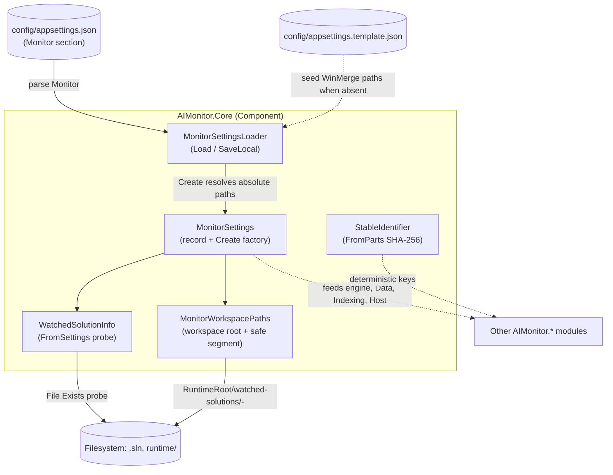
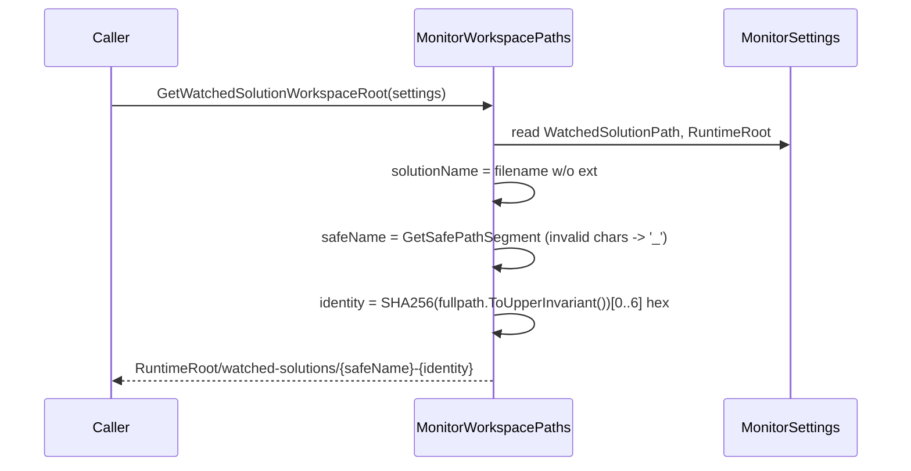

# AIMonitor.Core

> The foundational settings, path-resolution, and stable-identifier layer for the AIMonitor engine — resolves where the watched solution and runtime live before any other subsystem runs.

**Project:** `src/AIMonitor.Core/AIMonitor.Core.csproj` · **Depends on:** none (leaf — no `ProjectReference`, targets `net10.0` with implicit usings + nullable enabled) · **Depended on by:** `AIMonitor.Data`, `AIMonitor.Indexing`, `AIMonitor.Logging`, `AIMonitor.McpServer`, `AIMonitor.MSBuild`, `AIMonitor.Workflow`, `ClaudeWorkbench.Host` (and the integration/unit test projects)

## Purpose
AIMonitor.Core answers one question for every other module: *"Given a repository root, where is the watched solution, where is the runtime workspace, and what stable name identifies this configuration?"* It loads and saves the `Monitor` section of `config/appsettings.json`, normalizes every configured path to a rooted absolute path, and derives deterministic per-solution workspace folders and content-addressable identifiers. It holds no engine logic, no I/O beyond settings/probe files, and no UI — it is deliberately a thin, pure foundation.

## Key types
| Type | File | Role |
|---|---|---|
| `MonitorSettings` | `MonitorSettings.cs` | Immutable `record` holding the resolved `RepositoryRoot`, `RuntimeRoot`, `WatchedSolutionPath`, and `WinMergeCandidatePaths`. `Create(...)` factory normalizes all inputs to absolute paths. |
| `MonitorSettingsLoader` | `MonitorSettingsLoader.cs` | Static loader/saver. `Load` parses the `Monitor` JSON element into `MonitorSettings`; `SaveLocal` writes a local settings file, preserving existing WinMerge paths. |
| `MonitorWorkspacePaths` | `MonitorWorkspacePaths.cs` | Static helper that derives the per-solution workspace root under `RuntimeRoot/watched-solutions/` and sanitizes path segments. |
| `WatchedSolutionInfo` | `WatchedSolutionInfo.cs` | Immutable `record` describing the watched solution — path, project folder, and whether the `.sln` exists on disk. `FromSettings` probes the filesystem. |
| `StableIdentifier` | `StableIdentifier.cs` | Static utility producing deterministic `prefix:hex` identifiers from normalized parts via SHA-256. |
| `MonitorSettings.WatchedProjectFolder` | `MonitorSettings.cs` | Computed property — the directory containing the watched `.sln`. |

## How it works
`MonitorSettings` is the central value object; everything else either produces it, consumes it, or derives values from it. All path normalization funnels through `Path.GetFullPath` / `Path.Combine`, so downstream modules never see a relative path.

`MonitorSettingsLoader.Load` reads the `Monitor` object from `config/appsettings.json` (override path allowed). It requires `WatchedSolutionPath`, defaults `RuntimeRoot` to the literal `"runtime"` when absent, and resolves both relative to the correct base directory before handing off to `MonitorSettings.Create`. `WinMergeCandidatePaths` are read from the settings file, or — when absent — seeded from `config/appsettings.template.json`.

`MonitorWorkspacePaths.GetWatchedSolutionWorkspaceRoot` combines a filesystem-safe solution name with a short SHA-256 fingerprint of the *absolute, upper-cased* solution path, giving a collision-resistant per-solution folder under `RuntimeRoot`. `StableIdentifier.FromParts` applies the same normalization philosophy to produce stable IDs for arbitrary key parts.



## Key flows

Loading settings from `config/appsettings.json`:

```mermaid
sequenceDiagram
    participant Caller
    participant Loader as MonitorSettingsLoader
    participant FS as Filesystem
    participant Settings as MonitorSettings

    Caller->>Loader: Load(repositoryRoot, settingsPath?)
    Loader->>Loader: ResolveSettingsPath (default config/appsettings.json)
    Loader->>FS: File.Exists(settingsPath)?
    alt missing
        Loader-->>Caller: throw FileNotFoundException
    end
    Loader->>FS: read + JsonDocument.Parse
    Loader->>Loader: RequireString WatchedSolutionPath
    Loader->>Loader: RuntimeRoot ?? "runtime"
    Loader->>Loader: WinMergeCandidatePaths (file, else template)
    Loader->>Settings: Create(repoRoot, watchedSln, runtimeRoot, winMerge)
    Settings->>Settings: GetFullPath each; RuntimeRoot ?? repoRoot/runtime
    Settings-->>Caller: MonitorSettings (all paths absolute)
```

Resolving the per-solution workspace root:



## Owns / Does Not Own
- **Owns:** the shape and resolution rules of `MonitorSettings`; parsing/serialization of the `Monitor` settings section; the default `"runtime"` runtime-root convention; derivation of per-solution workspace folder names; filesystem-safe path-segment sanitization; deterministic identifier hashing (`StableIdentifier`, workspace-path fingerprints).
- **Does not own:** indexing, edit sessions, staging, review gates, or any MCP tool logic (those live in `AIMonitor.Indexing`, `AIMonitor.Workflow`, `AIMonitor.McpServer`); logging (`AIMonitor.Logging`); the actual runtime directory *contents* — it only computes the paths, it does not create the workspace tree; the Blazor Host or Node sidecar wiring.

## Gotchas & invariants
- **RuntimeRoot resolves relative to the repository root when not absolute.** In `Load`, `RuntimeRoot` is resolved via `ResolvePath(runtimeRoot, resolvedRepositoryRoot)`, and `MonitorSettings.Create` defaults it to `Path.Combine(resolvedRepositoryRoot, "runtime")`. A rooted `RuntimeRoot` is honored as-is; a relative one is anchored to the repo root, not the current working directory.
- **WatchedSolutionPath resolves relative to the *settings file's directory*, not the repo root** (`ResolvePath(watchedSolutionPath, settingsDirectory)`). If the settings file lives outside `config/`, the anchor moves with it.
- **All paths in a constructed `MonitorSettings` are absolute.** Both `Create` and `Load` push every value through `Path.GetFullPath`; downstream code may assume rooted paths.
- **`RuntimeRoot` default is the literal string `"runtime"`** when the property is missing or blank — both in `Load` (`?? "runtime"`) and in `SaveLocal` (blank → `"runtime"`).
- **Workspace identity is case-insensitive but content-addressable.** `GetPathIdentity` upper-cases and full-paths before hashing (6 bytes → 12 hex chars), so `C:\Foo\App.sln` and `c:\foo\APP.SLN` map to the same folder; different real paths get distinct suffixes.
- **`StableIdentifier.FromParts` normalizes aggressively:** backslashes → forward slashes, trim, upper-case, joined with the ASCII unit-separator ``, SHA-256, first 12 bytes → 24 hex chars, prefixed `prefix:`. Nulls are treated as empty strings.
- **`GetSafePathSegment` never returns empty:** invalid filename chars become `_`, leading/trailing dots and spaces are trimmed, and an otherwise-blank result falls back to `"solution"`.
- **`SaveLocal` preserves existing WinMerge candidate paths** — it reads them back from the existing file (or the template when the file is absent) rather than dropping them, so saving does not clobber operator-tuned diff-tool paths.
- **`WatchedSolutionInfo.FromSettings` performs a live `File.Exists` probe** — its `SolutionExists` is a point-in-time snapshot, not a watched/reactive value.

## Where to start reading
1. `MonitorSettings.cs` — the value object and its `Create` normalization; understand this first.
2. `MonitorSettingsLoader.cs` — `Load` and `ResolvePath`/`ResolveSettingsPath` show the base-directory anchoring rules; `SaveLocal` shows the round-trip and WinMerge preservation.
3. `MonitorWorkspacePaths.cs` — `GetWatchedSolutionWorkspaceRoot` + `GetPathIdentity` for the per-solution folder convention.
4. `StableIdentifier.cs` — the shared hashing/normalization pattern reused across the engine.

## Tests
Covered by the unit project **`tests/unit/AIMonitor.Core.Tests`**:
- `MonitorSettingsTests.cs` — `Create` normalization / default runtime-root behavior.
- `MonitorSettingsLoaderTests.cs` — load/save, path anchoring, WinMerge template seeding.
- `MonitorWorkspacePathsTests.cs` — safe-segment sanitization and workspace-root derivation.

Also exercised indirectly through `tests/integration/AIMonitor.Integration.Tests` and the smoke test projects, which reference AIMonitor.Core to construct settings for end-to-end scenarios.
