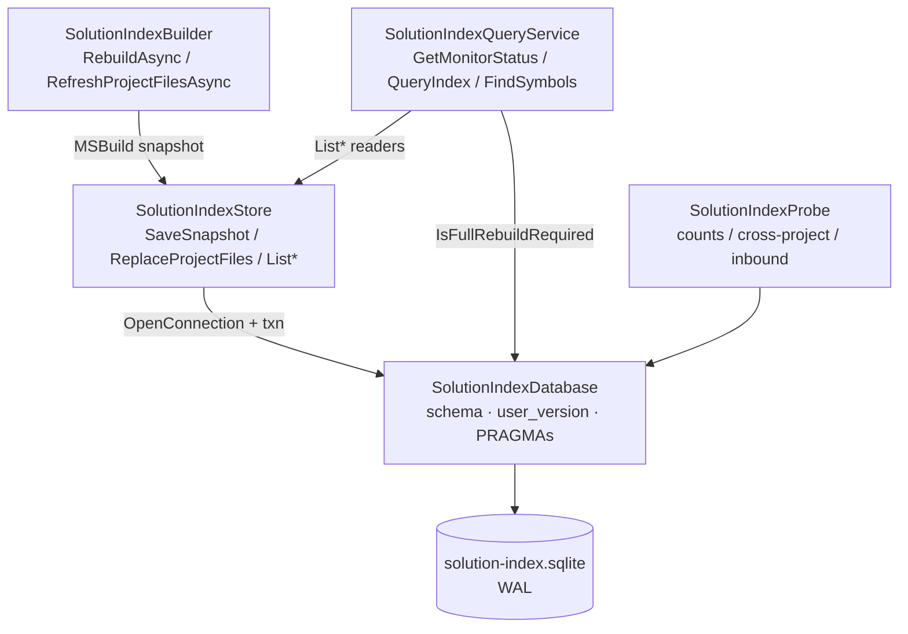
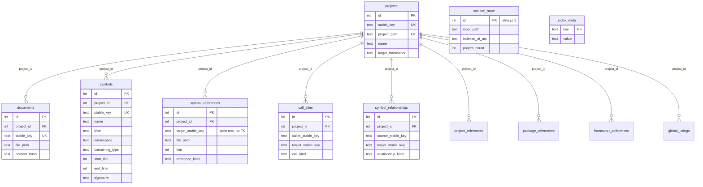
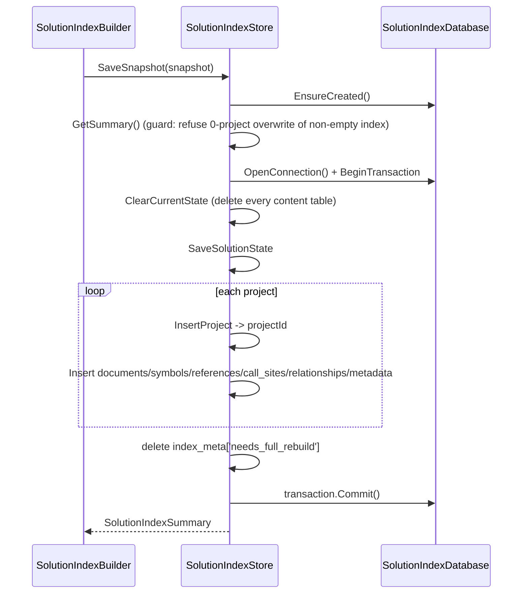
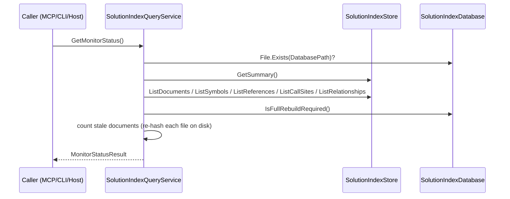

# AIMonitor.Data

> SQLite persistence for the Roslyn-extracted solution index — the "downstream truth" written after an accepted edit and read back to answer structural queries.

**Project:** `src/AIMonitor.Data/AIMonitor.Data.csproj` · **Depends on:** `AIMonitor.Core` (settings/paths, `StableIdentifier`), `AIMonitor.MSBuild` (snapshot DTOs + `MSBuildWorkspaceLoader`), `Microsoft.Data.Sqlite` 10.0.8 · **Depended on by:** `AIMonitor.Indexing`, `AIMonitor.McpServer`, `ClaudeWorkbench.Host`, plus the integration/unit test suites (the language corpus fixtures live in `tests/unit/AIMonitor.Data.Tests/Corpus`)

## Purpose

AIMonitor.Data owns the on-disk **solution index**: a single SQLite database (`<workspace>/data/solution-index.sqlite`) that stores what Roslyn/MSBuild extracted from the watched .NET solution — projects, documents, symbols, references, call sites, symbol relationships, and project/package/framework/global-using metadata.

The index is a **derived snapshot, not transactional data**. It is regenerated from the MSBuild workspace whenever the source changes: a full `RebuildAsync` after a large change or schema bump, or a project-scoped `RefreshProjectFiles` after an accepted single-project edit. Callers (the MCP server, CLI, and Blazor host) read it to answer "where is X", "who calls X", "what does file Y contain" without re-parsing the solution on every query.

## Key types

| Type | File | Role |
| --- | --- | --- |
| `SolutionIndexDatabase` | `SolutionIndexDatabase.cs` | Owns the connection, PRAGMAs, schema DDL, `user_version` schema-versioning, and the `needs_full_rebuild` marker. |
| `SolutionIndexStore` | `SolutionIndexStore.cs` | Write path (`SaveSnapshot`, `ReplaceProjectFiles`) and low-level list readers over the tables. |
| `SolutionIndexQueryService` | `SolutionIndexQueryService.cs` | Read-facing API: `GetMonitorStatus`, `QueryIndex`, `FindSymbols`, `GetFileDetail`, staleness checks, path resolution. |
| `SolutionIndexProbe` | `SolutionIndexProbe.cs` | Read-only verification/analysis queries (reference-kind counts, cross-project edges, inbound-dependent projects, row counts). |
| `SolutionIndexBuilder` | `SolutionIndexBuilder.cs` | Orchestrates MSBuild snapshot -> store (`RebuildAsync`, `RefreshProjectFilesAsync`). |
| `MonitorDataPaths` | `MonitorDataPaths.cs` | Resolves the default database path under the watched-solution workspace root. |
| `Indexed*Row` / `MonitorStatusResult` / `SolutionIndexSummary` | `Indexed*.cs`, etc. | Immutable DTOs returned to callers. |

## How it works

`SolutionIndexBuilder` obtains an `MSBuildSolutionSnapshot` from `AIMonitor.MSBuild`, then hands it to `SolutionIndexStore` to persist. `SolutionIndexDatabase` is the single owner of the SQLite file: every read/write opens a fresh connection through `OpenConnection()`, which sets `journal_mode=wal` and `foreign_keys=on`. Queries flow through `SolutionIndexQueryService`, which composes the store's list readers with path resolution, scoping, staleness hashing, and result clamping. `SolutionIndexProbe` runs standalone analytic SQL (used both by the scoped-refresh dependency logic and by the test suites).

## Data model

Thirteen tables. `projects` is the hub; the per-project tables carry a `project_id` FK with `ON DELETE CASCADE` (so deleting a project row clears all its owned rows). `solution_state` is a singleton (`check (id = 1)`) holding the last snapshot summary. `index_meta` is a durable key/value store that survives the row churn of `ClearCurrentState` — it holds the `needs_full_rebuild` marker.

The `symbols`/`documents`/`projects` `stable_key` columns are `unique`. Cross-symbol edges (`symbol_references`, `call_sites`, `symbol_relationships`) reference target/source symbols only by **plain-text `*_stable_key` columns — there is no cross-symbol FK** (removed in schema v2; see versioning note). Joins to resolve those keys happen at query time.

Not shown as relations: `project_references`, `package_references`, `framework_references`, `global_usings` (all `project_id`-owned metadata) and `diagnostics` (`id`, `message` — no FK). Roughly 25 secondary indexes back the common lookups (by `project_id`, `stable_key`, `target_stable_key`, `file_path`, `name`).

**Schema versioning.** `SchemaVersion = 2` is persisted via `PRAGMA user_version`. On `EnsureCreated()`, if the persisted version differs (including a fresh db reporting `0`), the index is treated as invalid: `EnsureCreated` **drops all tables, recreates the schema empty, sets `index_meta['needs_full_rebuild'] = '1'`, and stamps the new `user_version` — there is no content migration**. While the marker is set, the index is stale: scoped refreshes must be upgraded to a full rebuild and status reports `RebuildRequired = true`. A successful `SaveSnapshot` (full rebuild) deletes the marker in the same transaction.

## Key flows

`SaveSnapshot` runs the whole write as **one transaction** (full replace). `ReplaceProjectFiles` is the scoped write: it looks up `project_id` by path, deletes only that project's rows (order-independent now that no cross-symbol FK exists), reinserts the refreshed documents/symbols/references, and recomputes `solution_state` counts.

## Owns / Does Not Own

**Owns:** the SQLite schema and DDL; the connection/PRAGMA policy; schema versioning and the rebuild marker; the write transactions; all read queries and the DTO shapes; staleness detection (SHA-256 content-hash comparison); default database-path resolution.

**Does not own:** MSBuild/Roslyn extraction (that is `AIMonitor.MSBuild` — this project consumes its snapshot DTOs); the decision of *when* to rebuild vs. scoped-refresh and the inbound-dependency guard (that lives in the post-accept refresh service, which merely *uses* `SolutionIndexProbe.GetInboundDependentProjectPaths`); stable-key generation semantics (`AIMonitor.Core.StableIdentifier`); the MCP tool surface and the Blazor UI.

## Gotchas & invariants

- **All content SQL is parameterized** (`$name` bound parameters). The only non-bound interpolation is `PRAGMA user_version = <int>` and `drop table <name>` / `count(*) from <table>`, all from internal constants — never user input.
- **WAL mode + `foreign_keys=on`** are set on every `OpenConnection()`. Deleting a `projects` row cascades to all owned tables; a plain `DROP TABLE` does not run cascades, which is why `DropAllIndexTables` can drop in any order.
- **Connection-per-call, `using`-disposed.** No pooled/long-lived connection is held; each public method opens, does its work, and disposes. There is **no `busy_timeout`** set — concurrent writers can hit SQLITE_BUSY.
- **Zero-project guard:** `SaveSnapshot` refuses to overwrite a non-empty index with a zero-project snapshot (a degraded MSBuild load), throwing rather than wiping the index.
- **Per-row inserts:** every document/symbol/reference/etc. is a separate `SqliteCommand.ExecuteNonQuery` in the loop (no batched/multi-row insert or prepared-statement reuse). It is all inside one transaction, but large solutions pay command-per-row overhead.
- **Full-table reads:** `GetMonitorStatus`/`QueryIndex` load *entire* documents+symbols (+references/call-sites/relationships) tables into memory and filter/scope in LINQ, not SQL. `SymbolCount`/`ReferenceCount` etc. are `List.Count` of materialized rows, not `SELECT count(*)`.
- **Staleness re-hashes files on disk:** `GetMonitorStatus.StaleFileCount` and `GetFileDetail` open and SHA-256 every indexed file on each call — I/O-bound and unbounded by index size.
- **Correlated subquery:** the no-filter `ListReferences` resolves each row's containing "caller" symbol via a correlated `select ... limit 1` per reference row — a foot-gun on large reference tables.
- **`SQLitePCLRaw` advisory (NU1903):** `Microsoft.Data.Sqlite` 10.0.8 pulls in `SQLitePCLRaw.bundle_e_sqlite3` 2.1.11, which carries a transitive advisory. **Not exploitable here** — the app creates a local database it fully controls and every query uses bound parameters (no attacker-controlled SQL string, no untrusted DB file). Remediation if flagged: pin `SQLitePCLRaw.bundle_e_sqlite3 >= 3.50.3`.

## Where to start reading

1. `SolutionIndexDatabase.cs` — the schema (`CreateSchema`), `user_version` handling, and the `needs_full_rebuild` lifecycle. Read this first; the whole data model lives here.
2. `SolutionIndexStore.cs` — `SaveSnapshot` (full write) and `ReplaceProjectFiles` (scoped write), then the `List*` readers.
3. `SolutionIndexQueryService.cs` — how reads are scoped, clamped, and hashed for staleness.
4. `SolutionIndexProbe.cs` — the cross-project/inbound-dependency queries that drive scoped-refresh safety.

## Tests

`tests/unit/AIMonitor.Data.Tests` (xUnit, net10.0). Notable coverage: `SolutionIndexDatabaseSchemaVersionTests` (recreate-on-version-mismatch + marker lifecycle), `SolutionIndexStoreTests` (write/read round-trips, zero-project guard), `SolutionIndexQueryServiceTests` (scoping, staleness, qualified symbol search), `SolutionIndexBuilderTests`, and MCP-surface/token-benchmark suites.

One test is **skipped**: in `SolutionIndexBuilderTests.cs` (line 156), a `razor-generated:*` reference-row assertion is `[Fact(Skip = ...)]` because those rows only materialize when the MSBuildWorkspace host Roslyn matches the SDK's Razor source-generator version; on a skewed host the generator is silently skipped, so the row is environment-dependent (documented-don't-pin). The `razor:*` code-behind path stays covered.
