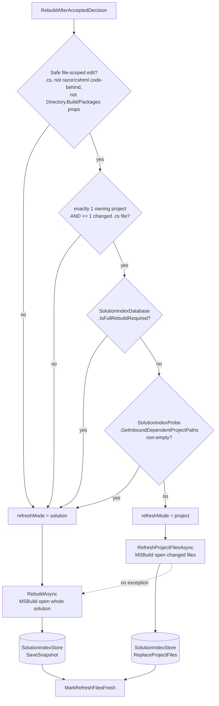
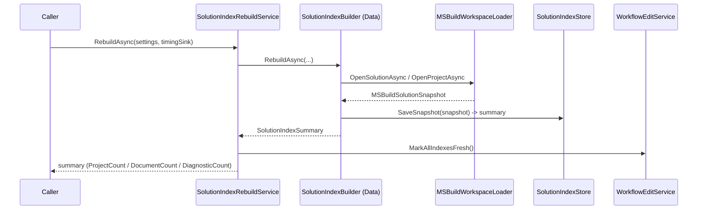
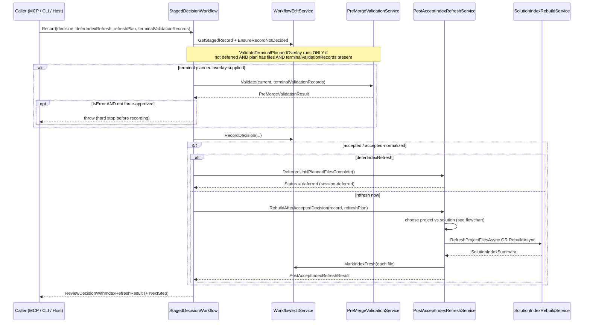

# AIMonitor.Indexing

> Orchestrates building and refreshing the solution index after governed AI edits: it drives MSBuild loading + semantic extraction into the SQLite index, and owns the post-accept refresh (scoped vs full) plus the staged-decision workflow.

**Project:** `src/AIMonitor.Indexing/AIMonitor.Indexing.csproj` · **Depends on:** `AIMonitor.Core`, `AIMonitor.Data`, `AIMonitor.Logging`, `AIMonitor.MSBuild`, `AIMonitor.Workflow`, `Microsoft.CodeAnalysis.CSharp.Workspaces` · **Depended on by:** `ClaudeWorkbench.Host` (EngineReviewWorkflow), `AIMonitor.McpServer` (AIMonitorTools.Review), `AIMonitor.Cli`, `tests/smoke/AIMonitor.ToolSmokeTests`, `tests/unit/AIMonitor.Indexing.Tests`

## Purpose

This project is the orchestration layer that keeps the solution index consistent with the watched .NET solution after a human accepts (or rejects) an AI-proposed edit. It does not itself parse C# or write SQLite rows — it composes lower layers:

- `AIMonitor.MSBuild` loads the solution/project into a Roslyn workspace and produces an immutable `MSBuildSolutionSnapshot` / `MSBuildProjectFileSnapshot` (documents, symbols, references).
- `AIMonitor.Data` (`SolutionIndexBuilder`, `SolutionIndexStore`, `SolutionIndexDatabase`, `SolutionIndexProbe`) persists snapshots into the versioned SQLite index and answers cross-project reference queries.
- `AIMonitor.Workflow` (`WorkflowEditService`, `PreMergeValidationService`) records decisions, marks index freshness per file, and runs the terminal overlay build.

On top of these it decides *what to reindex* (a single project's changed files vs. the whole solution) and *when* (immediately vs. deferred until all files in a planned multi-file session reach a terminal decision).

## Key types

| Type | File | Role |
| --- | --- | --- |
| `StagedDecisionWorkflow` | `StagedDecisionWorkflow.cs` | Entry point for recording a review decision: optional terminal overlay build gate, records the decision via `WorkflowEditService`, then triggers/defers the post-accept index refresh. |
| `PostAcceptIndexRefreshService` | `PostAcceptIndexRefreshService.cs` | Chooses scoped ("project") vs full ("solution") refresh, executes it, handles the solution fallback, marks files fresh, and emits telemetry. Also exposes the `deferred` sentinel. |
| `SolutionIndexRebuildService` | `SolutionIndexRebuildService.cs` | Thin façade over `AIMonitor.Data.SolutionIndexBuilder`: `RebuildAsync` (full) and `RefreshProjectFilesAsync` (scoped); clears stale flags after a full rebuild. |
| `PostAcceptIndexRefreshPlan` | `PostAcceptIndexRefreshPlan.cs` | Caller-supplied refresh closure: owning project paths, changed file paths; `InboundReferencingProjects` is filled in at refresh time for telemetry. |
| `PostAcceptIndexRefreshResult` | `PostAcceptIndexRefreshResult.cs` | Outcome of a refresh: `Status`, `RefreshMode`, counts, duration, `IsError`, message. |
| `ReviewDecisionWithIndexRefreshResult` | `ReviewDecisionWithIndexRefreshResult.cs` | Full result of `StagedDecisionWorkflow.Record`: decision fields, staged summary, `IndexRefresh`, `TerminalPreMergeValidation`, `NextStep`. |
| `IndexingBoundary` | `IndexingBoundary.cs` | Architectural contract constant: "Indexing consumes MSBuild-loaded projects and must preserve project identity." |

## How it works

Two responsibilities live here. The first is the **build/refresh pipeline** — a snapshot-then-persist flow that `SolutionIndexRebuildService` delegates into `AIMonitor.Data.SolutionIndexBuilder`. A full rebuild opens the whole solution (or a single `.csproj`) via `MSBuildWorkspaceLoader`, then `SolutionIndexStore.SaveSnapshot` writes every row. A scoped refresh opens only the changed files of one project (carrying forward the *other* files' existing symbol snapshots so cross-file references resolve), then `store.ReplaceProjectFiles` swaps just that project's rows. Each phase reports through the optional `timingSink` as `index.full.*` / `index.project.*` telemetry.

The second is the **refresh orchestration** in `PostAcceptIndexRefreshService.RebuildAfterAcceptedDecision`, which decides between a cheap project-scoped refresh and a full solution rebuild.

## Key flows

**Full rebuild** (manual, or the solution path / fallback of a post-accept refresh):

**Post-accept refresh via `StagedDecisionWorkflow.Record`**, including the terminal overlay build gate, the scoped-vs-full choice, and session deferral:

The deferral pattern: in a planned multi-file session, non-terminal accepts call `Record` with `deferIndexRefresh: true`, which records the decision but returns the `deferred` sentinel instead of touching the index. Only the terminal file passes `deferIndexRefresh: false` (plus the `refreshPlan` listing every session file), so the index is rebuilt exactly once against the fully-applied batch.

## Owns / Does Not Own

**Owns**

- The scoped-vs-full refresh *decision* and its guard rails (`RebuildAfterAcceptedDecision`).
- Session-level *deferral* semantics (`DeferredUntilPlannedFilesComplete`, the `deferIndexRefresh` flag).
- The terminal overlay *build gate* wiring (`ValidateTerminalPlannedOverlay` calling `PreMergeValidationService`).
- Post-refresh freshness marking, including the Razor code-behind fix-up in `GetFilesToMarkFresh`.
- Refresh telemetry (`index.refresh-after-accept.*` events and per-phase timing sinks).

**Does not own**

- C# parsing / symbol extraction — `AIMonitor.MSBuild`.
- SQLite schema, row persistence, cross-project reference queries, and the schema-version rebuild gate — `AIMonitor.Data` (`SolutionIndexDatabase`, `SolutionIndexStore`, `SolutionIndexProbe`).
- Decision recording, hash checks, and per-file stale flags — `AIMonitor.Workflow.WorkflowEditService`.
- The Blazor accept UI / session sequencing — `ClaudeWorkbench.Host` (`EngineReviewWorkflow`).

## Gotchas & invariants

- **Scoped ("project") refresh requires all guards to pass.** The edited file must be a plain `.cs` (not `.razor.cs` / `.cshtml.cs`, not `Directory.Build.props` / `.targets` / `Directory.Packages.props`), the plan must resolve to exactly one existing owning project with at least one existing changed `.cs` file, the DB must not be flagged `IsFullRebuildRequired`, and `GetInboundDependentProjectPaths` must be empty. Any failure downgrades to a full `solution` rebuild.
- **Deferred refresh does no index work.** `DeferredUntilPlannedFilesComplete()` returns a sentinel result (`Status = "deferred"`, `RefreshMode = "session-deferred"`); the actual rebuild happens only on the terminal file. Until then, index rows for earlier accepted files are stale — `NextStep` says so.
- **Terminal-build path can hard-stop the decision.** When `terminalValidationRecords` are supplied (and not deferred, and the plan has files), `ValidateTerminalPlannedOverlay` runs the full overlay build *before* recording. A failing build throws (decision not recorded) unless `PreMergeValidationForceApproved` is set, in which case the failure is carried on `TerminalPreMergeValidation` instead of thrown.
- **Known gap: the Blazor in-app accept path never runs the terminal build gate.** `EngineReviewWorkflow` (`ClaudeWorkbench.Host`) calls `StagedDecisionWorkflow.Record` with `deferIndexRefresh: !terminal` and a `refreshPlan`, but **omits `terminalValidationRecords`**. That argument defaults to `null`, so `ValidateTerminalPlannedOverlay` short-circuits and returns `null` — the GATE 2 overlay build described in the code comments never executes from the Blazor console. Only callers that pass `terminalValidationRecords` (the unit tests today) exercise the gate.
- **Scoped-refresh fallback.** If `RefreshProjectFilesAsync` throws, the service transparently retries a full `RebuildAsync` (`RefreshMode = "solution-fallback"`) and marks every session file fresh; only a fallback failure surfaces as `IsError`.
- **Stale FK-cascade comment.** The `HIGH #1` block in `PostAcceptIndexRefreshService` (lines ~39-43) warns that a project-scoped delete triggers a *cross-project ON DELETE CASCADE* that drops other projects' inbound rows. That cascade was **removed** — `SolutionIndexDatabase` (schema v2, see its header notes ~lines 12-15) dropped the cross-symbol `references symbols(stable_key) on delete cascade` FK, and `SolutionIndexStore` (~line 88) now states a single-project delete+reinsert "cannot cascade-delete other projects' inbound rows." The inbound-dependents guard is still a defensible conservatism (a scoped refresh only re-extracts the edited project's own rows), but the stated cascade mechanism is out of date.

## Where to start reading

1. `StagedDecisionWorkflow.cs` — the public entry point; shows the whole decision → validate → record → refresh sequence in ~120 lines.
2. `PostAcceptIndexRefreshService.RebuildAfterAcceptedDecision` — the scoped-vs-full decision and all the guard predicates.
3. `SolutionIndexRebuildService.cs` — the thin bridge into `AIMonitor.Data.SolutionIndexBuilder` (read that next to see the actual snapshot→store persistence).
4. `IndexingBoundary.cs` — the one-sentence architectural contract this project must honor.

## Tests

`tests/unit/AIMonitor.Indexing.Tests` (references only `AIMonitor.Indexing`):

- `StagedDecisionWorkflowTests.cs` — end-to-end coverage over real temp solutions:
  - full manual `RebuildAsync` clears every file's `IndexStale` flag;
  - a failing post-accept rebuild (missing `.csproj`) reports `IsError` and leaves the file stale, with a `NextStep` warning;
  - the terminal planned overlay that does not build **throws** and leaves the terminal decision unrecorded;
  - the same broken overlay, **force-approved**, records the accept and carries the failed `TerminalPreMergeValidation`;
  - a project-scoped refresh clears the stale flag on an accepted `.razor.cs` sibling even though it is filtered out of the cheap-path file list.
- `IndexingBoundaryTests.cs` — asserts `IndexingBoundary.Contract` names "MSBuild-loaded projects" as the source of project truth.
