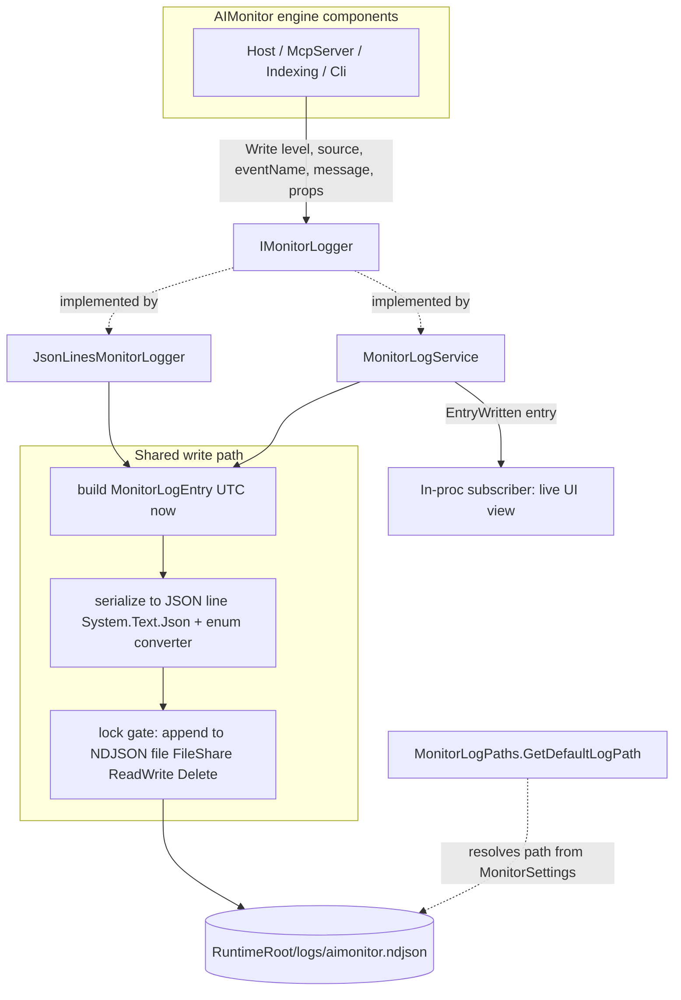
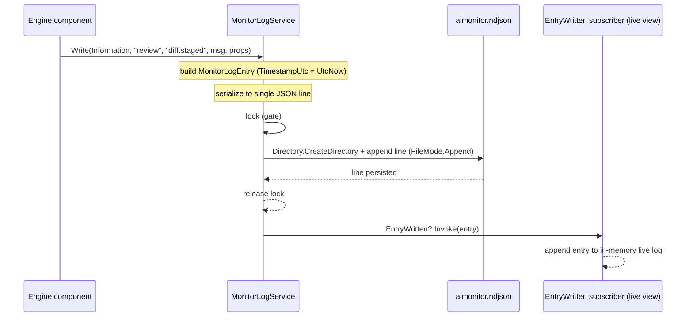

# AIMonitor.Logging

> Thin, structured logging sink for the AIMonitor engine: an `IMonitorLogger` abstraction, a JSON-lines file sink, and an in-proc sink that is also an event source for a live UI view.

**Project:** `src/AIMonitor.Logging/AIMonitor.Logging.csproj` · **Depends on:** `AIMonitor.Core` (for `MonitorSettings`) and the .NET BCL (`System.Text.Json`, `System.IO`) · **Depended on by:** `ClaudeWorkbench.Host`, `AIMonitor.McpServer`, `AIMonitor.Indexing` (plus the `AIMonitor.Logging.Tests` project)

## Purpose
AIMonitor.Logging is the logging seam extracted from the AIMonitor engine so every component writes structured events through one small interface instead of ad-hoc console output. Each event is serialized as one JSON object per line (NDJSON) and appended to a single runtime log file. The module ships two `IMonitorLogger` implementations: a plain file-only sink (`JsonLinesMonitorLogger`) and a sink that additionally raises an in-process event after every write (`MonitorLogService`) so a Blazor view can tail the log live without re-reading the file.

## Key types
| Type | File | Role |
|---|---|---|
| `IMonitorLogger` | `IMonitorLogger.cs` | Write-side abstraction; single `Write(level, source, eventName, message, properties?)` method that all engine components depend on. |
| `IMonitorLogEventSource` | `IMonitorLogEventSource.cs` | Read/subscribe-side abstraction; exposes the `event Action<MonitorLogEntry>? EntryWritten`. |
| `MonitorLogEntry` | `MonitorLogEntry.cs` | Immutable `record` describing one log event: `TimestampUtc`, `Level`, `Source`, `EventName`, `Message`, `Properties`. |
| `MonitorLogLevel` | `MonitorLogLevel.cs` | Severity enum: `Trace`, `Debug`, `Information`, `Warning`, `Error`, `Critical`. |
| `JsonLinesMonitorLogger` | `JsonLinesMonitorLogger.cs` | File-only `IMonitorLogger`; serializes and appends each entry to the NDJSON file under a lock. |
| `MonitorLogService` | `MonitorLogService.cs` | Both `IMonitorLogger` and `IMonitorLogEventSource`; does the same file append, then invokes `EntryWritten` for live subscribers. |
| `MonitorLogPaths` | `MonitorLogPaths.cs` | Static helper resolving the default log path (`<RuntimeRoot>/logs/aimonitor.ndjson`) from `MonitorSettings`. |

## How it works
Callers depend only on `IMonitorLogger` and call `Write(...)`. Both concrete sinks build a `MonitorLogEntry` stamped with `DateTimeOffset.UtcNow`, serialize it to a single line with `System.Text.Json` (web defaults — camelCase property names, no indentation) using a `JsonStringEnumConverter` so `Level` is emitted as its name (e.g. `"Information"`) rather than a number. The line is written inside a `lock (gate)`: the log directory is created if missing, then a `FileStream` is opened in `FileMode.Append` with `FileShare.ReadWrite | FileShare.Delete` so other readers (a tail, a log rotator) can access the file concurrently.

The two sinks differ only after the file write. `JsonLinesMonitorLogger` stops there. `MonitorLogService` additionally raises `EntryWritten?.Invoke(entry)`, letting an in-process subscriber (a Blazor live-log view) receive the strongly-typed entry immediately without parsing the file. The default log path comes from `MonitorLogPaths.GetDefaultLogPath(settings)`, which is the only point where this module touches `AIMonitor.Core`.

## Key flows

## Owns / Does Not Own
- **Owns:** the `IMonitorLogger` / `IMonitorLogEventSource` contracts; the `MonitorLogEntry` shape and `MonitorLogLevel` scale; the NDJSON serialization format (camelCase, enum-as-string, one object per line); the append-with-locking file-write mechanics and shared-access flags; the default log-path convention (`<RuntimeRoot>/logs/aimonitor.ndjson`).
- **Does not own:** DI registration (the Host's `Program.cs` chooses which implementation is bound to `IMonitorLogger`); log rotation, truncation, or retention; reading/parsing the NDJSON file back (subscribers get typed entries via `EntryWritten`); level filtering or sampling (every `Write` is persisted); the `MonitorSettings.RuntimeRoot` value itself (owned by `AIMonitor.Core`); rendering of any UI.

## Gotchas & invariants
- **Every `Write` persists.** There is no level threshold or filtering; if a caller invokes `Write`, a line is appended. Filtering, if wanted, must happen at the call site.
- **`MonitorLogEntry.Properties` is never null on disk.** A null `properties` argument is replaced with an empty dictionary before serialization, so the emitted JSON always has a `properties` object.
- **Timestamps are UTC.** Entries are stamped with `DateTimeOffset.UtcNow` inside the sink, not by the caller.
- **File open/close per write.** Each `Write` opens and closes its own `FileStream`/`StreamWriter`; this favors durability and simplicity over throughput and is not tuned for high-volume logging.
- **Cross-process/thread safe append, not atomic notify.** The `lock (gate)` serializes writes within a process, and `FileShare.ReadWrite | FileShare.Delete` allows external readers. For `MonitorLogService`, `EntryWritten` fires *after* the lock is released, so subscriber ordering follows write order but handler execution is synchronous on the writer's thread — a slow subscriber blocks the caller and a throwing subscriber propagates back to `Write`.
- **Path is fully resolved.** Constructors call `Path.GetFullPath(logPath)`, so `LogPath` is absolute regardless of the input.
- **Two sinks, pick one per binding.** The Host binds `IMonitorLogger` to `JsonLinesMonitorLogger` (file only). Use `MonitorLogService` where a live in-proc feed is required; the serialization/append logic is duplicated between the two by design (the service adds only the event raise).

## Where to start reading
1. `IMonitorLogger.cs` — the one method every caller uses.
2. `MonitorLogEntry.cs` + `MonitorLogLevel.cs` — the on-disk shape and severity scale.
3. `JsonLinesMonitorLogger.cs` — the canonical file-write path (serialization, locking, share flags).
4. `MonitorLogService.cs` — the same path plus `IMonitorLogEventSource.EntryWritten`.
5. `MonitorLogPaths.cs` — how the default log location is derived from `MonitorSettings`.

## Tests
(`tests/unit/AIMonitor.Logging.Tests`)
- `JsonLinesMonitorLoggerTests.cs` — `Write_appends_structured_json_line`: writes one entry to a temp path and asserts the parsed JSON line has `level` = `"Information"` (enum-as-string), `source`, `eventName`, and a nested `properties.runId`.
- `MonitorLogServiceTests.cs` — `Write_persists_line_and_notifies_listeners`: subscribes to `EntryWritten`, writes, and asserts the file contains a single line *and* the subscriber received one `MonitorLogEntry` with the expected `EventName`.
- `MonitorLogPathsTests.cs` — `GetDefaultLogPath_uses_runtime_root`: builds `MonitorSettings` and asserts the default path resolves to `<RuntimeRoot>/logs/aimonitor.ndjson`.
