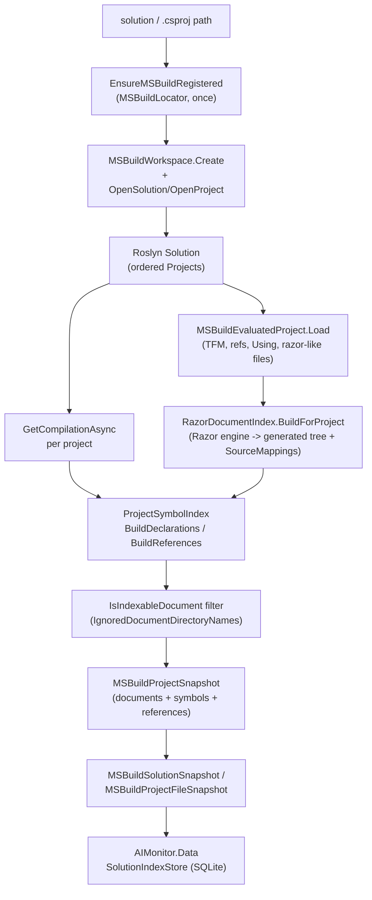
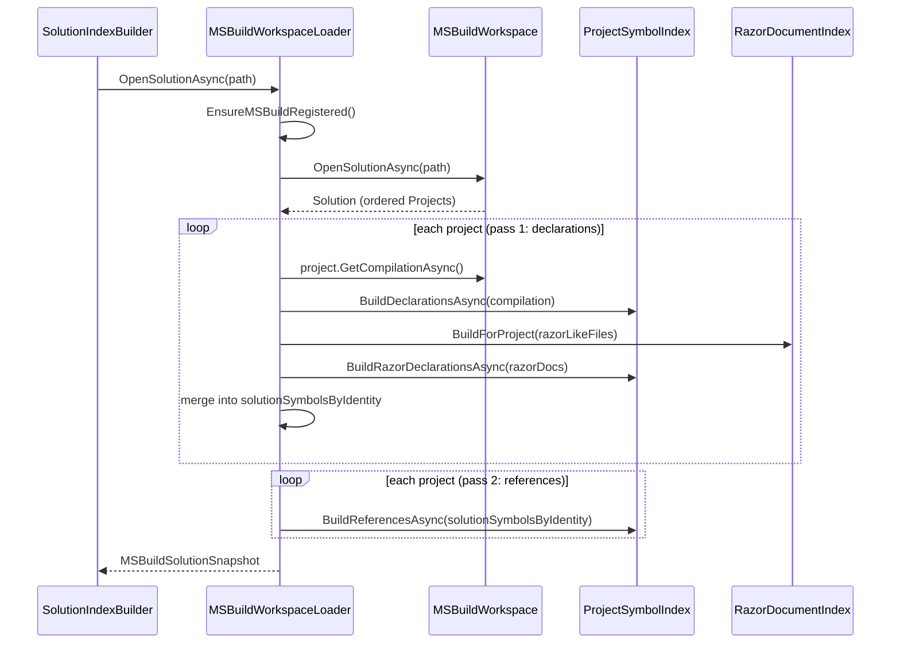
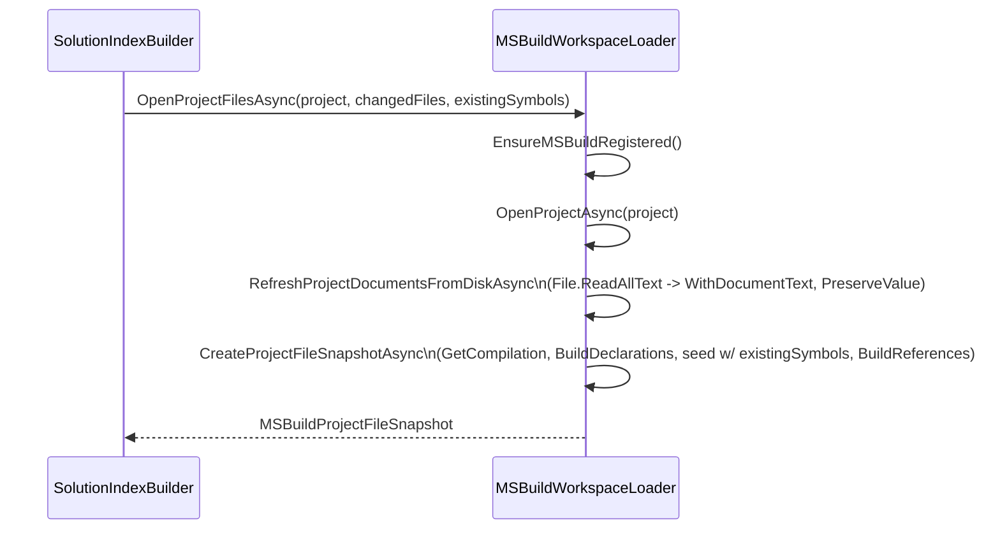

# AIMonitor.MSBuild

> Loads the watched .NET solution/project with MSBuildWorkspace + Roslyn and produces immutable document, project, symbol, and reference snapshots that feed the SQLite index.

**Project:** `src/AIMonitor.MSBuild/AIMonitor.MSBuild.csproj` · **Depends on:** `AIMonitor.Core` (for `StableIdentifier`), Roslyn Workspaces/MSBuild (`Microsoft.CodeAnalysis.CSharp.Workspaces` 5.3.0, `Microsoft.CodeAnalysis.Workspaces.MSBuild` 5.3.0), `Microsoft.Build*` 17.11 + `Microsoft.Build.Locator` 1.11, `Microsoft.AspNetCore.Razor.Language` 6.0 · **Depended on by:** `AIMonitor.Data` (`SolutionIndexBuilder`, the main consumer), and transitively `AIMonitor.Indexing`, `AIMonitor.McpServer`, `ClaudeWorkbench.Host`

## Purpose
This module is the read-only "loader" layer: given a solution (`.sln`/`.slnx`) or a single `.csproj`, it opens it through Roslyn's `MSBuildWorkspace`, obtains a `Compilation` per project, and walks syntax trees to extract declared symbols and cross-symbol references. It also evaluates the raw MSBuild project (target frameworks, package/project references, global usings) and handles Razor components — both single-file `.razor` and legacy combined `.razor.cs` — by running the Razor engine and mapping generated C# spans back to original source. The output is a set of plain snapshot records (`MSBuildSolutionSnapshot` / `MSBuildProjectFileSnapshot`); it never touches the database.

## Key types
| Type | File | Role |
| --- | --- | --- |
| `MSBuildWorkspaceLoader` | `MSBuildWorkspaceLoader.cs` | Public entry point. `OpenSolutionAsync`, `OpenProjectAsync`, `OpenProjectFilesAsync`; owns MSBuild registration, document filtering, snapshot assembly. |
| `MSBuildSolutionSnapshot` | `MSBuildWorkspaceLoader.cs` | Full-solution result: input path, ordered `MSBuildProjectSnapshot[]`, workspace diagnostics. |
| `MSBuildProjectFileSnapshot` | `MSBuildWorkspaceLoader.cs` | Scoped-refresh result for one project's changed files: documents, symbols, references, diagnostics. |
| `MSBuildProjectSnapshot` | `MSBuildWorkspaceLoader.cs` | Per-project metadata + documents/symbols/references/reference lists. |
| `MSBuildDocumentSnapshot` / `MSBuildSymbolSnapshot` / `MSBuildReferenceSnapshot` | `MSBuildWorkspaceLoader.cs` | Leaf records with `StableIdentifier`-derived keys and SHA-256 content hashes. |
| `MSBuildEvaluatedProject` | `MSBuildWorkspaceLoader.cs` (internal) | Raw MSBuild evaluation via `ProjectCollection.LoadProject` — TFMs, SDK, references, `Using` items, and the list of Razor-like files. |
| `ProjectSymbolIndex` | `MSBuildWorkspaceLoader.cs` (internal) | Declaration/reference extraction engine: `BuildDeclarationsAsync`, `BuildRazorDeclarationsAsync`, `BuildReferencesAsync`. |
| `RazorDocumentIndex` | `MSBuildWorkspaceLoader.cs` (internal) | Runs `RazorProjectEngine`, parses generated C#, and maps generated spans back to `.razor` source via `SourceMapping`. |

## How it works
`EnsureMSBuildRegistered()` runs `MSBuildLocator.RegisterDefaults()` once (guarded by a static lock + `registrationAttempted` flag) so the correct MSBuild toolset is on the resolver before any workspace is created. Each call then creates a fresh `MSBuildWorkspace`, opens the solution/project, and per project pulls a `Compilation`. Declarations are collected by walking every indexable document's syntax tree and calling `SemanticModel.GetDeclaredSymbol` on declaration nodes; references are collected in a second pass over candidate nodes (identifiers, invocations, object creations, attributes, casts, etc.), resolving each to a target symbol and matching it against a solution-wide `symbolsByIdentity` map. Symbol identity is a `StableIdentifier` hash over mapped file path + kind + display signature + line, so the same logical symbol matches across projects and across Razor mappings.

Document filtering is centralized in `IsIndexableDocument`: it keeps only `SourceCodeKind.Regular` files, drops hybrid `.razor.cs` files (handled by the Razor path instead), and rejects any path whose segments contain a name in `IgnoredDocumentDirectoryNames` (`.git`, `.vs`, `bin`, `obj`, `node_modules`, `packages`, `Working`, `archive`/`Archive`, `MonitorWorkspace`, `SourceBackups`). Razor handling is separate: `MSBuildEvaluatedProject.GetRazorLikeFiles` finds `.razor`/`.razor.cs` items, `RazorDocumentIndex.BuildForProject` runs the Razor engine to produce a generated C# tree per component, and declarations/references discovered in that generated tree are mapped back to original source coordinates. References that only surface in Roslyn's own source-generated Razor trees are recovered separately via `AddSourceGeneratedRazorReferences`.

## Key flows

Full-solution load and snapshot creation (`OpenSolutionAsync` → `CreateSnapshotAsync`). Declarations for every project are built first so that a solution-wide `solutionSymbolsByIdentity` map exists before references are resolved (cross-project references depend on it):

Scoped refresh from disk (`OpenProjectFilesAsync` → `RefreshProjectDocumentsFromDiskAsync`), used after an accepted edit to re-index only the changed files. Because `MSBuildWorkspace` caches the on-disk text as of open time, the loader re-reads the requested files from disk and overwrites the document text with `PreservationMode.PreserveValue` before extracting symbols. Declarations for unchanged files are supplied by the caller as `existingSymbolsByIdentity` so references still resolve:

## Owns / Does Not Own
- **Owns:** MSBuild registration/loading (`MSBuildLocator`, `MSBuildWorkspace`, `ProjectCollection` evaluation), the indexable-document filter and ignored-directory list, Roslyn declaration/reference extraction into snapshot records, Razor source-generation extraction and generated-to-original span mapping, per-file SHA-256 content hashes, and stable-key assignment.
- **Does not own:** the SQLite index and persistence — that is `AIMonitor.Data` (`SolutionIndexStore`, `SolutionIndexBuilder`); turning snapshot records into database rows / retained-symbol bookkeeping (`AIMonitor.Data` + `AIMonitor.Indexing`); the file-watching, workflow, and human-gate logic that decides *when* to reindex; and the `StableIdentifier` hashing primitive itself (owned by `AIMonitor.Core`).

## Gotchas & invariants
- **MSBuild registration is once-per-process.** `EnsureMSBuildRegistered` sets `registrationAttempted` under a lock and calls `MSBuildLocator.RegisterDefaults()` only if not already registered. Registering must happen before any Roslyn MSBuild type loads, so keep it as the first line of every public entry method.
- **Ignored directories are matched by path *segment*, not prefix.** `PathContainsIgnoredDirectory` splits on both separators and checks each segment against `IgnoredDocumentDirectoryNames` (case-insensitive). Adding a folder like `bin` anywhere in a path excludes it. `PathHasIgnoredDirectory` is the internal-visible wrapper used by Razor filtering too.
- **Hybrid `.razor.cs` files are deliberately excluded from the plain document path** (`IsIndexableDocument` returns false via `IsHybridRazorFile`) and re-added through the Razor path so their spans map to original source. A `.razor.cs` is treated as "hybrid" only if its text looks like Razor (`@code`/`@page`/`@using`/`@inherits`/`@inject` or markup lines).
- **Environment-dependent Razor source-gen skip.** Markup-only bindings (e.g. `@bind-Value="X"`) surface only through Roslyn's own source-generated Razor tree. When the `MSBuildWorkspace` host Roslyn (5.3.0) is older than the installed SDK's Razor generator, `GetSourceGeneratedDocumentsAsync` returns 0 docs and those `razor-generated:*` references are simply absent — not an error. The relevant test asserts only when the reference exists; see `docs/findings/RazorGeneratedReferencesEnvironment-2026-06-08.md` and `RazorGeneratorEnvironmentDiagnostic` (gated on `RAZORGEN_DIAG=1`).
- **Two-pass ordering is required for cross-project references.** All declarations must populate `solutionSymbolsByIdentity` before `BuildReferencesAsync` runs, otherwise references to symbols in later-ordered projects would not resolve. Projects are ordered by file path for deterministic output; documents/symbols/references are all sorted before emission so snapshots are stable.
- **Scoped refresh reads from disk, not the workspace's cached text.** `RefreshProjectDocumentsFromDiskAsync` overwrites document text with `PreservationMode.PreserveValue`; skip this and you re-index stale content after an edit.
- **Performance:** every public call spins up a fresh `MSBuildWorkspace` and re-runs full MSBuild evaluation; `GetCompilationAsync` per project is the dominant cost. `OpenProjectFilesAsync` exists precisely to avoid a full-solution rebuild on small edits. All phases are wrapped in `MeasureAsync`/`Measure` and reported through the optional `timingSink` callback.

## Where to start reading
1. `MSBuildWorkspaceLoader.OpenSolutionAsync` / `OpenProjectFilesAsync` — the two entry points and their timing wrappers.
2. `CreateSnapshotAsync` — the two-pass declaration-then-reference assembly and how snapshots are built.
3. `IsIndexableDocument` + `IgnoredDocumentDirectoryNames` — the filtering contract shared across the module.
4. `ProjectSymbolIndex.BuildDeclarationsAsync` / `BuildReferencesAsync` and `GetReferencedSymbol` — Roslyn semantic extraction.
5. `RazorDocumentIndex` (`BuildForProject`, `TryCreate`, `TryMapGeneratedSpan`) and `AddSourceGeneratedRazorReferences` — Razor handling and span mapping.

## Tests
`tests/unit/AIMonitor.MSBuild.Tests`:
- `MSBuildWorkspaceLoaderTests.cs` — SDK-style project load and metadata (`OpenProjectAsync_loads_sdk_style_project`), cross-project member references (`OpenSolutionAsync_indexes_cross_project_member_references`), legacy combined `.razor.cs` indexing, two-file Razor component-binding references (with the documented source-gen skip), and scoped disk refresh re-parsing changed files (`OpenProjectFilesAsync_reparses_changed_file_before_extracting_symbols`).
- `RazorGeneratorEnvironmentDiagnostic.cs` — diagnostic-only (gated on `RAZORGEN_DIAG=1`) dump of what `MSBuildWorkspace` actually resolves (analyzer references, additional documents, source-generated document count, Roslyn version) to explain the environment-dependent Razor generator behavior above.
