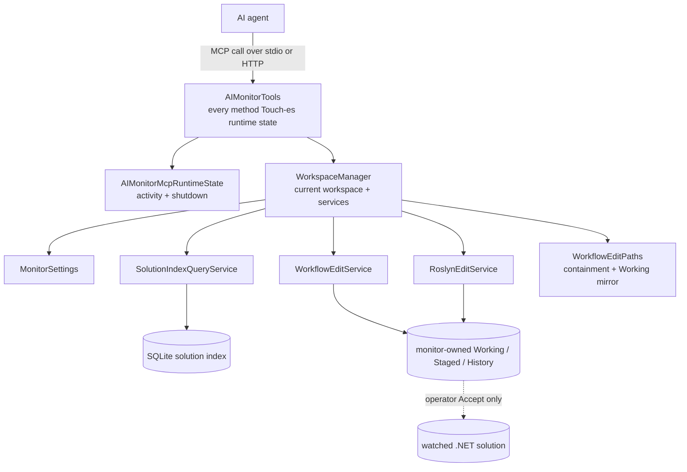

# AIMonitor.McpServer

> The MCP tool surface the AI agent uses to read, index, and propose governed edits to the watched .NET solution — the only sanctioned way it can touch that solution.

**Project:** `src/AIMonitor.McpServer/AIMonitor.McpServer.csproj` · **Depends on:** `AIMonitor.Core`, `AIMonitor.Data`, `AIMonitor.Logging`, `AIMonitor.Workflow`, `AIMonitor.MSBuild`, `AIMonitor.Indexing`, `AIMonitor.Runtime`, plus `ModelContextProtocol` 1.3.0 and `Microsoft.Extensions.Hosting` · **Depended on by:** `ClaudeWorkbench.Host` (hosts the same `AIMonitorTools` over HTTP via `MapMcp("/mcp")`) and `AIMonitor.Integration.Tests`.

## Purpose

ClaudeWorkbench is a Blazor operator console for human-gated AI edits to a watched .NET solution. `AIMonitor.McpServer` is the tool boundary between the AI agent and that solution. Every method on the `AIMonitorTools` partial class carries `[McpServerTool]`, and this surface is the *only* way the agent can inspect or mutate watched source: native `Write`/`Edit`/`Bash` are blocked at the sidecar (deny-by-default), so all file touches route through these tools.

The agent never writes watched source directly. It reads through the tools, builds a candidate in a monitor-owned *Working* mirror, stages it, and stops. The operator reviews and accepts in the in-app Merge Review dialog; acceptance is the sole path a candidate reaches the watched solution.

The project ships two entrypoints for the same tool class:

- **stdio console** — `Program.cs` builds a `HostApplicationBuilder`, registers `WorkspaceManager` / `AIMonitorMcpRuntimeState` / `IMonitorLogger`, and calls `AddMcpServer().WithStdioServerTransport().WithTools<AIMonitorTools>()`. Config comes from `--repo-root` / `--config` args via `MonitorSettingsLoader`.
- **Blazor Host** — `ClaudeWorkbench.Host` registers the same `WithTools<AIMonitorTools>()` over `WithHttpTransport()`. This is the surface the running console uses.

## The tool surface

~60 `[McpServerTool]` methods across six partial-class files. Tool names are exposed in **snake_case**: `ToToolName` (in `AIMonitorTools.cs`) inserts an underscore before every non-leading uppercase char and lowercases, so `StageCandidateForReview` becomes `stage_candidate_for_review`. `AIMonitorMcpRuntimeState.ToSnakeCase` applies the identical transform for telemetry.

| Category (file) | Count | Notable tools | Read vs mutation |
| --- | --- | --- | --- |
| **Editing** (`.Editing.cs`) | 13 | `get_file`, `find_file`, `refresh_file`, `new_file`, `get_file_outline`, `get_source_map`, `get_symbol`, `submit_file`, `replace_text_in_file`, `replace_span_in_file`, `find_text_span`, `check_file_hash`, `get_edit_status` | Reads auto-allow; the three text/full-file writers (`submit_file`, `replace_text_in_file`, `replace_span_in_file`) are gated mutations |
| **Index** (`.Index.cs`) | 12 | `query_solution_index`, `find_indexed_symbols`, `get_indexed_symbol`, `find_indexed_references`, `find_indexed_callers`, `find_indexed_relationships`, `get_solution_index_tree`, `refresh_solution_index` | All read/query against the SQLite index (auto-allow); refreshes rebuild monitor-owned index state, not watched source |
| **Status** (`.Status.cs`) | 13 | `get_monitor_status`, `get_workflow_status`, `get_self_check`, `get_tool_manifest`, `get_staging_guide`, `list_ledgers`, `get_ledger`, `list_watched_projects`, `shutdown_server` | Read/introspection (auto-allow); `shutdown_server` is destructive but relies on default-deny gating |
| **RoslynEdits** (`.RoslynEdits.cs`) | 11 | `submit_symbol`, `remove_symbol`, `add_using`, `remove_using`, `set_type_partial`, `add_symbol`, `add_field`, `add_property`, `add_method`, `add_constructor`, `add_nested_type` | All gated mutations (typed C# edits into the Working candidate) |
| **Sessions** (`.Sessions.cs`) | 6 | `start_monitor_session`, `set_monitor_session_edit_plan`, `list_monitor_sessions`, `get_monitor_session`, `record_monitor_session_event`, `list_session_staged_records` | Session bookkeeping — writes monitor-owned session JSON, not watched source |
| **Review** (`.Review.cs`) | 5 | `stage_candidate_for_review`, `launch_staged_diff`, `record_diff_decision`, `get_staged_record`, `compare_file` | `stage_candidate_for_review` is gated; `launch_staged_diff` / `record_diff_decision` are operator/host review actions |

**Governed mutation path:** candidate write (`submit_*` / `replace_*` / Roslyn edits into the Working mirror) → `stage_candidate_for_review` (immutable staged record) → operator review decision (`record_diff_decision` / in-app Accept). Only the accept step writes watched source. Mutations are gated twice: at the **sidecar operator gate** (where native tools are also blocked) and server-side by `EnsurePlannedMutationAllowed`.

## Key types

| Type | File | Role |
| --- | --- | --- |
| `AIMonitorTools` | `AIMonitorTools*.cs` (partial) | `[McpServerToolType]` class holding all tool methods. Ctor-injected with `WorkspaceManager`, `AIMonitorMcpRuntimeState`, `IHostApplicationLifetime`, `IMonitorLogger`. |
| `WorkspaceManager` | `WorkspaceManager.cs` | Owns the current watched workspace and the engine services bound to it (`Query`, `EditService`, `RoslynEditService`, `EditPaths`, `Settings`). `SwitchTo()` rebuilds them for a new solution at runtime; `ProvisionAsync()` builds the index. Tools read services through it so the whole surface retargets on a workspace switch. |
| `AIMonitorMcpRuntimeState` | `AIMonitorMcpRuntimeState.cs` | Tracks `LastActivityUtc` / `ShutdownRequested`. `Touch()` (called first in every tool via `[CallerMemberName]`) stamps activity and emits an `adapter.mcp.tool.called` log line. |
| Contracts (`AIMonitorSessionState`, `AIMonitorSessionEditPlan`, `AIMonitorSessionPlannedFile(Input)`, `AIMonitorFileReadResult`, `AIMonitorToolErrorResult`, `AIMonitorSelfCheckResult`, `PlannedSessionDecisionOptions`, …) | `AIMonitorToolContracts.cs` | `sealed record` DTOs returned/accepted by tools. `AIMonitorToolErrorResult(IsError, Message, Expected, Received)` is the guided error shape; `AIMonitorSessionState.EditPlan` holds the planned-file scope that gates mutations. |

## How it works

Every tool call flows through the `WorkspaceManager`, which resolves the engine services for the *current* watched workspace. The tools themselves hold no engine state — `settings`, `queryService`, `workflowService`, `roslynEditService`, and `workflowPaths` are all forwarding properties onto `workspace.*`. Read tools hit the query service or the filesystem; mutation tools funnel into `WorkflowEditService` / `RoslynEditService`, which write only the monitor-owned Working mirror.

## Path containment (security)

Every path a tool receives is normalized and confined to the watched solution before use:

- `AIMonitorTools.ResolveWatchedPath(path)` rejects blank input, resolves relative paths against `settings.WatchedProjectFolder`, `Path.GetFullPath`-normalizes (collapsing `..\` traversal), then calls `workflowPaths.GetRelativeWatchedPath(fullPath)` purely for its side effect: to throw if the result escapes the watched root.
- `WorkflowEditPaths.GetRelativeWatchedPath` is the boundary. It requires the full path to `.Equals(watchedRoot)` **or** `.StartsWith(watchedRoot + Path.DirectorySeparatorChar)`. The **`+ separator` guard is load-bearing**: a bare `StartsWith(watchedRoot)` would let a sibling directory whose name merely *prefixes* the root (e.g. `C:\Watched` vs `C:\WatchedEvil`) slip through. Anchoring on `root + \` defeats that sibling-prefix escape, and full-path normalization already neutralizes `..\` traversal. Anything outside throws `File is not under the watched solution folder`.

`ResolveWatchedPath` is the front door for nearly every path-taking tool, so the containment check is uniform across the surface. `get_ledger` adds a second, independent guard (rejecting `..`-relative ledger paths under the ledger root).

## Session/plan gate

Watched-source mutations require an active session whose declared plan includes the target file. This is the server-side complement to the sidecar operator gate.

- `start_monitor_session(filesPlanned)` requires a non-empty planned list and persists an `AIMonitorSessionEditPlan` of `AIMonitorSessionPlannedFile` entries (each resolved + given an owning MSBuild project) to session JSON under the workspace `workflow/sessions` root.
- `EnsurePlannedMutationAllowed(sessionId, sourceFilePath)` is invoked at the top of every mutating tool (`submit_file`, `replace_text_in_file`, `replace_span_in_file`, all Roslyn edits, `stage_candidate_for_review`). A missing/blank `sessionId` throws (`Session edit scope is required…`); otherwise `RequireSessionEditPlan` loads the plan and `EnsurePlannedFile` throws `Source file is not in the session edit plan` unless the target's full path matches a planned file.
- **Planned-session deferral:** while not all planned Working files exist yet, `ShouldDeferPlannedOverlayValidation` suppresses per-edit overlay validation; `ShouldDeferBuildValidationUntilAccept` and `BuildPlannedSessionDecisionOptions` defer the expensive build/index pass until every planned file has reached a terminal decision, then drive a `PostAcceptIndexRefreshPlan`.

## Owns / Does Not Own

**Owns:**
- The MCP tool surface (~60 methods) and its snake_case naming.
- `WorkspaceManager` (current watched workspace + per-workspace engine service graph, runtime switching).
- `AIMonitorMcpRuntimeState` (activity/shutdown) and the tool-call telemetry line.
- The MCP tool DTO contracts (`AIMonitorToolContracts.cs`).
- Session-scope enforcement (`EnsurePlannedMutationAllowed`), path resolution into the watched root, self-check guardrails, and the tool manifest / staging guide text.
- The stdio console entrypoint (`Program.cs`).

**Does not own:**
- The edit engine itself — `WorkflowEditService`, `RoslynEditService`, `WorkflowEditPaths`, `StagedDecisionWorkflow`, `StagedDiffLaunchWorkflow` all live in `AIMonitor.Workflow`.
- The solution index — `SolutionIndexQueryService` / `SolutionIndexRebuildService` live in `AIMonitor.Indexing`.
- The HTTP hosting, the sidecar operator gate, and the in-app Merge Review UI — those are `ClaudeWorkbench.Host`.
- `MonitorSettings` and workspace path layout (`AIMonitor.Core`).

## Gotchas & invariants

- **`get_indexed_symbol` full-scan cap:** it calls `FindSymbols(string.Empty, maxResults: 50000)` and `FirstOrDefault`s for the stable key. A symbol whose row sits beyond the 50,000 cap returns **`null` silently** — indistinguishable from "not found."
- **Read-tool IO errors leak raw:** `get_file`, `get_ledger`, `list_monitor_runs`, etc. call `File.ReadAllText` / `Deserialize` directly. A locked/deleted/corrupt file surfaces as an opaque framework exception, not the guided `AIMonitorToolErrorResult` shape used elsewhere (e.g. the Roslyn markup guidance path or `TryCreateIndexedStableSymbolKeyError`).
- **`ValidateExpectedHash` is dead code:** the private helper in `AIMonitorTools.cs` has no callers; `replace_text_in_file` does its own `expectedOldTextHash` check inline instead.
- **`shutdown_server` is destructive:** it flips runtime state and schedules `applicationLifetime.StopApplication()` after a 100 ms delay. It has no per-call auth of its own — its safety rests entirely on default-deny gating at the sidecar.
- **Residual WinMerge wording:** WinMerge is retired (review is the in-app DiffPlex surface), yet legacy naming lingers — `WinMergeCandidatePaths` in settings/status, `record_diff_decision`'s "Classify a completed WinMerge review" description, and `launch_staged_diff`'s "launch WinMerge" text. The `get_staging_guide` prose has been corrected to say the operator reviews in-app and *not* to call `launch_staged_diff` / `record_diff_decision`, but the tool descriptions still read WinMerge-era. The `diff-tool-available` self-check guardrail was intentionally dropped.
- **Services retarget at runtime:** tools capture no service singletons; a `WorkspaceManager.SwitchTo()` mid-run repoints the entire surface. Anything caching a path/handle across calls must re-resolve.
- **`find_text_span` / `replace_span_in_file` call `EnsureSession`** (ensures an editable Working session for the path) in addition to (for the span writer) `EnsurePlannedMutationAllowed`.

## Where to start reading

1. `Program.cs` — DI wiring and the stdio entrypoint; shows the four injected services.
2. `AIMonitorTools.cs` — the partial-class core: `ToToolName`, `ResolveWatchedPath`, `EnsurePlannedMutationAllowed`, `RequireSessionEditPlan`, session persistence helpers, and the manifest/staging-guide text.
3. `WorkspaceManager.cs` — how the current workspace and engine services are owned and swapped.
4. `AIMonitorTools.Editing.cs` then `.RoslynEdits.cs` — the read-then-candidate-then-stage mutation shape.
5. `AIMonitorTools.Review.cs` + `.Sessions.cs` — staging, decisions, and the planned-session gate in action.

## Tests

Integration coverage lives in `tests/integration/AIMonitor.Integration.Tests/`:

- `McpServerSmokeTests.cs` — broad smoke pass over the tool surface.
- `McpReadIndexSurfaceTests.cs` — read/index tools (`query_solution_index`, `find_indexed_*`, tree/status).
- `McpPlannedSessionSurfaceTests.cs` — the planned-session gate: `start_monitor_session`, plan enforcement, staging, and decision/refresh deferral.
