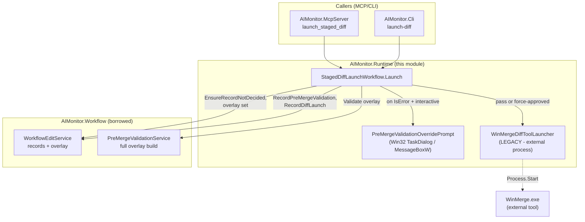
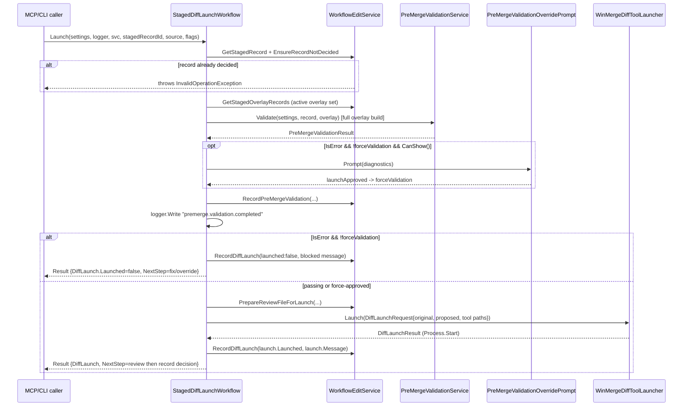

# AIMonitor.Runtime

> Runtime orchestration for the GATE-1 staged-diff launch step — build/validate a staged edit before merge, block it unless validation passes or a human force-approves, and (on the MCP/CLI path) hand off to the external WinMerge diff tool.

**Project:** `src/AIMonitor.Runtime/AIMonitor.Runtime.csproj` · **Depends on:** `AIMonitor.Core`, `AIMonitor.Logging`, `AIMonitor.Workflow` (targets `net10.0`, implicit usings + nullable enabled) · **Depended on by:** `AIMonitor.McpServer` (the `launch_staged_diff` tool), `AIMonitor.Cli` (the `launch-diff` command), and `AIMonitor.Runtime.Tests`. `ClaudeWorkbench.Host` carries a `ProjectReference` to it but **uses no type from it** — the host's review path is entirely in-app.

## Purpose
AIMonitor.Runtime is the "does-execution" layer for one specific gate: taking a staged candidate edit that is ready for review and driving it through pre-merge build/validation and then into a side-by-side diff for a human decision. Its `RuntimeBoundary.Contract` states the module's charter: *"Runtime owns build, test, process, and external tool execution adapters."* In practice this project holds two things — the `StagedDiffLaunchWorkflow` orchestrator (still live, drives the MCP/CLI launch) and the `WinMergeDiffToolLauncher` external-process adapter (legacy — see [Live vs legacy](#live-vs-legacy)). It owns no persistence, no session state, and no UI; it borrows `WorkflowEditService`/`PreMergeValidationService` from `AIMonitor.Workflow` for all record mutation and validation.

## Key types
| Type | File | Role |
|---|---|---|
| `StagedDiffLaunchWorkflow` | `StagedDiffLaunchWorkflow.cs` | The GATE-1 orchestrator. `Launch(...)` validates a staged record, blocks or records the launch, and returns a `StagedDiffLaunchWorkflowResult`. Live. |
| `StagedDiffLaunchWorkflowResult` | `StagedDiffLaunchWorkflowResult.cs` | Result DTO — carries `StagedEditSummary`, optional full `StagedEditRecord` (verbose), the `PreMergeValidationResult`, the `DiffLaunchResult`, and a human-readable `NextStep`. |
| `PreMergeValidationOverridePrompt` | `PreMergeValidationOverridePrompt.cs` | Static Win32 interop dialog. `CanShow()` gates on Windows + interactive session + env flag; `Prompt(diagnostics)` shows a TaskDialog (falls back to `MessageBoxW`) asking the operator to override a failed validation. |
| `WinMergeDiffToolLauncher` | `WinMergeDiffToolLauncher.cs` | External-process adapter — resolves a WinMerge executable and `Process.Start`s it with side-by-side arguments. **Legacy** (MCP/CLI only). |
| `DiffLaunchRequest` | `DiffLaunchRequest.cs` | Input DTO for the launcher — original/proposed file paths, explicit tool path, candidate tool paths. |
| `DiffLaunchResult` | `DiffLaunchResult.cs` | Output DTO — `Launched`, `Tool` (always `"WinMerge"`), `ToolPath`, `ProcessId`, `Message`. |
| `RuntimeBoundary` | `RuntimeBoundary.cs` | Holds the single `Contract` constant string documenting the module's ownership boundary. |

## How it works
`StagedDiffLaunchWorkflow.Launch` is the single entry point. It is handed a `MonitorSettings`, an `IMonitorLogger`, a `WorkflowEditService`, a `stagedRecordId`, a `source` string, and optional flags (`diffToolPath`, `forceValidation`, `deferBuildValidationUntilAccept`, `verbose`).

The workflow first fetches the staged record and calls `WorkflowEditService.EnsureRecordNotDecided` — a terminal (already accepted/rejected) record throws `InvalidOperationException` and nothing is launched or recreated. It then assembles the **staged overlay set** via `GetStagedOverlayRecords`: for a session-scoped record it lists that session's staged records, keeps only *active* overlay records (`IsActiveOverlayRecord` — no decision, not superseded by id/status/classification), appends the current record, and dedupes per watched file keeping the newest by `CreatedAtUtc`. A single (sessionless) record overlays only itself.

That overlay set is passed to `PreMergeValidationService.Validate`, which runs the **full overlay build** so the staged batch is build-validated *before* any merge. (`deferBuildValidationUntilAccept` is informational context from the caller — both the deferred planned-session path and the single-file path run the full overlay build here; the terminal real-tree build still runs at final accept.) If validation `IsError`, `forceValidation` is false, and an interactive dialog `CanShow()`, the operator is prompted; approving sets `forceValidation = true`. The validation outcome is persisted via `RecordPreMergeValidation` and logged under event `premerge.validation.completed`.

If validation still fails and was not force-approved, the launch is **blocked**: `RecordDiffLaunch(launched: false, ...)` records the block and the method returns early with a not-launched `DiffLaunchResult` and a `NextStep` that differs depending on whether a dialog was available. Otherwise `PrepareReviewFileForLaunch` readies the review baseline and the (legacy) `WinMergeDiffToolLauncher` is invoked; the launch outcome is recorded and returned.

## Key flows
`StagedDiffLaunchWorkflow.Launch` — pre-merge validate → block unless passing/force-approved → record launch:

## Live vs legacy
- **Live — the launch orchestration (`StagedDiffLaunchWorkflow`, `PreMergeValidationOverridePrompt`, the result/request DTOs).** These still power the MCP/CLI review launch: `AIMonitor.McpServer`'s `launch_staged_diff` tool (`AIMonitorTools.Review.cs`) and `AIMonitor.Cli`'s `launch-diff` command both call `new StagedDiffLaunchWorkflow().Launch(...)`. The pre-merge validate / block / force-override / record-launch logic is the current GATE-1 gate for that path.
- **Legacy — the WinMerge external diff (`WinMergeDiffToolLauncher`).** WinMerge is **retired for the Blazor operator console**. In `ClaudeWorkbench.Host`, staged review/merge is done **in-app** with the DiffPlex `MergeReviewDialog` (`src/ClaudeWorkbench.Host/Components/Dialogs/MergeReviewDialog.razor.cs`) driven by the host-side `EngineReviewWorkflow` (`src/ClaudeWorkbench.Host/Services/EngineReviewWorkflow.cs`) — the host never *uses* an AIMonitor.Runtime type (the project reference is vestigial) and never launches WinMerge. The MCP guidance text even instructs agents *not* to call `launch_staged_diff` and *not* to expect WinMerge in the Workbench environment (`AIMonitorTools.cs`). The launcher therefore only runs on the raw MCP/CLI path, which is legacy relative to the operator console.

## Owns / Does Not Own
**Owns:**
- The GATE-1 launch orchestration sequence: validate → prompt/override → block-or-launch → record.
- The active-overlay-set assembly rules (`IsActiveOverlayRecord`, newest-per-watched-file dedupe).
- The Win32 override dialog (TaskDialog with `MessageBoxW` fallback, env-gated).
- The WinMerge external-process adapter and its argument/tool-path resolution (legacy).

**Does not own:**
- Staged-record persistence, decision recording, or summaries — those live in `WorkflowEditService` (`AIMonitor.Workflow`).
- The actual build/validation engine — `PreMergeValidationService` (`AIMonitor.Workflow`).
- In-app review/merge UI — `MergeReviewDialog` + `EngineReviewWorkflow` in `ClaudeWorkbench.Host`.
- Settings/path resolution (`MonitorSettings`, incl. `WinMergeCandidatePaths`) — `AIMonitor.Core`.

## Gotchas & invariants
- **Terminal records are never relaunched.** `EnsureRecordNotDecided` throws before any file is prepared or recreated — a rejected new-file record does not resurrect the target file on disk (asserted by the unit test).
- **The launch is always recorded, even when blocked.** Both the block path and the launch path call `RecordDiffLaunch`, so a failed/blocked launch is auditable, not silent.
- **`Tool` is hard-coded `"WinMerge"`** in every `DiffLaunchResult`, including the blocked result and the "not found" result — it is not a generic diff-tool abstraction.
- **The override dialog blocks.** `PreMergeValidationOverridePrompt.Prompt` draws a native, blocking dialog and waits for a click; it must never run in CI. `CanShow()` requires Windows + `Environment.UserInteractive` and honors `AIMONITOR_DISABLE_VALIDATION_DIALOG=1` to suppress it.
- **No dialog ≠ auto-approve.** When validation fails and no dialog can show, the launch is blocked and `NextStep` tells the caller to obtain explicit human approval and rerun with force validation — override is never implicit.
- **Full overlay build runs before merge regardless of `deferBuildValidationUntilAccept`.** That flag is contextual (planned-session batch fully staged); the fidelity fix (option A) means both launch paths build the overlay before merge, with the terminal real-tree build still at final accept.
- **Tool resolution is existence-based.** An explicit `diffToolPath` is used only if `File.Exists`; otherwise the first existing entry in `settings.WinMergeCandidatePaths` wins, else the launcher returns a not-launched "WinMerge was not found" result.
- **Baseline selection:** the launcher's "original" side is `ReviewBaselineFilePath` when set, otherwise `WatchedFilePath`; the "proposed" side is always `StagedFilePath`.

## Where to start reading
1. `StagedDiffLaunchWorkflow.cs` — read `Launch` top-to-bottom; it is the whole orchestration and the only public behavior worth tracing.
2. `RuntimeBoundary.cs` — one line, states the module's ownership charter.
3. `WinMergeDiffToolLauncher.cs` — the (legacy) external-process adapter; short and self-contained.
4. `PreMergeValidationOverridePrompt.cs` — the Win32 interop override dialog and its gating.
5. Then the callers for the live path: `AIMonitor.McpServer/AIMonitorTools.Review.cs` (`launch_staged_diff`) and `AIMonitor.Cli/Program.cs` (`LaunchDiff`).

## Tests
`tests/unit/AIMonitor.Runtime.Tests` (references `AIMonitor.Runtime` + `AIMonitor.Logging`; xUnit on `net10.0`):
- `StagedDiffLaunchWorkflowTests.cs` — `Launch_rejects_terminal_rejected_record_without_recreating_new_file_target`: stages a new file, records a `rejected` decision, then asserts `Launch` throws `InvalidOperationException` ("already has a final decision") and does **not** recreate the watched target file. Uses a `NullMonitorLogger`.
- `PreMergeValidationOverridePromptManualTests.cs` — `Trips_the_validation_override_dialog_with_a_synthetic_error`: **manual-only**, a no-op pass unless `AIMONITOR_MANUAL_DIALOG_TEST=1` (the dialog is blocking and would hang CI). When opted in, it renders the override dialog with synthetic diagnostics; "Yes Launch" → `true`, "Cancel" → `false`. It only verifies the dialog returns a result, not which button.
