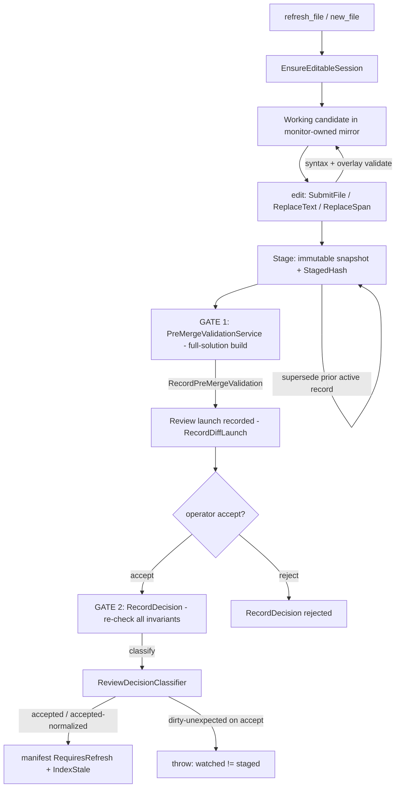
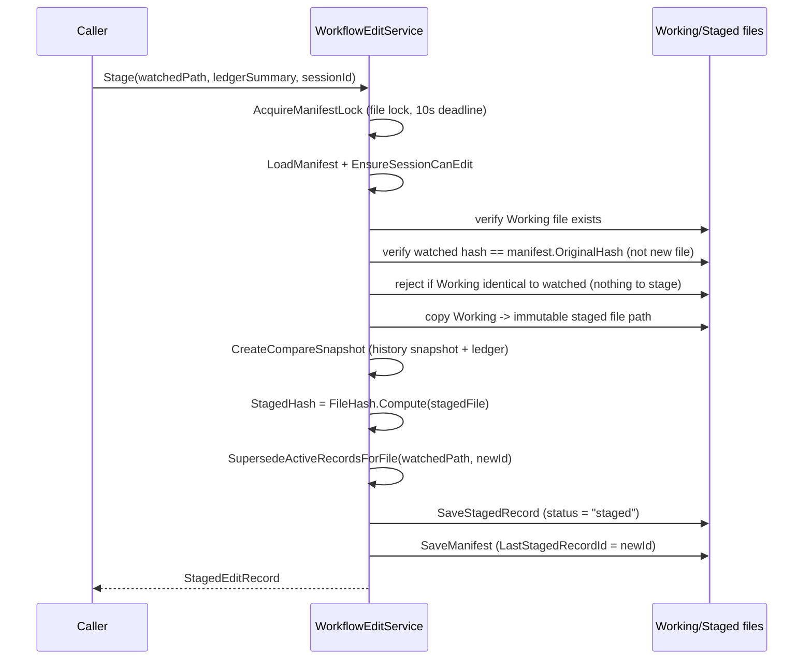
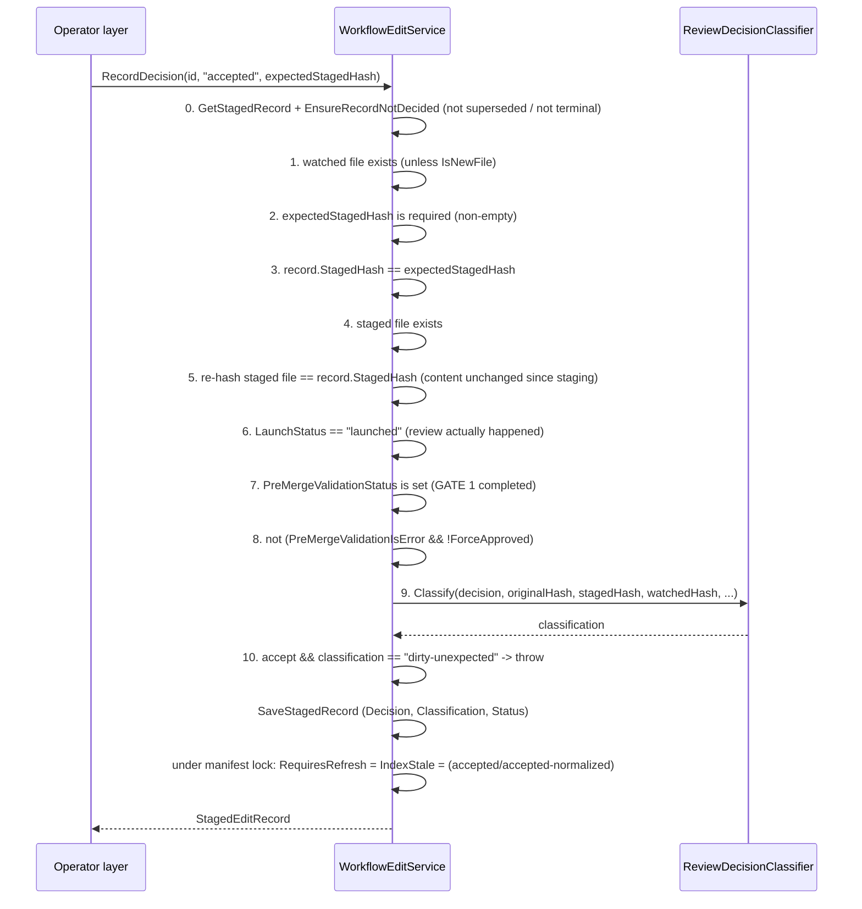

# AIMonitor.Workflow

> The governed-edit engine: it owns the monitor's Working mirror, stages candidate edits as immutable hashed records, and enforces the two review gates that stand between an AI-authored change and the watched source.

**Project:** `src/AIMonitor.Workflow/AIMonitor.Workflow.csproj` · **Depends on:** `AIMonitor.Core`, `Microsoft.CodeAnalysis.CSharp.Workspaces` (Roslyn 5.3.0) · **Depended on by:** `AIMonitor.McpServer`, `AIMonitor.Indexing`, `ClaudeWorkbench.Host`

## Purpose

ClaudeWorkbench never lets an AI agent write directly to the watched .NET solution. Instead, agents write **candidate** edits into a monitor-owned **Working mirror**, those candidates are **staged** as immutable, SHA-256-hashed snapshots, and a human operator **accepts** or **rejects** each one. `AIMonitor.Workflow` is where that machinery lives.

It is responsible for:

- **Edit sessions** — a per-watched-file manifest tracking baseline hashes, refresh state, and the last staged record (`EditSessionManifest`, `WorkflowEditService.Refresh`/`NewFile`).
- **The Working mirror** — a shadow copy of each watched file under a monitor-owned `working/` root that agents mutate via whole-file, find/replace, and span edits.
- **Staging** — snapshotting a Working candidate into an immutable `StagedEditRecord` with a recorded hash, superseding any earlier active record for the same file.
- **Two review gates** — pre-merge full-solution build validation (`PreMergeValidationService`) and the accept-time invariant checks + decision classification (`WorkflowEditService.RecordDecision` → `ReviewDecisionClassifier`).
- **Hash integrity** — every state transition is gated on SHA-256 hashes so that what an operator accepts is provably identical to what they reviewed (`FileHash`).

The safety invariants of the whole product live in this module; the layers above it (`AIMonitor.Indexing`, `ClaudeWorkbench.Host`, the MCP server) orchestrate it but do not re-implement its guarantees.

## Key types

| Type | File | Role |
|------|------|------|
| `WorkflowEditService` | `WorkflowEditService.cs` | Central service. Owns session lifecycle, Working mirror edits, staging, decisions, and all manifest/record persistence. |
| `EditSessionManifest` | `EditSessionManifest.cs` | Per-file session state persisted as JSON: baseline hashes, `RequiresRefresh`, `IndexStale`, last staged record, validation results. |
| `StagedEditRecord` | `StagedEditRecord.cs` | Immutable snapshot metadata: staged file path, `StagedHash`, launch/validation status, decision, supersession chain. |
| `ReviewDecisionClassifier` | `ReviewDecisionClassifier.cs` | Pure function mapping (operator decision, hashes, new-file flag) → `accepted` / `accepted-normalized` / `rejected` / `dirty-unexpected`. |
| `PreMergeValidationService` | `PreMergeValidationService.cs` | GATE 1. Re-hashes staged files, copies source into an isolated validation workspace, and runs a full-solution `dotnet build`. |
| `CandidateEditValidator` | `CandidateEditValidator.cs` | Roslyn syntax check + overlay compilation of the candidate against the observed source tree (runs on every Working write). |
| `WorkflowEditPaths` | `WorkflowEditPaths.cs` | Computes all workspace paths (working, metadata, staged files/records, history, retrieval backups) and enforces the watched-root containment check. |
| `FileHash` | `FileHash.cs` | SHA-256 over raw file bytes (`Compute`) and over line-ending-normalized text (`ComputeText`/`ComputeNormalizedFile`). |
| `WorkflowRunRecorder` | `WorkflowRunRecorder.cs` | Append-only run log + telemetry for compare/stage runs (atomic write pattern). |
| `FileLedgerWriter` | `FileLedgerWriter.cs` | Appends a per-file Markdown ledger entry on each compare snapshot. |
| `EditSessionStatus` / `CompareSnapshotResult` / `StagedEditSummary` / `ReplaceTextResult` / `TextSpanResult` | (respective files) | DTOs returned to callers. |
| `EditSyntaxValidationResult` / `EditOverlayValidationResult` | `EditValidationResult.cs` | Candidate validation results embedded in the manifest. |

## The governed edit lifecycle

An edit begins with a session. For an existing file, `Refresh(path)` copies the watched file into the Working mirror, records `OriginalHash` (raw) and `OriginalNormalizedHash` (line-ending-normalized), and writes a timestamped **retrieval backup** of the source. For a not-yet-existing target, `NewFile(path)` seeds an empty Working file and marks the manifest `IsNewFile`. `EnsureEditableSession` picks the right one automatically, but refuses if the manifest is `RequiresRefresh` (set after a prior accept).

Agents then mutate the Working candidate through `SubmitFile` / `WriteWorkingCandidate` (whole file), `ReplaceText` (find/replace with match-count and hash guards), or `ReplaceSpan` / `FindTextSpan` (line/column spans). Every write funnels through `WriteCandidateContent`, which **rejects C# syntax errors up front** (`CandidateEditValidator.ValidateSyntaxIfCSharp`), preserves the file's dominant line ending, optionally runs an overlay compile, and bumps `OperationCount`.

`Stage` freezes the candidate: it verifies the watched file is unchanged since refresh (raw hash equals `OriginalHash`), copies the Working file to an immutable per-record path, records `StagedHash` and `StagedNormalizedHash`, and **supersedes** any earlier active record for the same watched file. From there the two gates run — GATE 1 (`PreMergeValidationService.Validate`, a full-solution build in an isolated workspace) and, only after a review launch has been recorded, GATE 2 inside `RecordDecision`, which re-checks every invariant before writing the decision.

## Key flows

### (a) Stage a candidate — hash and supersede

`WorkflowEditService.Stage` (lines 641-717). Note that the immutable `StagedHash` is computed from the **copied staged file**, not the live Working file, so it is stable for the record's lifetime.

### (b) RecordDecision("accepted") — the enforced invariants, in order

`WorkflowEditService.RecordDecision` (lines 833-931). The order below is exact; each check throws `InvalidOperationException` (or `FileNotFoundException`) and aborts before any state is written.

The classifier itself (`ReviewDecisionClassifier.Classify`) returns `accepted` when the watched raw hash equals the staged hash, `accepted-normalized` when only the line-ending-normalized hashes match, and `dirty-unexpected` when an "accepted" decision does not agree with the watched hash — which invariant 10 turns into a hard failure.

## The safety invariants (the crux)

The product's core promise is: **an accepted edit is byte-for-byte (or normalized-equal) the thing the operator reviewed.** Three mechanisms combine to make that true:

1. **Immutable staged snapshot.** `Stage` copies the Working candidate to a dedicated per-record path (`WorkflowEditPaths.GetStagedFilePath`) and records `StagedHash = FileHash.Compute(stagedFile)`. The record is what gets reviewed; the mutable Working file can change afterward without affecting it.

2. **Re-hash on accept.** `RecordDecision` recomputes the staged file's hash (`currentStagedHash = FileHash.Compute(record.StagedFilePath)`) and refuses to proceed unless it still equals the recorded `StagedHash`. This detects any tampering with the staged snapshot between staging and acceptance. `PreMergeValidationService.ValidateStagedRecordHash` performs the same re-hash check at GATE 1.

3. **watched == staged required to accept.** After the merge is applied and review launched, the classifier compares the **watched** file's current hash against the **staged** hash. An "accepted" decision that does not match (`dirty-unexpected`) is rejected outright by invariant 10. `accepted-normalized` is the only relaxation, and only when the normalized-text hashes agree.

Supporting these: `expectedStagedHash` must be supplied by the caller and match the record (invariants 2-3), so the operator layer must echo back the exact hash it showed the user; the record must have been through a real review launch (`LaunchStatus == "launched"`, invariant 6) and GATE 1 must have completed without an unapproved error (invariants 7-8). `EnsureRecordNotDecided` prevents double-decisions and decisions on superseded records.

## Owns / Does Not Own

**Owns:**
- The Working mirror and its line-ending-preserving edit operations.
- Edit-session manifests and staged-record persistence (their JSON shape and file layout under the workspace root).
- Hashing of watched / working / staged files (`FileHash`) and all hash-equality gating.
- Staging, supersession, and the accept/reject decision path.
- GATE 1 pre-merge full-solution build validation and GATE 2 accept-time invariant enforcement + classification.
- Per-candidate Roslyn syntax + overlay compilation feedback.
- Compare snapshots, run/telemetry logs, and per-file ledgers.

**Does Not Own:**
- Actually merging the accepted staged file into the watched source (the runtime/host review workflow applies the merge; this module classifies the result).
- Presenting the review UI (`ClaudeWorkbench.Host`'s in-app Merge Review — this module only records `RecordDiffLaunch`). There is no external diff tool; that path was retired.
- Solution indexing and the post-accept index rebuild (`AIMonitor.Indexing`; this module only flips the `IndexStale` flag).
- MCP tool contracts (`AIMonitor.McpServer`).
- `MonitorSettings`, workspace root layout, and the safe-path helpers it consumes from `AIMonitor.Core`.

## Gotchas & invariants

- **Staged records are held in memory, guarded by one lock.** `WorkspaceManager` builds one `WorkflowEditService` per workspace and hands it to every caller (the agent stages through the in-process MCP surface; the operator accepts through the Blazor host — same instance). The records are the in-memory source of truth under a single `recordSync` lock, lazily rehydrated from disk on first use, and every read returns an isolated clone so a caller mutating a returned record cannot reach into the cache. This replaced the old read-file/mutate/write-file-per-step design, which threw "the record .json is being used by another process" when an accept overlapped a supersede or list. Individual record operations are now safe; a *compound* read-modify-write spanning separate `GetStagedRecord` → mutate → `SaveStagedRecord` calls is still last-writer-wins.
- **`CandidateEditValidator` cache is not thread-safe.** `overlayValidationCache` is a plain `Dictionary` mutated without synchronization inside a service that is shared across callers; concurrent overlay validations can corrupt it or throw.
- **Staged records persist atomically; the manifest still does not.** `SaveStagedRecord` writes a sibling `<record>.json.writing` temp and `File.Move`-swaps it (the temp name is not `*.json`, so rehydration ignores it), and a torn file left by an older build is skipped on rehydrate rather than making the record blink out of `ListStagedRecords`. `SaveManifest` is still a bare `File.WriteAllText`, so a crash mid-write can leave a truncated/corrupt JSON manifest — the `WorkflowRunRecorder.WriteAllTextAtomically` pattern has not been applied there.
- **Residual WinMerge language.** Review is now in-app (`EngineReviewWorkflow` records `RecordDiffLaunch(..., "in-app merge review")`), but user-facing messages still say "snapshotted for WinMerge review" (`Stage`, `StagedEditRecord.Message`) and "ready for WinMerge review" (`PreMergeValidationService`). Cosmetic, but misleading.
- **Accept requires the merge to already be applied.** GATE 2's `dirty-unexpected` guard compares the *watched* file to the staged hash. `RecordDecision` does not itself write the watched file (except deleting a blank new-file target on reject); the caller must have applied the merge first, or an "accepted" decision will be rejected.
- **`RequiresRefresh` latch after accept.** An accepted/normalized-accepted decision sets `RequiresRefresh = true` and `IndexStale = true` on the manifest. Further edits/staging are blocked (`EnsureSessionCanEdit`) until `Refresh` is re-run, guaranteeing hashes and saved line endings reflect the new watched source.
- **New-file staging refuses if the target has appeared.** `Stage` throws if `IsNewFile` but the watched path now exists; `PrepareReviewFileForLaunch`/`RecordDecision` also guard against a non-blank pre-existing target.
- **Watched-root containment is enforced by path math.** `WorkflowEditPaths.GetRelativeWatchedPath` throws for any file outside `Settings.WatchedProjectFolder`, so sessions cannot be created for arbitrary paths.
- **Two hash notions.** `FileHash.Compute` hashes raw bytes; `ComputeNormalizedFile` hashes line-ending-normalized text. Mixing them up would defeat the `accepted` vs `accepted-normalized` distinction — the code is careful to pair raw-with-raw and normalized-with-normalized.

## Where to start reading

1. `WorkflowEditService.RecordDecision` (lines 833-931) — the accept-time gate; read this first, it is the crux.
2. `WorkflowEditService.Stage` (641-717) — how an immutable hashed record is created and prior records superseded.
3. `ReviewDecisionClassifier.Classify` — the pure decision function the whole safety story reduces to.
4. `WorkflowEditService.WriteCandidateContent` (509-542) — the common path for every Working edit (syntax gate, line-ending preservation, overlay validation).
5. `PreMergeValidationService.Validate` — GATE 1's isolated-workspace full-solution build.
6. `EditSessionManifest` / `StagedEditRecord` — the persisted state shapes everything else reads and writes.

## Tests

`tests/unit/AIMonitor.Workflow.Tests` — **46 tests**. Highlights:

- `WorkflowEditServiceSafetyTests` (23) — the bulk of the invariant coverage: staging, supersession, hash-mismatch rejection, the accept-gate ordering, and `dirty-unexpected` handling.
- `WorkflowEditServiceRecordStoreTests` (4) — the in-memory staged-record store: durability across a service restart, the atomic temp-then-rename write, clone isolation, and the concurrent accept/supersede that used to throw a file-sharing violation.
- `ReviewDecisionClassifierTests` (3) — the classifier's four outcomes.
- `ClaudeSmokes*` suites — end-to-end "smoke" flows exercising authoring, materialization, the Phase 2 `dirty-unexpected` path, Phase 6 validation, and WinForms source-map handling over fixtures under `samples/`.
- `RoslynEditService*Tests` — outline/source-map behavior for the Roslyn edit helpers.
