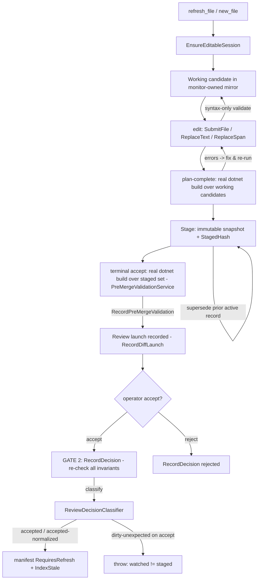
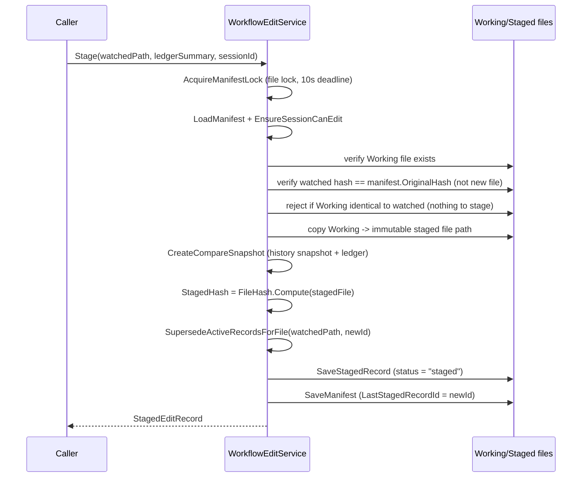
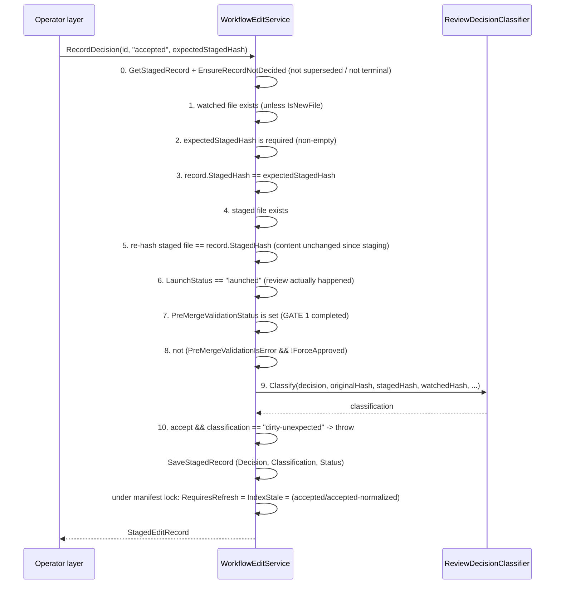
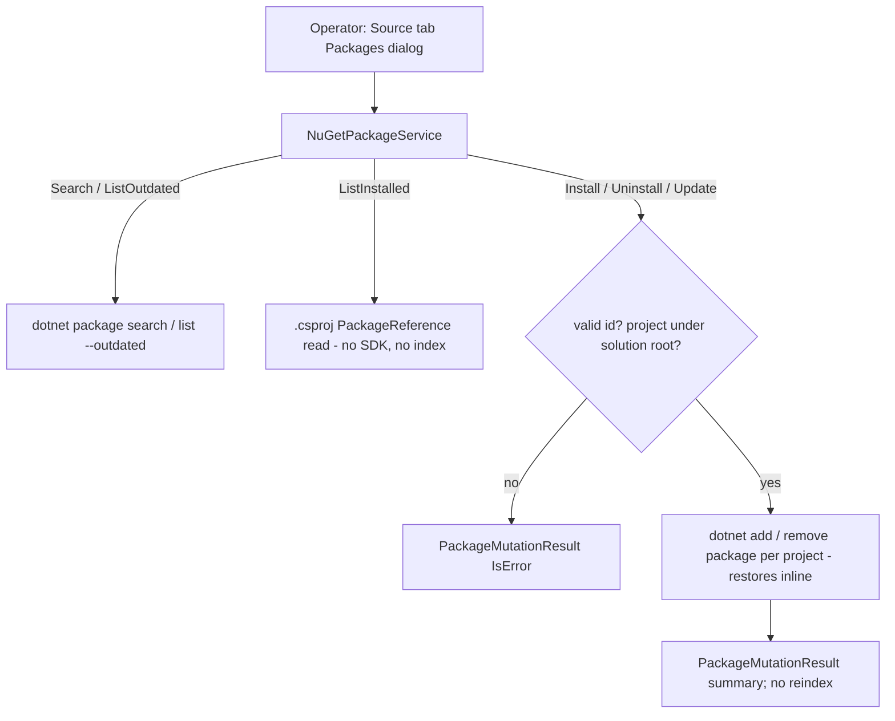

# AIMonitor.Workflow

> The governed-edit engine: it owns the monitor's Working mirror, stages candidate edits as immutable hashed records, and enforces the two review gates that stand between an AI-authored change and the watched source.

**Project:** `src/AIMonitor.Workflow/AIMonitor.Workflow.csproj` · **Depends on:** `AIMonitor.Core`, `Microsoft.CodeAnalysis.CSharp.Workspaces` (Roslyn 5.3.0) · **Depended on by:** `AIMonitor.McpServer`, `AIMonitor.Indexing`, `ClaudeWorkbench.Host`

## Purpose

ClaudeWorkbench never lets an AI agent write directly to the watched .NET solution. Instead, agents write **candidate** edits into a monitor-owned **Working mirror**, those candidates are **staged** as immutable, SHA-256-hashed snapshots, and a human operator **accepts** or **rejects** each one. `AIMonitor.Workflow` is where that machinery lives.

It is responsible for:

- **Edit sessions** — a per-watched-file manifest tracking baseline hashes, refresh state, and the last staged record (`EditSessionManifest`, `WorkflowEditService.Refresh`/`NewFile`).
- **The Working mirror** — a shadow copy of each watched file under a monitor-owned `working/` root that agents mutate via whole-file, find/replace, and span edits.
- **Staging** — snapshotting a Working candidate into an immutable `StagedEditRecord` with a recorded hash, superseding any earlier active record for the same file.
- **The pre-merge build** — a real, incremental `dotnet build` of the whole solution with the candidate set overlaid (`PreMergeValidationService`), run at **plan-complete** (working candidates) and again at the **terminal accept** (staged set) — plus the accept-time invariant checks + decision classification (`WorkflowEditService.RecordDecision` → `ReviewDecisionClassifier`).
- **Hash integrity** — every state transition is gated on SHA-256 hashes so that what an operator accepts is provably identical to what they reviewed (`FileHash`).

The safety invariants of the whole product live in this module; the layers above it (`AIMonitor.Indexing`, `ClaudeWorkbench.Host`, the MCP server) orchestrate it but do not re-implement its guarantees.

## Key types

| Type | File | Role |
|------|------|------|
| `WorkflowEditService` | `WorkflowEditService.cs` | Central service. Owns session lifecycle, Working mirror edits, staging, decisions, and all manifest/record persistence. |
| `EditSessionManifest` | `EditSessionManifest.cs` | Per-file session state persisted as JSON: baseline hashes, `RequiresRefresh`, `IndexStale`, last staged record, validation results. |
| `StagedEditRecord` | `StagedEditRecord.cs` | Immutable snapshot metadata: staged file path, `StagedHash`, launch/validation status, decision, supersession chain. |
| `ReviewDecisionClassifier` | `ReviewDecisionClassifier.cs` | Pure function mapping (operator decision, hashes, new-file flag) → `accepted` / `accepted-normalized` / `rejected` / `dirty-unexpected`. |
| `PreMergeValidationService` | `PreMergeValidationService.cs` | The real pre-merge build. Mirrors source into a PERSISTENT per-solution `validation-workspace` incrementally (`robocopy /MIR`, keeping `obj`/`bin`), overlays the candidate set, runs a real `dotnet build`. `Validate` (staged/accept) + `ValidateWorkingOverlay` (plan-complete) share a private core; `ValidateStagedOverlay` is a no-build hash-readiness check. Per-solution lock serializes the shared workspace. |
| `CandidateEditValidator` | `CandidateEditValidator.cs` | C# **syntax-only** check of a candidate (`ValidateSyntaxIfCSharp`), run on every Working write. The old in-memory flat overlay compile was removed — a single flat compilation couldn't model per-project refs/SDKs/`.razor`; the real build is the compile gate. |
| `WorkflowEditPaths` | `WorkflowEditPaths.cs` | Computes all workspace paths (working, metadata, staged files/records, history, retrieval backups) and enforces the watched-root containment check. |
| `FileHash` | `FileHash.cs` | SHA-256 over raw file bytes (`Compute`) and over line-ending-normalized text (`ComputeText`/`ComputeNormalizedFile`). |
| `WorkflowRunRecorder` | `WorkflowRunRecorder.cs` | Append-only run log + telemetry for compare/stage runs (atomic write pattern). |
| `FileLedgerWriter` | `FileLedgerWriter.cs` | Appends a per-file Markdown ledger entry on each compare snapshot. |
| `NuGetPackageService` | `NuGetPackageService.cs` | **Operator-only** package management. Host-run, out-of-process `dotnet package search` / `list package --outdated` / `add package` / `remove package` from the solution root. NOT an agent tool and NOT part of the staging workflow — the agent changes packages by editing a `<PackageReference>` as a governed staged edit; this service backs the Source tab's "Packages" dialog. |
| `EditSessionStatus` / `CompareSnapshotResult` / `StagedEditSummary` / `ReplaceTextResult` / `TextSpanResult` | (respective files) | DTOs returned to callers. |
| `EditSyntaxValidationResult` / `EditSyntaxDiagnostic` | `EditValidationResult.cs` | Per-candidate **syntax** validation result embedded in the manifest (`LastSyntaxValidation`). |

## The governed edit lifecycle

An edit begins with a session. For an existing file, `Refresh(path)` copies the watched file into the Working mirror, records `OriginalHash` (raw) and `OriginalNormalizedHash` (line-ending-normalized), and writes a timestamped **retrieval backup** of the source. For a not-yet-existing target, `NewFile(path)` seeds an empty Working file and marks the manifest `IsNewFile`. `EnsureEditableSession` picks the right one automatically, but refuses if the manifest is `RequiresRefresh` (set after a prior accept).

Agents then mutate the Working candidate through `SubmitFile` / `WriteWorkingCandidate` (whole file), `ReplaceText` (find/replace with match-count and hash guards), or `ReplaceSpan` / `FindTextSpan` (line/column spans). Every write funnels through `WriteCandidateContent`, which **rejects C# syntax errors up front** (`CandidateEditValidator.ValidateSyntaxIfCSharp`), preserves the file's dominant line ending, writes the candidate **atomically** (temp + `File.Move`), and bumps `OperationCount`. There is no per-write semantic/overlay compile — semantic validation is the real build at plan-complete and accept.

`Stage` freezes the candidate: it verifies the watched file is unchanged since refresh (raw hash equals `OriginalHash`), copies the Working file to an immutable per-record path, records `StagedHash` and `StagedNormalizedHash`, and **supersedes** any earlier active record for the same watched file. The real compile gate runs the pre-merge `dotnet build` against the shared persistent workspace **twice**: once at **plan-complete** over the session's *working* candidates (`WorkflowEditService.ValidatePlannedOverlayBuild` → `PreMergeValidationService.ValidateWorkingOverlay`, so the agent self-corrects before the operator reviews), and again at the **terminal accept** over the *staged* set (`PreMergeValidationService.Validate`), before `RecordDecision` re-checks every invariant. The review-launch readiness check (`ValidateStagedOverlay`) is hash-only and does **not** build.

```mermaid
flowchart TD
    A[refresh_file / new_file] --> B[EnsureEditableSession]
    B --> C[Working candidate in monitor-owned mirror]
    C --> D[edit: SubmitFile / ReplaceText / ReplaceSpan]
    D -->|syntax-only validate| C
    D --> P[plan-complete: real dotnet build over working candidates]
    P -->|errors -> fix & re-run| D
    P --> E[Stage: immutable snapshot + StagedHash]
    E -->|supersede prior active record| E
    E --> F[terminal accept: real dotnet build over staged set - PreMergeValidationService]
    F -->|RecordPreMergeValidation| G[Review launch recorded - RecordDiffLaunch]
    G --> H{operator accept?}
    H -->|accept| I[GATE 2: RecordDecision - re-check all invariants]
    H -->|reject| J[RecordDecision rejected]
    I -->|classify| K[ReviewDecisionClassifier]
    K -->|accepted / accepted-normalized| L[manifest RequiresRefresh + IndexStale]
    K -->|dirty-unexpected on accept| M[throw: watched != staged]
```

## Key flows

### (a) Stage a candidate — hash and supersede

`WorkflowEditService.Stage` (lines 690-771). Note that the immutable `StagedHash` is computed from the **copied staged file**, not the live Working file, so it is stable for the record's lifetime.

```mermaid
sequenceDiagram
    participant Caller
    participant Svc as WorkflowEditService
    participant FS as Working/Staged files
    Caller->>Svc: Stage(watchedPath, ledgerSummary, sessionId)
    Svc->>Svc: AcquireManifestLock (file lock, 10s deadline)
    Svc->>Svc: LoadManifest + EnsureSessionCanEdit
    Svc->>FS: verify Working file exists
    Svc->>FS: verify watched hash == manifest.OriginalHash (not new file)
    Svc->>FS: reject if Working identical to watched (nothing to stage)
    Svc->>FS: copy Working -> immutable staged file path
    Svc->>Svc: CreateCompareSnapshot (history snapshot + ledger)
    Svc->>Svc: StagedHash = FileHash.Compute(stagedFile)
    Svc->>Svc: SupersedeActiveRecordsForFile(watchedPath, newId)
    Svc->>FS: SaveStagedRecord (status = "staged")
    Svc->>FS: SaveManifest (LastStagedRecordId = newId)
    Svc-->>Caller: StagedEditRecord
```

### (b) RecordDecision("accepted") — the enforced invariants, in order

`WorkflowEditService.RecordDecision` (lines 902-966); the ordered guards live in the shared `EnsureAcceptanceGuardsPass` (also used by `RecordSessionApproval` for per-file approval in multi-file sessions). The order below is exact; each check throws `InvalidOperationException` (or `FileNotFoundException`) and aborts before any state is written.

```mermaid
sequenceDiagram
    participant Op as Operator layer
    participant Svc as WorkflowEditService
    participant Cls as ReviewDecisionClassifier
    Op->>Svc: RecordDecision(id, "accepted", expectedStagedHash)
    Svc->>Svc: 0. GetStagedRecord + EnsureRecordNotDecided (not superseded / not terminal)
    Svc->>Svc: 1. watched file exists (unless IsNewFile)
    Svc->>Svc: 2. expectedStagedHash is required (non-empty)
    Svc->>Svc: 3. record.StagedHash == expectedStagedHash
    Svc->>Svc: 4. staged file exists
    Svc->>Svc: 5. re-hash staged file == record.StagedHash (content unchanged since staging)
    Svc->>Svc: 6. LaunchStatus == "launched" (review actually happened)
    Svc->>Svc: 7. PreMergeValidationStatus is set (GATE 1 completed)
    Svc->>Svc: 8. not (PreMergeValidationIsError && !ForceApproved)
    Svc->>Cls: 9. Classify(decision, originalHash, stagedHash, watchedHash, ...)
    Cls-->>Svc: classification
    Svc->>Svc: 10. accept && classification == "dirty-unexpected" -> throw
    Svc->>Svc: SaveStagedRecord (Decision, Classification, Status)
    Svc->>Svc: under manifest lock: RequiresRefresh = IndexStale = (accepted/accepted-normalized)
    Svc-->>Op: StagedEditRecord
```

The classifier itself (`ReviewDecisionClassifier.Classify`) returns `accepted` when the watched raw hash equals the staged hash, `accepted-normalized` when only the line-ending-normalized hashes match, and `dirty-unexpected` when an "accepted" decision does not agree with the watched hash — which invariant 10 turns into a hard failure.

## NuGet package management (operator-only, out-of-band)

`NuGetPackageService` is the operator-driven counterpart to `SolutionRestoreService` / `ProjectScaffoldService`: it drives the real .NET SDK **out-of-process** from the solution root (`dotnet` with `WorkingDirectory = solutionRoot`), so `NuGet.config`, `Directory.Build.props`, and private feeds are honoured exactly as a normal `dotnet` invocation would be. It is deliberately **outside the governed-edit machinery** described above — it is not an `[McpServerTool]`, has no session/staging/hash gate, and never touches the Working mirror. The agent adds a package the governed way (edit a `<PackageReference>` as a planned staged file, then `restore_solution`); this service is what the **host** invokes from the Source tab's "Packages" dialog when the operator manages packages directly.

**Reads** (return an empty list on launch failure / timeout / non-zero exit, and swallow JSON format drift rather than throwing into the Blazor circuit):

- `Search(query, includePrerelease, take)` — `dotnet package search <query> --format json --take N` (45s timeout). Results are aggregated across the configured sources and **deduped by id**, first source listed winning (nuget.org is listed first). `PackageSearchHit` carries only what the CLI returns (id, latest version, total downloads, owners, source name) — no description.
- `ListInstalled(settings)` — reads each project's `<PackageReference>` items **directly from the `.csproj` via `XDocument`**, with no SDK subprocess and no code index (installing a package changes no user symbols, so this stays instant and always fresh). Handles the version as an attribute or child element; `Version` is `null` under Central Package Management (the version lives in `Directory.Packages.props`). A malformed project file is skipped, not thrown.
- `ListOutdated(settings, includePrerelease)` — `dotnet list <solution> package --outdated --format json` (3min timeout), one call for the whole solution, keyed by `(projectPath, packageId)` and de-duplicated across the frameworks of a multi-TFM project.

**Writes** (`Install` / `Uninstall`, both funnelling through the private `Mutate`, default 5min timeout) validate up front, then run `dotnet add|remove package` **per target project** and let the SDK restore inline (no `--no-restore`) — no explicit reindex, since a package change alters no user symbols and the code index refreshes on its own on the next real build/accept:

- **Package-id grammar** is validated (dot-separated letters/digits/`_`/`-`) before any process launches.
- **Containment:** each target project's full path must sit under the solution root (`projectPath.StartsWith(solutionRoot + separator)`), the same sibling-prefix-safe `root + separator` guard the McpServer uses for watched paths; a project outside throws before anything runs.
- A specific `version` is an `Install` with `--version` — which is also how **"Update to X"** is expressed. Under Central Package Management the SDK routes the version into `Directory.Packages.props` itself; the service does not special-case it.
- `PackageMutationResult(IsError, Message, Diagnostics)` is the guided result. A missing `dotnet` yields a friendly "install the .NET 10 SDK" message; a timeout / non-zero exit extracts up to 30 diagnostic lines (those containing `: error`, `error:`, `not found`, or `NU1`), falling back to the tail of stderr/stdout when none match.

```mermaid
flowchart TD
    op[Operator: Source tab Packages dialog] --> svc[NuGetPackageService]
    svc -->|Search / ListOutdated| sdkRead[dotnet package search / list --outdated]
    svc -->|ListInstalled| csproj[.csproj PackageReference read - no SDK, no index]
    svc -->|Install / Uninstall / Update| gate{valid id? project under solution root?}
    gate -->|no| err[PackageMutationResult IsError]
    gate -->|yes| sdkWrite[dotnet add / remove package per project - restores inline]
    sdkWrite --> done[PackageMutationResult summary; no reindex]
```

## The safety invariants (the crux)

The product's core promise is: **an accepted edit is byte-for-byte (or normalized-equal) the thing the operator reviewed.** Three mechanisms combine to make that true:

1. **Immutable staged snapshot.** `Stage` copies the Working candidate to a dedicated per-record path (`WorkflowEditPaths.GetStagedFilePath`) and records `StagedHash = FileHash.Compute(stagedFile)`. The record is what gets reviewed; the mutable Working file can change afterward without affecting it.

2. **Re-hash on accept.** `RecordDecision` recomputes the staged file's hash (`currentStagedHash = FileHash.Compute(record.StagedFilePath)`) and refuses to proceed unless it still equals the recorded `StagedHash`. This detects any tampering with the staged snapshot between staging and acceptance. `PreMergeValidationService.ValidateStagedRecordHash` performs the same re-hash check at GATE 1.

3. **watched == staged required to accept.** After the merge is applied and review launched, the classifier compares the **watched** file's current hash against the **staged** hash. An "accepted" decision that does not match (`dirty-unexpected`) is rejected outright by invariant 10. `accepted-normalized` is the only relaxation, and only when the normalized-text hashes agree.

Supporting these: `expectedStagedHash` must be supplied by the caller and match the record (invariants 2-3), so the operator layer must echo back the exact hash it showed the user; the record must have been through a real review launch (`LaunchStatus == "launched"`, invariant 6) and GATE 1 must have completed without an unapproved error (invariants 7-8). `EnsureRecordNotDecided` prevents double-decisions and decisions on superseded records.

## Owns / Does Not Own

**Owns:**
- The Working mirror and its line-ending-preserving edit operations.
- Edit-session manifests and staged-record persistence (their JSON shape and file layout under the workspace root).
- Hashing of watched / working / staged files (`FileHash`) and all hash-equality gating.
- Staging, supersession, and the accept/reject decision path.
- The pre-merge `dotnet build` (persistent incremental workspace) at plan-complete and accept, plus accept-time invariant enforcement + classification.
- Per-candidate Roslyn **syntax** feedback (semantic validation is the real pre-merge build, not a per-edit overlay).
- Compare snapshots, run/telemetry logs, and per-file ledgers.
- The **operator-only** NuGet package surface (`NuGetPackageService`): out-of-process `dotnet` search/outdated reads, direct `.csproj` `<PackageReference>` reads, and `add`/`remove` writes with id-grammar validation and solution-root containment. This is out-of-band of the staging workflow — no session, no hash gate, no Working mirror, no agent tool.

**Does Not Own:**
- Actually merging the accepted staged file into the watched source (the runtime/host review workflow applies the merge; this module classifies the result).
- Presenting the review UI (`ClaudeWorkbench.Host`'s in-app Merge Review — this module only records `RecordDiffLaunch`). There is no external diff tool; that path was retired.
- Solution indexing and the post-accept index rebuild (`AIMonitor.Indexing`; this module only flips the `IndexStale` flag).
- MCP tool contracts (`AIMonitor.McpServer`).
- `MonitorSettings`, workspace root layout, and the safe-path helpers it consumes from `AIMonitor.Core`.

## Gotchas & invariants

- **Staged records are held in memory, guarded by one lock.** `WorkspaceManager` builds one `WorkflowEditService` per workspace and hands it to every caller (the agent stages through the in-process MCP surface; the operator accepts through the Blazor host — same instance). The records are the in-memory source of truth under a single `recordSync` lock, lazily rehydrated from disk on first use, and every read returns an isolated clone so a caller mutating a returned record cannot reach into the cache. This replaced the old read-file/mutate/write-file-per-step design, which threw "the record .json is being used by another process" when an accept overlapped a supersede or list. Individual record operations are now safe; a *compound* read-modify-write spanning separate `GetStagedRecord` → mutate → `SaveStagedRecord` calls is still last-writer-wins.
- **The pre-merge validation workspace is shared and serialized.** `PreMergeValidationService` reuses one persistent `validation-workspace` per solution so builds are incremental; a process-wide static per-solution lock (`WorkspaceLocks`) serializes every build against it (plan-complete + accept), and each build full-mirrors source first (reverting any prior overlay) before applying the current candidates — so concurrent sessions cannot contaminate each other. `RuntimeRoot` is per host instance, so different instances use different workspaces.
- **All persisted state now writes atomically.** `SaveStagedRecord`, `SaveManifest`, and `WriteCandidateFile` (the working candidate) each write a sibling `.writing` temp then `File.Move`-swap it (the temp name is not `*.json`, so rehydration/overlay scans ignore it). This guards a lock-free reader (e.g. `GetStatus`) or an out-of-sequence agent from ever seeing a truncated manifest/working file, and a crash mid-write leaves the prior version intact.
- **Accept requires the merge to already be applied.** GATE 2's `dirty-unexpected` guard compares the *watched* file to the staged hash. `RecordDecision` does not itself write the watched file (except deleting a blank new-file target on reject); the caller must have applied the merge first, or an "accepted" decision will be rejected.
- **`RequiresRefresh` latch after accept.** An accepted/normalized-accepted decision sets `RequiresRefresh = true` and `IndexStale = true` on the manifest. Further edits/staging are blocked (`EnsureSessionCanEdit`) until `Refresh` is re-run, guaranteeing hashes and saved line endings reflect the new watched source.
- **New-file staging refuses if the target has appeared.** `Stage` throws if `IsNewFile` but the watched path now exists; `PrepareReviewFileForLaunch`/`RecordDecision` also guard against a non-blank pre-existing target.
- **Watched-root containment is enforced by path math.** `WorkflowEditPaths.GetRelativeWatchedPath` throws for any file outside `Settings.WatchedProjectFolder`, so sessions cannot be created for arbitrary paths.
- **Two hash notions.** `FileHash.Compute` hashes raw bytes; `ComputeNormalizedFile` hashes line-ending-normalized text. Mixing them up would defeat the `accepted` vs `accepted-normalized` distinction — the code is careful to pair raw-with-raw and normalized-with-normalized.

## Where to start reading

1. `WorkflowEditService.RecordDecision` (lines 902-966) + `EnsureAcceptanceGuardsPass` — the accept-time gate; read this first, it is the crux.
2. `WorkflowEditService.Stage` (690-771) — how an immutable hashed record is created and prior records superseded.
3. `ReviewDecisionClassifier.Classify` — the pure decision function the whole safety story reduces to.
4. `WorkflowEditService.WriteCandidateContent` (507-537) — the common path for every Working edit (syntax gate, atomic BOM-preserving write, line-ending preservation).
5. `PreMergeValidationService` — the persistent incremental workspace + the shared `Validate`/`ValidateWorkingOverlay` real-build core; `ValidatePlannedOverlayBuild` (in `WorkflowEditService`) is the plan-complete entry.
6. `EditSessionManifest` / `StagedEditRecord` — the persisted state shapes everything else reads and writes.

## Tests

`tests/unit/AIMonitor.Workflow.Tests` — **46 tests**. Highlights:

- `WorkflowEditServiceSafetyTests` — the bulk of the invariant coverage: staging, supersession, hash-mismatch rejection, the accept-gate ordering, `dirty-unexpected` handling, and that per-edit validation is syntax-only (a semantically-wrong-but-parseable edit is written, not blocked — the real build catches it).
- `WorkflowEditServiceRecordStoreTests` (4) — the in-memory staged-record store: durability across a service restart, the atomic temp-then-rename write, clone isolation, and the concurrent accept/supersede that used to throw a file-sharing violation.
- `ReviewDecisionClassifierTests` (3) — the classifier's four outcomes.
- `ClaudeSmokes*` suites — authoring, materialization, the Phase 2 `dirty-unexpected` path, Phase 6 (per-edit is syntax-only: syntax errors rejected, semantic errors pass through to the build), and WinForms source-map handling over `samples/` fixtures.
- `RoslynEditService*Tests` — outline/source-map behavior for the Roslyn edit helpers.
- The real plan-complete build is exercised end-to-end against the samples (Calculator, Blazor, and cross-DLL `MixedTfmSample`) by `AgentLoopSampleWorkflowTests` in `tests/integration/AIMonitor.Integration.Tests` — each scenario emits reviewable code + workflow output files.
