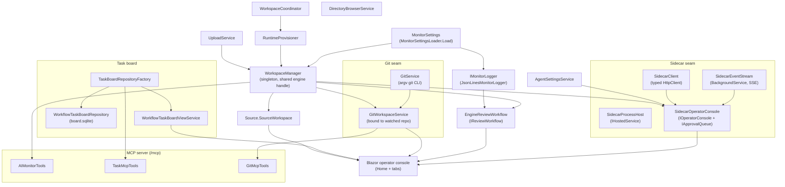
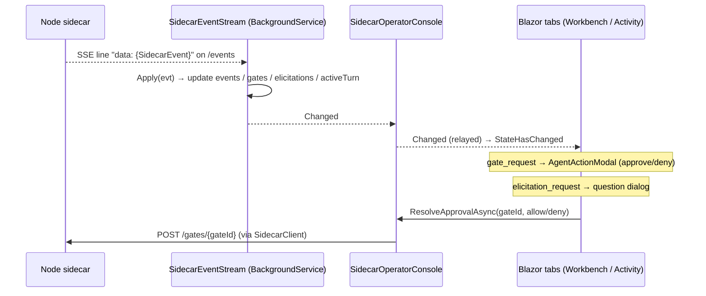

# ClaudeWorkbench.Host

> The single .NET process that fuses the AIMonitor engine, the claude-workbench MCP tool surface, the Blazor operator console, and a supervised Node sidecar into one governed workbench — and is the only code that ever writes watched source.

**Project:** `src/ClaudeWorkbench.Host/ClaudeWorkbench.Host.csproj` (`Microsoft.NET.Sdk.Web`, `net10.0`) · **Depends on:** every engine project — `AIMonitor.Core`, `AIMonitor.Logging`, `AIMonitor.Data`, `AIMonitor.MSBuild`, `AIMonitor.Workflow`, `AIMonitor.Indexing`, `AIMonitor.McpServer` (plus `ModelContextProtocol.AspNetCore`, `Radzen.Blazor`, `DiffPlex`, `Markdig`, `Microsoft.Data.Sqlite`) · **Serves:** MCP over Streamable HTTP at `/mcp`, the Blazor UI, and a `/health` probe; launches and supervises the sidecar.

## Purpose

ClaudeWorkbench.Host is the runtime that turns the extracted AIMonitor engine into an operator-driven, human-gated workbench for AI edits to a watched .NET solution. It runs as a **single start** (`dotnet run` / the published exe) on port `:6100` — one workspace per process; `ClaudeWorkbench.Launcher` runs several instances side by side by overriding the port pair per instance — and does four jobs in one process, sharing one engine instance and one logging sink in-process:

1. hosts the AIMonitor engine (via `WorkspaceManager` + the `AIMonitor.*` project references);
2. exposes the `claude-workbench` MCP tool surface over HTTP for the sidecar's agent to call;
3. renders the Blazor operator console (Radzen) the human uses to prompt, gate, review, and merge;
4. launches and supervises the Node sidecar as a child process.

The load-bearing invariant: the agent **never** writes watched source. It stages candidates through the governed MCP; the operator reviews the diff and accepts; `EngineReviewWorkflow.Accept` — an operator-authorized Blazor action — performs the only write into the watched tree.

## What it hosts (three surfaces in one process)

- **MCP HTTP surface** — `app.MapMcp("/mcp")`. An `AddMcpServer(...).WithHttpTransport()` server named `claude-workbench` v0.1.0, composed from three tool types: `WithTools<AIMonitorTools>()` (the engine's edit/index/search surface, from `AIMonitor.McpServer`), `WithTools<Tasks.TaskMcpTools>()` (task board read + agent-notes write), and `WithTools<GitMcpTools>()` (governed git). Together these are the **71-tool surface** the sidecar's Claude Agent SDK query consumes = `AIMonitorTools` (60) + `TaskMcpTools` (3) + `GitMcpTools` (8). (Verified against a live `tools/list`.)
- **Blazor operator console** — `app.MapRazorComponents<App>().AddInteractiveServerRenderMode()`. Radzen + interactive Server components; the `Home` page hosts the tab shell (Tasks / Workbench / Source / Git / Activity).
- **Sidecar supervisor** — `SidecarProcessHost` (an `IHostedService`) launches `node dist/index.js` as a child process, passing `SIDECAR_PORT` and `WORKBENCH_MCP_URL=http://localhost:6100/mcp` so the sidecar loops back to this process's MCP surface.

## Service graph

Wiring lives entirely in `Program.cs`. `MonitorSettingsLoader.Load` produces the `MonitorSettings` that seeds the `WorkspaceManager` (the shared engine handle) and the `JsonLinesMonitorLogger` sink. From there the DI container assembles the MCP server, the sidecar trio (process host + event stream + control client) behind the `IOperatorConsole` / `IApprovalQueue` seams, the review workflow, the git pair, and the task/source/upload/provisioner services.



## Key services

| Service | File | Role |
|---|---|---|
| `WorkspaceManager` | (engine, `AIMonitor.McpServer`) | The shared, singleton engine handle. Holds `Settings`, `EditService`, `RepositoryRoot`, `WatchedSolutionPath`, `HasWorkspace`; every host service that touches the watched solution goes through it. |
| `EngineReviewWorkflow` | `Services/EngineReviewWorkflow.cs` | `IReviewWorkflow` (singleton). In-process adapter over the AIMonitor workflow engine that replaces the external WinMerge step. **The only place watched source is written** — temp-then-rename per file, on the **terminal** operator Accept only, covering every approved file in the session, after the GATE-2 build passes. |
| `SidecarProcessHost` | `Services/SidecarProcessHost.cs` | `IHostedService` that launches + supervises `node dist/index.js`; skips launch if the port is already open; kills the child tree on shutdown. |
| `SidecarEventStream` | `Services/SidecarEventStream.cs` | `BackgroundService` that reads the sidecar's SSE `/events`, maintaining bounded event history (max 500), the pending-gate set, elicitations, connection + active-turn state; raises `Changed`. Reconnects every 2 s on drop; re-seeds gates/elicitations on each connect. |
| `SidecarClient` | `Services/SidecarClient.cs` | Typed `HttpClient` for the sidecar's control surface: `/prompt`, `/gates/{id}`, `/elicitations/{id}`, `/stop`, `/new-thread`, `/review-outcome`, `/usage`. |
| `SidecarOperatorConsole` (+ `.Approvals`) | `Services/SidecarOperatorConsole*.cs` | Scoped adapter implementing both `IOperatorConsole` (transcript/activity/status, SendAsync, StopAsync, NewThread, usage) and `IApprovalQueue` (pending gates → `ApprovalRequest`, elicitations, resolve). The one place aware of sidecar event shapes. |
| `GitService` | `Services/GitService.cs` | Stateless wrapper that launches the `git` executable via `ProcessStartInfo.ArgumentList` (argv, `UseShellExecute=false`) — **no shell, no injection surface**. Never throws on non-zero exit; caller inspects `GitResult.Ok`. |
| `GitWorkspaceService` | `Services/GitWorkspaceService.cs` | Singleton binding `GitService` to the current watched repo (resolves the repo root so porcelain paths line up). Shared by both the operator Git panel and the agent's `GitMcpTools`. |
| `TaskMcpTools` | `Tasks/TaskMcpTools.cs` | MCP task surface: agent reads the Active task + notes and writes back agent-notes (durable memory) into the runtime task-memory store — never watched source. |
| `WorkflowTaskBoardRepository` | `Tasks/WorkflowTaskBoardRepository.cs` | SQLite-backed (`board.sqlite`) task board + task-memory markdown store; created per-workspace via `TaskBoardRepositoryFactory`. |
| `Source.SourceWorkspace` | `Source/SourceWorkspace.cs` | Builds the source-browser snapshot from the in-process AIMonitor index and rebuilds it; retargets when the watched workspace changes. |
| `WorkspaceCoordinator` / `RuntimeProvisioner` | `Services/*.cs` | Selecting a watched solution: point the manager at it, persist the choice, provision its runtime skeleton + task DB (idempotent, also on startup). Persistence targets the registered `MonitorConfigPath` — **the same file the host was started with** (`--config`), not a default path, so reader and writer cannot drift. |
| `AgentSettingsService` / `UploadService` / `DirectoryBrowserService` | `Services/*.cs` | Operator tool-policy (persisted `AgentToolPolicy`), file attachments into the runtime `uploads/` folder, and filesystem navigation for the workspace picker (opening at the watched solution's folder, or the user profile on first run — never the process cwd, which under the Launcher is the install folder). |
| `BrowserPresenceTracker` / `BrowserLifetimeCircuitHandler` | `Services/*.cs` | Opt-in browser-owned lifetime (`CWB_EXIT_WITH_BROWSER=1`, set by the Launcher): the circuit handler tracks live Blazor circuits and the tracker shuts the host down shortly after the last tab closes — so closing an instance's window stops its backend from the browser side. |

## The two critical flows

### (a) The terminal Accept writes the whole session

**The edit session is the atomic unit** ([ADR 0005](../decisions/0005-edit-session-is-atomic.md)). A per-file **Accept before the last file is an approval that writes nothing** — it records the decision so review advances, and returns a message saying plainly that nothing has reached source yet. Only the **terminal** accept (the last pending file) runs GATE 2 and writes, and it writes **every approved-but-unwritten file in the session together**, after the combined-overlay build passes. A **single Reject voids the session**, including files approved earlier — they were never written, so there is nothing to roll back.

GATE 1 remains the fast staged-overlay readiness check (no `dotnet build`). The terminal build runs *before* any bytes reach the watched tree, and **a failed build is a hard stop**.

Written-ness is a recorded fact, not an inference: `StagedEditRecord.WrittenAtUtc` is stamped immediately after each file's rename, so a retry after a partial write resumes rather than rewriting.

> Writing N files is **not** a transaction and does not claim to be. Each file is temp-file-then-rename, so no single file can be left truncated, but a failure partway leaves the set half-applied. `Accept` reports exactly which relative paths reached source and which did not, and how to resume.

> Historical note: writes used to happen per accept, and before `b029a03` even preceded the build (`File.Copy` before `StagedDecisionWorkflow.Record`), so a failed build left the watched file already overwritten. `b029a03` inverted build and write; ADR 0005 then made the *session* the unit, so accepting file 1 of 3 and rejecting file 2 can no longer leave half a refactor in your source.

```mermaid
sequenceDiagram
    participant Op as Operator (MergeReviewDialog)
    participant ERW as EngineReviewWorkflow
    participant Val as PreMergeValidationService (GATE 1)
    participant FS as Watched file
    participant SDW as StagedDecisionWorkflow (GATE 2)
    Op->>ERW: Accept(stagedRecordId, forceApproveValidation)
    ERW->>Val: EnsureValidatedAndLaunched (staged-overlay check, no build)
    Val-->>ERW: PreMergeValidationResult
    Note over ERW: if error & not force-approved → return, no write
    ERW->>ERW: record still pending? staged file present? re-hash == StagedHash?
    alt more files still pending (non-terminal)
        ERW->>ERW: RecordSessionApproval → decision "approved"
        ERW-->>Op: "NOTHING written yet; N file(s) still to review"
    else last pending file (terminal)
        ERW->>Val: Validate(write set overlay) — authoritative GATE 2 build
        Val-->>ERW: PreMergeValidationResult
        Note over ERW: build failed & not force-approved → return, NOTHING written
        loop each approved-but-unwritten file, oldest first
            ERW->>FS: copy staged → *.cwb-accept-tmp, then File.Move(overwrite:true)
            ERW->>ERW: MarkWrittenToWatchedSource (stamp WrittenAtUtc)
        end
        ERW->>SDW: Record("accepted") per file → index rebuild for the whole set
        SDW-->>ERW: decision + index outcome
        ERW-->>Op: ReviewActionResult (message + outcome summary)
    end
```

### (b) Sidecar SSE → Blazor UI



## UI tabs

Hosted on `Components/Pages/Home.razor`:

- **Tasks** (`Tabs/Tasks/*`) — the task board the operator curates; sets which task is Active, its state and notes. Backed by `WorkflowTaskBoardViewService` over `board.sqlite`.
- **Workbench / Assistant** (`Tabs/AssistantTab`) — the chat surface: prompt the agent, watch the transcript, resolve gates/elicitations via `AgentActionModal`, start a new thread.
- **Source** (`Pages/Source/*`) — read-only browser of the watched solution from the in-process AIMonitor index (`SourceWorkspace`).
- **Git** (`Tabs/GitTab`) — the operator's git panel over `GitWorkspaceService`: status, stage/unstage/discard, diff, commit, push, branches.
- **Activity** (`Tabs/ActivityTab`) — the reverse-chronological event feed derived from `SidecarEventStream` snapshots.

## Git integration

Two consumers, one backing service. `GitService` is a stateless CLI wrapper that spawns `git` via `ProcessStartInfo.ArgumentList` (argv only, `UseShellExecute=false`, `CreateNoWindow=true`) — there is no shell and thus no injection surface. `GitWorkspaceService` (singleton) binds it to the currently watched solution, resolving the repo root so porcelain paths and diffs align even when the `.sln` sits in a subfolder. Both the operator **Git panel** and the agent's **`GitMcpTools`** share that one singleton.

`GitMcpTools` is the governed surface for the agent: reads (`git_status`, `git_diff`, `git_log`, `git_list_branches`) auto-allow at the sidecar gate, while the four mutations — `git_commit`, `git_push`, `git_create_branch`, `git_switch_branch` — are marked **GOVERNED** and pause at the operator's approval gate before running, so nothing outward or irreversible happens without the operator's OK. The shared `Components/Shared/DiffView` renders side-by-side diffs for both the Git panel and the `MergeReviewDialog`; `GitWorkspaceService.GetDiffContentAsync` normalizes both sides to `\n` so line-ending differences don't render as spurious changes.

## Owns / Does Not Own

**Owns:** the *only* write to watched source — the temp-then-rename write performed by `EngineReviewWorkflow.Accept` on the **terminal** accept, covering the whole approved session, gated behind an operator Blazor action. Owns the MCP HTTP surface composition, the sidecar lifecycle, the Blazor console, and the git seam.

**Does not own:** engine internals. `WorkspaceManager`, `EditService`, `StagedDecisionWorkflow`, `PreMergeValidationService`, the index, and the underlying `AIMonitorTools` all live in the `AIMonitor.*` projects; the Host adapts and orchestrates them but does not implement staging, validation, indexing, or search.

## Gotchas & invariants

- **Validate-before-write (Accept).** Every guard runs before a byte reaches the watched tree: the record must still be pending (not superseded, not decided), the staged file must exist and still re-hash to `record.StagedHash`, and on the terminal accept the authoritative GATE-2 build must pass. A failed build is a hard stop — nothing is written, so there is nothing to roll back — unless the operator explicitly overrides validation.
- **Each file's write is atomic; the session's is not.** `Accept` copies each staged file to a sibling `*.cwb-accept-tmp` then `File.Move(..., overwrite: true)`s it into place, so no file can be left truncated. Across N files there is no transaction: a failure partway leaves the set half-applied, and `Accept` says exactly which paths reached source and which did not rather than implying a rollback. `WrittenAtUtc` makes a retry resume instead of rewriting.
- **A non-terminal accept touches no file.** It records `"approved"` — deliberately *not* a terminal decision, so the record can still become `accepted` or `rejected`. `"approved"` is a new value in a string-typed state field (`Decision`/`Status`/`Classification`); readers that switch on it were checked, but that is where an unchecked reader would hide.
- **The terminal build runs in the Host, not in `StagedDecisionWorkflow`.** `Accept` deliberately calls `Record(...)` **without** `terminalValidationRecords` — passing them would re-run the build it already ran pre-write.
- **`runtime/**` is excluded from compilation.** `DefaultItemExcludes` in the `.csproj` excludes `runtime\**`. Those folders hold working/staged mirrors of watched-solution `.cs` source; if globbed into the Host assembly they produce duplicate-type build errors (CS0101/CS0111) as soon as a watched solution is configured. Do not remove the exclude.
- **SSE fragility.** `SidecarEventStream.ReadStreamAsync` deserializes each `data:` line independently; a malformed JSON payload throws out of the read loop, marks the stream disconnected, and forces the 2 s reconnect — a single bad line tears the current stream. On reconnect it re-seeds gates and elicitations from `/gates` and `/elicitations` so stale state self-heals.
- **DI lifetimes.** `WorkspaceManager`, `EngineReviewWorkflow`, `SidecarEventStream`, `GitService`, `GitWorkspaceService`, `TaskBoardRepositoryFactory`, and `SourceWorkspace` are **singletons**; `SidecarOperatorConsole`, `IOperatorConsole`, `IApprovalQueue`, `UploadService`, and the task view service are **scoped** (per Blazor circuit). The scoped `SidecarOperatorConsole` subscribes to the singleton stream's `Changed` and unsubscribes on `Dispose` — leaking that subscription would pin dead circuits.
- **Single-start / port reuse.** `SidecarProcessHost` skips launching if something already listens on the sidecar port (a dev/standalone sidecar), so a stray process silently takes over supervision.
- **Paths anchor to the binary, not the process cwd.** `ResolveContentRoot` uses `ContentRootPath` only when it actually contains `config\`, else falls back to `AppContext.BaseDirectory` — the Launcher starts the host from its bin folder. `ResolveSidecarDirectory` likewise walks up from `AppContext.BaseDirectory` looking for a `sidecar\dist\index.js`, falling back to `<repoRoot>\sidecar`. Both are overridable (`--repo-root`, `--config`, `Sidecar:Directory`).
- **The startup index warm is background, not blocking.** With a workspace already attached, `ApplicationStarted` fires a background `WorkspaceManager.ProvisionAsync()` behind the `IndexRebuildStatus` spinner, because a cold index makes the first agent turn flaky (`start_monitor_session` cannot prove the single owning project). Kestrel is never blocked; a failure is logged as `startup-index-rebuild-failed` and the app keeps running. Indexing needs the **.NET SDK** present — `MSBuildLocator.RegisterDefaults()` resolves a real MSBuild toolset.
- **The `/review/*` endpoints are test-only and off by default.** `GET /review/pending`, `POST /review/accept`, `POST /review/reject`, and `POST /review/warmup` are mapped **only** when `CWB_ENABLE_REVIEW_API=1`. They call the same `IReviewWorkflow` methods the Merge Review dialog's buttons call, bypassing the human merge window, so the sidecar flow smoke can drive an accept without an operator. Production never sets the variable, which is what keeps "operator Accept is the only path that writes watched source" true in real use.

## Where to start reading

1. `Program.cs` — the whole wiring story in one file: content-root/config resolution, settings load, MCP composition, sidecar options, every DI registration, the startup index warm, and the endpoint map.
2. `Services/EngineReviewWorkflow.cs` — the accept path and the one watched-source write; read `Accept` and `EnsureValidatedAndLaunched` together.
3. `Services/SidecarEventStream.cs` — how sidecar events become UI state (the `Apply` switch and reconnect loop).

## Tests

`tests/unit/ClaudeWorkbench.Host.Tests` — the first host test project (`ClaudeWorkbench.Host.Tests.csproj`). `GitServiceTests.cs` covers `GitService`/`GitWorkspaceService`: **15 green** (12 `[Fact]` + a 3-case `[Theory]` over `DraftCommitMessage`), exercising status parsing, staging, diff, commit/push argv, and the ahead/behind regex against a real temp git repo.
