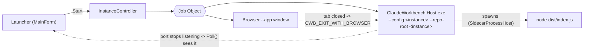

# ClaudeWorkbench.Launcher

> WinForms control panel that runs **several watched solutions side by side** — one host +
> sidecar + browser window per workspace, each isolated, all held in a Windows **Job Object**
> so they start and die together.

## Purpose

The Host is a single-workspace process: one `WatchedSolutionPath`, one port pair, one runtime.
The Launcher is the multi-instance layer *above* it. It does not embed the engine or the UI — it
allocates ports, writes each instance its own config, starts the Host as a child process, and
owns the lifetime of the resulting process group.

It is also what makes a **published install** usable: see
[the deployment guide](../guide/deploying.md) and `scripts/publish-live.ps1`.

## Key types

| Type | File | Role |
|---|---|---|
| `MainForm` | `MainForm.cs` | The control panel: one grid row per workspace (name, solution, port, status), Start/Stop/Add/Remove/Settings/Help, a 2 s poll that reflects instances that exited on their own. |
| `InstanceController` | `InstanceController.cs` | One workspace's whole lifecycle: allocate a free port pair, write the instance config, launch Host + browser into a Job Object, wait for `/health`, capture host stdout/stderr to `host.log`. `Stop()` terminates the job. |
| `JobObject` | `JobObject.cs` | Win32 Job Object wrapper with kill-on-close, so a Launcher crash cannot orphan a backend. |
| `LauncherState` / `WorkspaceEntry` | `LauncherModel.cs` | Persisted state (`<workbench root>\launcher.json`, so it travels with the install) **and the path-anchoring policy** — see below. |
| `LaunchSupport` (`BrowserResolver`, `Ports`) | `LaunchSupport.cs` | Chrome/Edge/custom-Chromium resolution from `SpecialFolder` (no hardcoded Program Files), and free host+sidecar port-pair selection. |
| `SettingsForm` / `HelpForm` | `*.cs` | Host exe, sidecar dir, instances dir, browser choice; and the in-app explanation of the lifetime model. |
| `SelfTest` | `SelfTest.cs` | Headless lifecycle check (`--selftest <solution> <log>`): starts an instance, waits for host **and** sidecar to listen, stops, waits for both to be gone. Returns 0 on success. |

## Lifetime — "kill one, kill all"

- **Stop**, or closing the Launcher, terminates the Job Object: host + sidecar + browser together.
- Closing the **browser window** stops the backend from the other side — the Launcher sets
  `CWB_EXIT_WITH_BROWSER=1` and the Host's `BrowserPresenceTracker` shuts down after the last
  circuit drops. `Poll()` uses the **port** as ground truth so the row flips to *stopped* promptly.
- The Host's Kestrel endpoint is forced per instance via `Kestrel__Endpoints__Http__Url` — an
  env var outranks `appsettings.json`, which pins `:6100` and would otherwise make every second
  instance fail to bind.

## Path anchoring (the part with the invariants)

`launcher.json` is written at the **workbench root** so the install stays portable (a read-only
install falls back to `%LOCALAPPDATA%`, and state left there by an older build is adopted once
and then migrated in). Absolute paths in it would rot as soon as the folder moved, so the policy
in `LauncherState` is:

1. **Find the workbench root** (`Reanchor` / `FindWorkbenchRoot`), in order: from the configured
   **host exe** (walking up for `ClaudeWorkbench.slnx`, `src\ClaudeWorkbench.Host\`, or a
   published `host\` folder — else that exe's own folder); then from the **Launcher's own
   location**; then from the persisted `WorkbenchRootHint`.
2. **Store paths relative to it** (`Portable` / `Resolve`). Paths outside the workbench — a
   watched solution elsewhere on disk — stay absolute.
3. **Re-guess anything stale.** A recorded host exe or sidecar dir that no longer exists is
   replaced by a fresh guess on load, so old state heals itself. The host-exe guess prefers a
   sibling exe (published), then `<root>\host\`, then the newest build in a checkout with
   **Release ahead of Debug**.
4. **Instances live at `<root>\runtime\<workspace>`.** `InstancesRoot` is empty by default,
   meaning *track the workbench root*; an explicit value in Settings overrides it.
5. **The instance folder name is claimed once and sticky** (`WorkspaceEntry.InstanceFolder`), so
   renaming a workspace never strands its index. Name collisions get `-2`, `-3`; names are
   sanitized for invalid characters, trailing dots/spaces, length, and Windows device names
   (`CON`, `LPT1`, …).

## Owns / Does Not Own

- **Owns:** multi-instance orchestration; port-pair allocation; the Job Object lifetime contract;
  per-instance config generation and `host.log` capture; browser resolution and the `--app`
  window; the workbench-root anchoring policy and instance-folder naming.
- **Does not own:** anything the Host owns — the engine, the MCP surface, the UI, the sidecar
  (the Host spawns it), the index, or the governed loop. The Launcher never reads a watched
  solution; it only points a Host at one.

## Gotchas & invariants

- The generated instance config sets `RuntimeRoot` to the **instance directory itself**, so
  provisioning writes `watched-solutions\` and `logs\` alongside `config\` and `host.log`.
- `StartAsync` waits up to 120 s for `/health` but treats only an **exited** host as a failure —
  a big solution's first index rebuild is slow, and a live-but-slow host must not be killed.
- The self-test binds the normal ports; don't run it against a live install you are using.
- A running install holds its exes open — close the Launcher before re-publishing over it.

## Where to start reading

`InstanceController.StartAsync` (the whole lifecycle in one method), then `LauncherState`'s
`Reanchor` / `InstanceDirectoryFor` for the path policy, then `JobObject`.

## Tests

No xUnit project. Verification is `SelfTest` (`--selftest`), which asserts the mechanism that
matters: host **and** sidecar up after Start, both gone after Stop.
