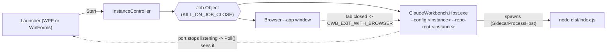

# ClaudeWorkbench.Launcher

> The control panel that runs **several watched solutions side by side** — one host +
> sidecar + browser window per workspace, each isolated, all held in a Windows **Job Object**
> so they start and die together. Ships as **two interchangeable UIs over one shared engine**:
> a modernized **WPF** rewrite (primary) and the original **WinForms** panel (fallback).

## Purpose

The Host is a single-workspace process: one `WatchedSolutionPath`, one port pair, one runtime.
The Launcher is the multi-instance layer *above* it. It does not embed the engine or the UI — it
allocates ports, writes each instance its own config, starts the Host as a child process, and
owns the lifetime of the resulting process group.

It is also what makes a **published install** usable: see
[the deployment guide](../guide/deploying.md) and `scripts/publish-live.ps1`.

## Two UIs, one engine

The repo ships two launcher projects that do the same job:

| Project | Exe | Role | UI framework |
|---|---|---|---|
| `src/ClaudeWorkbench.Launcher.Wpf/` | `ClaudeWorkbench.Launcher.Wpf.exe` | **Primary** | WPF (`net10.0-windows`, `UseWPF`) |
| `src/ClaudeWorkbench.Launcher/` | `ClaudeWorkbench.Launcher.exe` | **Fallback** | WinForms (`net10.0-windows`, `UseWindowsForms`) |

The two are **feature-identical** — same command bar (Add workspace, New blank solution, Start,
Stop, Remove, Claude/GitHub sign-in, Reset samples, Settings, Help), same 2 s status poll, same
`--selftest` contract. Only the presentation layer differs. The WPF rewrite exists for
**DPI correctness**: WPF renders vectors in device-independent units, so scaling and theming come
for free (`ClaudeWorkbench.Launcher.Wpf.csproj` notes PerMonitorV2 there just tells Windows not to
bitmap-stretch it), whereas the WinForms build has to opt into `PerMonitorV2` +
`AutoScaleMode.Font` + Segoe UI 9pt by hand (`ClaudeWorkbench.Launcher.csproj`).

The engine is **duplicated, not shared**: each project carries its own copy of
`AuthLauncher` / `InstanceController` / `JobObject` / `LaunchSupport` / `LauncherModel` /
`SelfTest`, in its own namespace (`ClaudeWorkbench.Launcher.Wpf` vs `ClaudeWorkbench.Launcher`).
The WPF `.csproj` spells out why: two projects declaring the same types from the same shared files
can't coexist in one Roslyn solution, which broke the workbench's own source index. Independent
copies keep both launchers indexable and launchable. The WPF and WinForms `InstanceController`,
`JobObject`, etc. are behaviourally the same code; the sections below describe the WPF copy but
apply to both.

Both point at the **same `launcher.json` and `runtime\`** in the install root (see
[Path anchoring](#path-anchoring-the-part-with-the-invariants)), so whichever exe you launch
drives the same workspace list — only the window differs.

## Key types

| Type | File | Role |
|---|---|---|
| `MainWindow` (WPF) / `MainForm` (WinForms) | `MainWindow.xaml(.cs)` / `MainForm.cs` | The control panel: one grid row per workspace (name, solution, port, status), the command bar, a 2 s `DispatcherTimer` / `Forms.Timer` poll that reflects instances that exited on their own. WPF binds an `ObservableCollection<WorkspaceRow>` via `INotifyPropertyChanged`; WinForms pokes the changed cells in place. |
| `InstanceController` | `InstanceController.cs` | One workspace's whole lifecycle: allocate a free port pair, write the instance config, launch Host + browser into a Job Object, wait for `/health`, capture host stdout/stderr to `host.log`. `Stop()` terminates the job. |
| `JobObject` | `JobObject.cs` | Win32 Job Object wrapper with `KILL_ON_JOB_CLOSE`, so a Launcher crash cannot orphan a backend. |
| `LauncherState` / `WorkspaceEntry` | `LauncherModel.cs` | Persisted state (`<workbench root>\launcher.json`, so it travels with the install) **and the path-anchoring policy** — see below. |
| `LaunchSupport` (`BrowserResolver`, `Ports`) | `LaunchSupport.cs` | Chrome/Edge/custom-Chromium resolution from `SpecialFolder` (no hardcoded Program Files), and free host+sidecar port-pair selection. |
| `AuthLauncher` | `AuthLauncher.cs` | Opens a real terminal on the Claude or GitHub CLI login/status/logout flow (machine-wide, deliberately *outside* the Job Object). |
| `WorkspaceRow` (WPF only) | `WorkspaceRow.cs` | The `INotifyPropertyChanged` view-model for one grid row; `Refresh()` pulls the controller's status into bound `Port` / `StatusText` / `StatusBrush`. |
| `SettingsWindow` / `SettingsForm`, `HelpWindow` / `HelpForm` | `*.xaml(.cs)` / `*.cs` | Host exe, sidecar dir, instances dir, browser choice; and the in-app explanation of the lifetime model. |
| `SelfTest` | `SelfTest.cs` | Headless lifecycle check (`--selftest <solution> <log>`): starts an instance, waits for host **and** sidecar to listen, stops, waits for both to be gone. Returns 0 on success. |

## Lifetime — "kill one, kill all"


```mermaid
flowchart LR
    L["Launcher (WPF or WinForms)"] -->|"Start"| IC["InstanceController"]
    IC --> JOB{{"Job Object<br/>(KILL_ON_JOB_CLOSE)"}}
    JOB --> H["ClaudeWorkbench.Host.exe<br/>--config &lt;instance&gt; --repo-root &lt;instance&gt;"]
    JOB --> B["Browser --app window"]
    H -->|"spawns (SidecarProcessHost)"| S["node dist/index.js"]
    B -.->|"tab closed -> CWB_EXIT_WITH_BROWSER"| H
    H -.->|"port stops listening -> Poll() sees it"| L
```

- **Stop**, or closing the Launcher, terminates the Job Object: host + sidecar + browser together.
  (On close, `MainWindow` disposes every controller; `Dispose()` calls `Stop()`.)
- The Job is assigned the host handle right after `Start`, *before* the host spawns the sidecar, so
  the sidecar — a child process — inherits the job and dies with it (`JobObject.Assign`). The
  browser handle is assigned too when it is a job-controllable Chromium `--app` window.
- Closing the **browser window** stops the backend from the other side — the Launcher sets
  `CWB_EXIT_WITH_BROWSER=1` and the Host's `BrowserPresenceTracker` shuts down after the last
  circuit drops. `Poll()` uses the **port** as ground truth (a 300 ms TCP connect to the host port)
  so the row flips to *stopped* promptly.
- The Host's Kestrel endpoint is forced per instance via `Kestrel__Endpoints__Http__Url` — an
  env var outranks `appsettings.json`, which pins `:6100` and would otherwise make every second
  instance fail to bind. `ASPNETCORE_URLS` is set to match, and `Sidecar__BaseUrl` / `Sidecar__McpUrl`
  / `Sidecar__Directory` wire the host to this instance's sidecar port and the shared sidecar dir.

### Ports and the loading splash

- `Ports.FindFreePair` walks host ports `6100, 6200, … 7000` (spaced by 100), sidecar at `host+10`,
  skipping ports already claimed by another live controller and probing each with a throwaway
  `TcpListener`. Ports are assigned at **start** time and not persisted, so they stay free between
  runs.
- The browser opens **immediately**, pointed at a static `loading.html` (spinner + self-redirect to
  the host once it answers), not the app URL — a busy machine's cold boot then shows a visible
  "Starting…" instead of an absent or blank window. `loading.html` ships next to the exe and is
  resolved from `AppContext.BaseDirectory`; if it's missing the browser opens the app URL directly.
- Chromium browsers open with `--app`, an isolated `--user-data-dir` under the instance folder,
  and `--start-maximized` (a plain "maximized" spills its bottom edge behind the taskbar). The
  chosen browser exe is also handed to the host as `CWB_BROWSER_EXE`, so a Source-tab "Run" opens
  the watched app in the same browser rather than the OS default.

## Settings surface

`SettingsWindow` / `SettingsForm` edit four things on `LauncherState`, then `Save()`:

- **Host exe** — the `ClaudeWorkbench.Host.exe` to launch. Editing it re-anchors everything else
  (`state.Reanchor()`), because the host exe is what locates the workbench.
- **Sidecar dir** — the folder holding `dist\index.js` (passed to the host as `Sidecar__Directory`).
- **Instances dir** — shown pre-filled with the computed default; only stored if the user types
  something *other* than the default, so an untouched box keeps tracking the workbench root
  (`InstancesRoot` reverts to empty).
- **Browser** — Chrome / Edge / Custom (Chromium) / Default browser (`BrowserKind`), plus a custom
  `.exe` path used only for the Custom choice. `BrowserResolver` resolves Chrome/Edge from
  `SpecialFolder` candidates; Firefox and "Default browser" can't be job-controlled (they're opened
  but not force-closed on Stop).

All four are **auto-guessed on first run** (`ApplyDefaults` / `GuessHostExe` / `GuessSidecarDir`)
so a fresh publish is usable without visiting Settings.

## Claude / GitHub sign-in

The command bar's **Claude sign-in ▾** and **GitHub sign-in ▾** buttons open a context menu with
*Sign in…*, *Check status*, and *Sign out* (`AuthLauncher.Claude` / `AuthLauncher.GitHub`). Each
runs the CLI's own flow (`claude auth login|status|logout`, `gh auth login|status|logout`).

- Sign-in is **machine-wide, not per-workspace**: Claude caches its credential under `~\.claude`
  (the sidecar inherits it), `gh` under the user profile.
- It runs in a **real terminal** (`cmd.exe /k … & <cli> …` with `UseShellExecute=true`), because
  these are interactive OAuth flows that print a URL + code and block on a console — the exact
  opposite of the host/sidecar's redirected, windowless launch. `/k` keeps the window open so the
  result ("Login successful", or an error) stays readable.
- These processes are **deliberately not** placed in the Job Object: a login is the user's, not an
  instance's, and must outlive the Launcher (you might close the Launcher while the browser tab is
  still completing the handshake).
- If a CLI isn't on PATH the button shows an install hint instead of flashing a console
  (`ResolveExecutable` walks `%PATH%`; the Claude CLI is accepted as `claude.cmd/.exe/.ps1/claude`).

## Path anchoring (the part with the invariants)

`launcher.json` is written at the **workbench root** so the install stays portable (a read-only
install — Program Files, a network share — falls back to `%LOCALAPPDATA%\ClaudeWorkbench\Launcher`,
and state left there by an older build is adopted once on load and then migrated in on the next
`Save`). Absolute paths in it would rot as soon as the folder moved, so the policy in
`LauncherState` is:

1. **Find the workbench root** (`Reanchor` / `FindWorkbenchRoot`), in order: from the configured
   **host exe** (walking up for `ClaudeWorkbench.slnx`, `src\ClaudeWorkbench.Host\`, or a
   published `host\ClaudeWorkbench.Host.exe` — else that exe's own folder); then from the
   **Launcher's own location**; then from the persisted `WorkbenchRootHint`.
2. **Store paths relative to it** (`Portable` / `Resolve`). Paths outside the workbench — a
   watched solution elsewhere on disk — stay absolute.
3. **Re-guess anything stale.** A recorded host exe or sidecar dir that no longer exists is
   replaced by a fresh guess on load, so old state heals itself. The host-exe guess prefers a
   sibling exe (a flat publish), then `<root>\host\`, then the newest build in a checkout with
   **Release ahead of Debug**.
4. **Instances live at `<root>\runtime\<workspace>`.** `InstancesRoot` is empty by default,
   meaning *track the workbench root* (`DefaultInstancesRoot`); an explicit value in Settings
   overrides it. Only if no workbench can be located at all does it fall back to `%LOCALAPPDATA%`.
5. **The instance folder name is claimed once and sticky** (`WorkspaceEntry.InstanceFolder`), so
   renaming a workspace never strands its index. Name collisions get `-2`, `-3`; names are
   sanitized for invalid characters, trailing dots/spaces, length (64), and Windows device names
   (`CON`, `LPT1`, …). Legacy `instances\<guid>` folders from an older build are migrated across.

## Published layout (`scripts/publish-live.ps1`)

The publish script produces one install root the Launcher recognises — both UIs side by side,
sharing the host, sidecar, `launcher.json` and `runtime\`:

```
<Destination>\
    host\               ClaudeWorkbench.Host.exe (the Blazor app) + its config\
    sidecar\            dist\index.js + production node_modules
    launcher\wpf\       ClaudeWorkbench.Launcher.Wpf.exe   (primary)
    launcher\winforms\  ClaudeWorkbench.Launcher.exe       (fallback)
    samples\            watched sample solutions (+ samples-golden\ pristine mirror)
    runtime\            created on first run: one folder per workspace
    launcher.json       shared workspace list + settings (written at first Save)
```

- Each UI publishes to its **own subfolder** so outputs never intermix, but both walk up to the
  install root (via the `host\` marker) and share `launcher.json` + `runtime\` there — so either
  drives the same workspaces.
- The script writes **a desktop shortcut for each**: "ClaudeWorkbench Launcher (WPF)" and
  "ClaudeWorkbench Launcher (WinForms)", named so the two are told apart at a glance.
- `runtime\` is never touched on re-publish (workspaces and indexes survive); the build-machine's
  `host\config\appsettings.json` is deleted (each instance writes its own).
- **Reset samples** (a command-bar button, present in both UIs) restores `samples\` from the
  pristine `samples-golden\` mirror the script lays down, skipping `bin\`/`obj\` so a lingering
  build host can't half-delete the source.

## Owns / Does Not Own

- **Owns:** multi-instance orchestration; port-pair allocation; the Job Object lifetime contract;
  per-instance config generation and `host.log` capture; browser resolution and the `--app`
  window; the machine-wide CLI sign-in terminal; the workbench-root anchoring policy and
  instance-folder naming.
- **Does not own:** anything the Host owns — the engine, the MCP surface, the app UI, the sidecar
  (the Host spawns it), the index, or the governed loop. The Launcher never reads a watched
  solution; it only points a Host at one. It also does not own the CLI credentials — sign-in just
  shells out to `claude` / `gh`.

## Gotchas & invariants

- The generated instance config sets `RuntimeRoot` to the **instance directory itself**, so
  provisioning writes `watched-solutions\` and `logs\` alongside `config\` and `host.log`.
- `StartAsync` waits up to 120 s for `/health` but treats only an **exited** host as a failure —
  a big solution's first index rebuild is slow, and a live-but-slow host must not be killed (the
  loading page keeps waiting and redirects once it catches up).
- The self-test binds the normal ports; don't run it against a live install you are using.
- A running install holds its exes open — close the Launcher(s) before re-publishing over it. The
  publish script checks for running `ClaudeWorkbench.Launcher.Wpf` / `ClaudeWorkbench.Launcher` /
  `ClaudeWorkbench.Host` under the destination and refuses up front.
- The engine files are **copied** between the two projects, not shared — a fix to one
  `InstanceController` / `JobObject` / `LauncherModel` must be applied to both.

## Where to start reading

`InstanceController.StartAsync` (the whole lifecycle in one method), then `LauncherState`'s
`Reanchor` / `InstanceDirectoryFor` for the path policy, then `JobObject`. Read the WPF copy first;
the WinForms one is the same engine behind a different window.

## Tests

No xUnit project. Verification is `SelfTest` (`--selftest <solution> <log>`), which asserts the
mechanism that matters: host **and** sidecar up after Start, both gone after Stop. Both launcher
exes expose the same `--selftest` entrypoint (WPF from `App.OnStartup`, WinForms from `Program.Main`).
