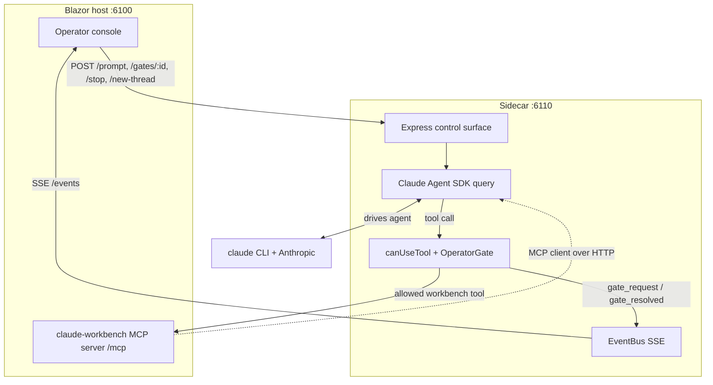
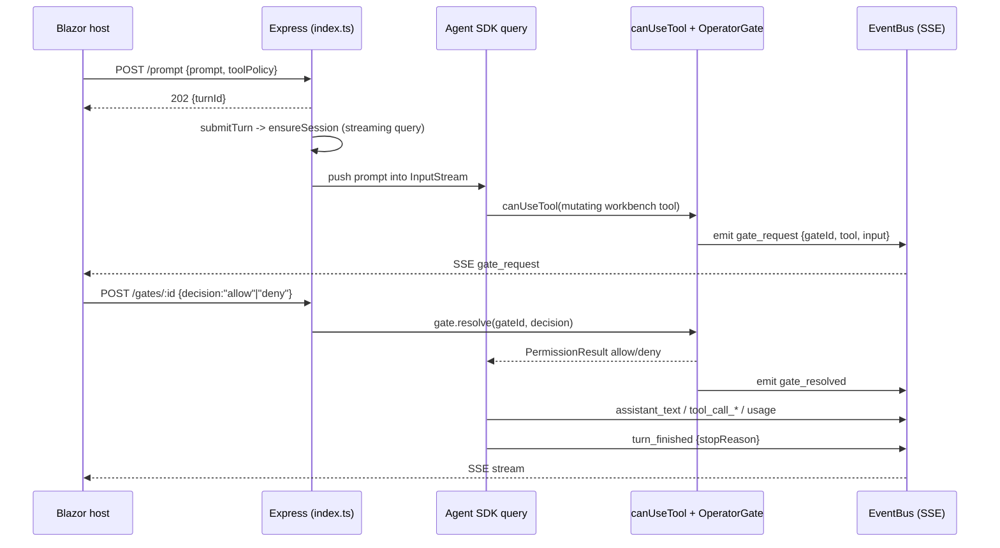

# Sidecar (Node / Claude Agent SDK)

> The Node process that drives Claude over the Agent SDK, acts as MCP client to the host, and enforces the deny-by-default human-operator gate on every tool call.

**Path:** `sidecar/` · **Runtime:** Node (Claude Agent SDK, Express) · **Port:** :6110 by default (`SIDECAR_PORT`), bound to **127.0.0.1 only** · **Talks to:** host MCP (:6100/mcp) as client; host drives it via HTTP; streams events back via SSE.

## Purpose

The sidecar is the single seam between the Blazor operator console and Claude. It:

- Runs the Claude Agent SDK (`@anthropic-ai/claude-agent-sdk`), calling the local `claude` CLI on behalf of the operator.
- Acts as the **MCP client** to the host's `claude-workbench` MCP server (HTTP, `http://localhost:6100/mcp`), exposing the AIMonitor staging/git tools to the agent.
- **Enforces the operator gate** via the SDK's `canUseTool` callback: deny-by-default, with governed mutations pausing until a human accepts or rejects.
- Injects a governed role card as the system prompt so the agent knows its read-only + staging contract from turn one.
- Streams a **neutral, vendor-decoupled event contract** (`events.ts`) back to the host over Server-Sent Events.
- Exposes a small Express control surface the host uses to submit prompts, resolve gates/elicitations, read usage, feed back merge-review outcomes, and reset the thread — loopback-bound and behind a Host/Origin guard.

Isolation is deliberate: `strictMcpConfig` plus `settingSources: []` mean the machine's other MCP servers, the personal `~/.claude`, and any `CLAUDE.md` in the watched tree are **never** loaded. The only authored guidance is the injected governance card.

## Key files

| File | Role |
| --- | --- |
| `src/index.ts` | Entry point. Config, `InputStream` (streaming-input queue), `canUseTool` gate logic, `ensureSession`/`submitTurn`, SDK message → event mapping (`handleMessage`), and the full Express HTTP surface. |
| `src/gate.ts` | The `GATED_TOOLS` set, `baseName`/`isGatedTool` helpers, and `OperatorGate` — the pending-gate registry whose promises `canUseTool` awaits and the host resolves. |
| `src/bus.ts` | `EventBus` — SSE fan-out to any number of subscribers with a bounded 1000-event replay history (gate lifecycle events are excluded from replay). Every `res.write` is guarded: a dead/half-open subscriber is dropped instead of throwing out of `emit()`. |
| `src/events.ts` | `SidecarEvent` discriminated union — the neutral sidecar→host event contract, deliberately decoupled from any agent vendor's wire shapes. |

Supporting: `package.json` (deps: `@anthropic-ai/claude-agent-sdk ^0.3.212`, `express ^4.21.2`; scripts `build`/`start`/`typecheck`), `tsconfig.json` (`NodeNext` ESM, `strict`, `target ES2022`).

## How it works

The host launches the sidecar once (single-start; under `ClaudeWorkbench.Launcher` each instance gets its own host+sidecar pair on its own port pair). On startup it resolves its workspace `cwd` from the host `/health` (the watched solution's folder, plus the uploads dir as an extra read-only directory). Each operator prompt is a **turn**; a series of turns sharing SDK session state is a **thread**.

A turn's flow: the host `POST /prompt` → `submitTurn` → `ensureSession` lazily starts a long-lived streaming query → the prompt is pushed into the `InputStream` → the SDK runs the agent → each tool call routes through `canUseTool` → allowed calls run (workbench tools hit the host MCP), gated mutations pause and emit a `gate_request` → the host resolves it → SDK messages are mapped to neutral events and fanned out over `/events`.

## The operator gate (deny-by-default)

`canUseTool` (index.ts) is invoked for every tool the agent tries to use. It decides in this exact order:

1. **`AskUserQuestion`** → routed to the elicitation dialog. A `randomUUID` elicitation is registered, an `elicitation_request` event is emitted, and the call awaits the operator's answers. The result is returned as `{ behavior: "allow", updatedInput: { ...input, questions, answers } }` per the Agent SDK contract. Abort resolves it with empty answers.
2. **Non-workbench tools** (name does not start with `mcp__claude-workbench__`) → allow only if the name is in `activeAllowedNative`; otherwise **deny** with an explanatory message steering the agent to Read/Grep/Glob and the staging workflow. This path **fails closed** — anything not explicitly allowed is denied.
3. **Workbench read-only tools** (`get_*`, `find_*`, `list_*`, etc. — not in `GATED_TOOLS`) → auto-allow, so the operator is not interrupted for discovery.
4. **Workbench mutations** (`isGatedTool` is true) → if `activeAutoApprove` is on for the turn, allow; otherwise register an `OperatorGate` request, emit `gate_request`, and **await the operator's decision** before allowing or denying.

Even with auto-approve, candidate mutations only touch the monitor-owned Working copy — watched source is still written **only** by the operator's Accept in the Merge Review dialog.

### Tool policy pieces

| Constant / flag | Members / meaning |
| --- | --- |
| `ALWAYS_ALLOWED_NATIVE` | `ToolSearch`, `TodoWrite` — needed for the agent to function (`ToolSearch` loads the MCP tool schemas). Always allowed. |
| `READ_TOOLS` | `Read`, `Grep`, `Glob` — allowed when `policy.allowNativeReads` (default true); otherwise added to `disallowedTools`. |
| `BLOCKABLE_TOOLS` | `Write`, `Edit`, `MultiEdit`, `NotebookEdit`, `Bash`, `PowerShell` — hard-removed via `disallowedTools` unless the operator opts them in through `enabledTools`. This list is also the **allowlist** `/prompt`'s `enabledTools` is filtered against: no other tool name can be opted in. |
| `GATED_TOOLS` (gate.ts) | The workbench mutation set that pauses at the gate: `new_file`, `submit_file`, `replace_text_in_file`, `replace_span_in_file`, `submit_symbol`, `add_using`, `remove_using`, `set_type_partial`, `add_symbol`, `add_field`, `add_property`, `add_method`, `add_constructor`, `add_nested_type`, `remove_symbol`, `stage_candidate_for_review`, `record_diff_decision`. Git is **not** here: the agent has read-only git only (`git_status`/`git_diff`/`git_log`/`git_list_branches`, absent from this set so they auto-allow), and there are no git-write tools — commit/push/branch/merge are operator-only in the Git page. |

`activeAllowedNative` and `activeAutoApprove` are recomputed per turn from that turn's policy; `canUseTool` reads them.

## Key flows

## Session model

- **`InputStream`** — an async-iterable backed by a queue that operator turns are pushed into. Using a streaming input (rather than a single prompt string) is what puts the query in **streaming-input mode**, the only mode that exposes the `Query` control handle (`interrupt`, `getContextUsage`, experimental usage).
- **`ensureSession(policy)`** — lazily creates the long-lived `query(...)` **once per thread**. Options (`cwd`, `mcpServers`, `canUseTool`, `systemPrompt` = `claude_code` preset + governance card, `disallowedTools`, `strictMcpConfig`, `settingSources: []`, optional `model`/`effort`/`resume`/`additionalDirectories`) are frozen here. A background loop drains the query output into `handleMessage` for the life of the thread.
- **`resume` / `currentSessionId`** — every SDK message carries a `session_id`; the sidecar captures it and passes it as `resume` on the next `ensureSession`, so the thread survives a process restart. Within a live process, session state lives in the query handle itself.
- **New Thread** — `activeInput.end()` completes the input stream (ending the query), then clears `activeQuery`, `activeInput`, `currentSessionId`, `pendingReviewOutcome`, elicitations, and the bus history, and emits `thread_reset`.

Because options are frozen at session start, a **workspace switch, tool-policy change, model/effort change, or resume all require starting a new thread**. Only the message text and the review-outcome prepend are per-turn.

## The control surface

All endpoints are plain Express JSON handlers on :6110, driven by the host. The listener binds `127.0.0.1`, and a middleware ahead of every route rejects (403) any request whose `Host` header is not localhost and any browser request carrying a non-local `Origin` — a DNS-rebinding defense. The host talks over loopback and sends no `Origin`, so it is unaffected.

| Method + path | Purpose |
| --- | --- |
| `GET /health` | Status, MCP server name/URL, `activeTurn`, pending-gate count. Also used to resolve `watchedSolutionPath`/`uploadsPath`. |
| `POST /prompt` | Submit an operator turn `{ prompt, toolPolicy }`. 409 if a turn is active, 400 if empty; else 202 `{ turnId }` and `submitTurn` runs. |
| `POST /stop` | Interrupt the active turn via `activeQuery.interrupt()`. |
| `GET /gates` | List pending gates from the live registry. |
| `POST /gates/:id` | Resolve a gate `{ decision: "allow"|"deny", reason? }`. 400 on bad decision, 404 if unknown. |
| `GET /elicitations` | List pending `AskUserQuestion` elicitations. |
| `POST /elicitations/:id` | Answer an elicitation `{ answers }`; resolves the awaiting `canUseTool`. 404 if unknown. |
| `GET /events` | **SSE** stream of `SidecarEvent`s; replays bounded history (minus gate lifecycle) to late joiners. |
| `GET /usage` | Live context + subscription usage read off the `Query` handle (experimental SDK methods, guarded; null before a thread exists). |
| `POST /review-outcome` | Host posts a merge-review build/index summary; prepended to the agent's next prompt and echoed to the transcript. |
| `POST /new-thread` | End the current thread and reset session/gate/elicitation/bus state. 409 if a turn is active. |

## Owns / Does Not Own

**Owns:**

- The `canUseTool` policy engine and the deny-by-default decision for every tool call.
- The `OperatorGate` pending-gate registry and its allow/deny lifecycle.
- Session/thread lifecycle: streaming query creation, resume capture, New Thread teardown.
- Mapping SDK messages onto the neutral `SidecarEvent` contract and SSE fan-out.
- The governance role card injected as the system prompt, and SDK isolation settings.

**Does not own:**

- The `claude-workbench` MCP tools themselves — those live in the host (:6100/mcp); the sidecar is only their client.
- Writing watched source — that is the host's Merge Review Accept; the agent can only stage candidates.
- Operator UI, authentication, task/thread persistence, and the actual model inference (the `claude` CLI / Anthropic backend).

## Gotchas & invariants

- **`/prompt` `toolPolicy.enabledTools` is constrained to `BLOCKABLE_TOOLS`.** Names outside that set (`Agent`, `WebFetch`, anything unknown) are filtered out before the policy is built, so a `/prompt` body cannot widen the deny-by-default surface beyond the writers/shells an operator may deliberately opt into.
- **The Express control surface still has no token auth — it relies on locality.** It binds `127.0.0.1` (no remote reach) and rejects spoofed `Host` / cross-origin `Origin` headers with 403, but `POST /gates/:id` is what resolves the human gate, so **another process on the same machine** could still approve mutations. That residual risk is knowingly accepted for a localhost console.
- **`GATED_TOOLS` must stay a complete mirror of the MCP mutation set.** Any workbench mutation not listed in `GATED_TOOLS` **fails open** (auto-allowed as a "read-only" tool). Adding a new mutating tool to the host MCP server without adding its basename here silently bypasses the gate.
- **Tool policy is frozen at turn 1, but `autoApprove` is per-turn.** `ensureSession` options (reads/blockables/model/effort/strictMcp) come from the *first* turn's policy for the whole thread; only `activeAutoApprove` is refreshed each `submitTurn`. Changing any other policy field mid-thread has no effect until New Thread.
- **An unhandled rejection can strand `activeTurn`.** `activeTurn` is set to the turnId in `/prompt` before `submitTurn` runs; `submitTurn` is fired with `void`. If it throws before the SDK produces a `result` message, `activeTurn` never clears and every subsequent `/prompt` returns a permanent 409 until New Thread.
- **SSE fan-out tolerates dead subscribers but has no backpressure.** `EventBus.write` wraps each `res.write` in a `try/catch` and deletes the failing client, so a closed browser tab can no longer throw out of `emit()` and tear down the in-flight turn (deleting from the `Set` being iterated is safe). There is still no backpressure — a slow-but-open client is written to regardless.
- **Thread state is only cleared by the query that owns it.** The read loop's `finally` nulls `activeQuery`/`activeInput`/`activeTurn` **only if `activeQuery` is still its own query**. Without that guard, New Thread followed immediately by a prompt let the old loop null out the new turn's state, so the new turn looked finished within seconds while its work continued untracked.
- **The deny-by-default native path fails CLOSED (correct).** Unknown non-workbench tools are denied, not allowed — the safe default. This is the intended invariant and should be preserved.

## Where to start reading

Start with **`src/index.ts`** — it is the whole runtime: config, `canUseTool`, `ensureSession`/`submitTurn`, `handleMessage`, and every HTTP route. Then read **`src/gate.ts`** for the exact mutation set and the `OperatorGate` promise mechanics. `bus.ts` and `events.ts` are small and self-explanatory once the flow is clear.

## Tests

**No unit tests — but there is an end-to-end flow smoke.** `npm run smoke` (`src/smoke/flow.smoke.test.ts`, `node --test` over the compiled output) drives the governed edit loop against the **live** stack on the `CalculatorSample` fixture: a real Claude turn stages a candidate, then accept / reject / multi-file accept run through `EngineReviewWorkflow` via the host's test-only `/review/*` endpoints (opt in with `CWB_ENABLE_REVIEW_API=1`), asserting the watched bytes and the GATE-2 build. It polls `GET /health` rather than subscribing to `/events`, and restores every fixture file in a `finally`. See `sidecar/src/smoke/README.md`.

The static checks remain `npm run typecheck` (`tsc --noEmit`) and `npm run build` (`tsc`). The gate policy itself and the `GATED_TOOLS` completeness invariant are still unguarded by tests.
